```{r, echo=FALSE, out.width="100%"}

```


##  Introduction
In environmental and public health laboratories targeted mass-spectrometry methods are the gold-standard for performing both qualitative and quantitative analysis of chemicals due to their accuracy, precision, and reproducibility. However, the development and application of targeted analysis methods is reliant on analytical standards to perform measurements. Access to analytical standards or reference data for emerging contaminants is limited. Therefore, additional monitoring techniques are necessary for environmental and public health laboratories to better address emerging contaminants in environmental media. 

<span style=color:#2da343>**Non-targeted analysis (NTA)**</span> methods utilize high-resolution mass spectrometry (HRMS) to measure chemicals without requiring pre-existing knowledge of their presence. These methods are not reliant on analytical standards or reference data (e.g., standardized methods, reference spectra) to perform measurements and instead use generalized approaches to measure thousands of chemicals across a vast chemical space. The use of NTA by the U.S. Environmental Protection Agency’s Office of Research and Development (ORD) is summarized in the video below. 

{width="100%"}  


<div class="alert alert-info" role="alert">
**For more information on NTA methods and applications in the environment, see the following resources.**   
https://www.epa.gov/chemical-research/non-targeted-analysis-research	
https://nontargetedanalysis.org/  </div>


NTA methods are increasingly employed by researchers to investigate **per- and polyfluoroalkyl substances (PFAS)**, a class of anthropogenic chemicals that have found ubiquitous use in various industrial and commercial applications since the 1940s. In 2021, PFAS were [defined by the Organization for Economic Co-operation and Development (OECD)](https://www.oecd.org/en/publications/reconciling-terminology-of-the-universe-of-per-and-polyfluoroalkyl-substances_e458e796-en.html) as *“fluorinated substances that contain at least one fully fluorinated methyl or methylene carbon atom (without any H/Cl/Br/I atom attached to it)”*. As of 2023, the United States Environmental Protection Agency (EPA) lists 14,735 unique PFAS in the [CompTox Chemicals Dashboard](https://comptox.epa.gov/dashboard/chemical-lists/PFASSTRUCTV5). Another [2020 report](https://pubs.rsc.org/en/content/articlelanding/2020/em/d0em00291g) identified more than 200 use categories, broken out into 87 industrial and 123 commercial and consumer uses for approximately 1,400 unique PFAS.  

The manufacturing, use, and disposal of PFAS has led to their widespread occurrence in environmental media, and research consistently demonstrates that exposure to PFAS is linked to harmful health effects in humans and animals. In environmental and public health laboratories, the use of targeted analyses to measure PFAS in drinking water, surface and groundwaters, and other environmental media is common. Though, as described above, these targeted analysis methods focus on a small number (up to 40 individual chemicals in [EPA Method 1633](https://www.epa.gov/cwa-methods/cwa-analytical-methods-and-polyfluorinated-alkyl-substances-pfas#method-1633)) of PFAS. NTA methods can potentially characterize the additional PFAS not covered by existing targeted approaches. 


<div class="alert alert-info" role="alert">
**For more information on PFAS in the environment and their effects on human health, see the following publications and resources.**  
https://doi.org/10.1787/e458e796-en  
https://www.epa.gov/pfas/pfas-explained  
https://www.niehs.nih.gov/health/topics/agents/pfc  
https://doi.org/10.1039/D0EM00291G </div>


### Background
Within ORD, NTA methods are employed to identify PFAS in environmental media and
have been effective in providing more comprehensive PFAS identifications. ORD has also provided NTA technical assistance to states’ environmental and public health laboratories that has resulted in state actions with consequential public health impacts. 
 

An example of this impact includes the discovery of GenX and Nafion byproducts in the Cape Fear River and downstream finished drinking water ([McCord and Strynar 2019](https://pubs.acs.org/doi/10.1021/acs.est.8b06017)). This work resulted in [state orders to cease discharge](https://www.deq.nc.gov/news/press-releases/2017/09/05/state-orders-chemours-stop-chemical-releases-begins-legal-action-and#:~:text=Sep%205%2C%202017-,State%20officials%20ordered%20Chemours%20on%20Tuesday%20to%20stop%20releasing%20all,discharging%20wastewater%20into%20the%20river.), drastically reducing PFAS exposures in the drinking water of ~500,000 residents in North Carolina. Additional examples of NTA PFAS work include the detection of a novel PFAS and source attribution in New Jersey ([Washington *et al.* 2020](https://www.science.org/doi/10.1126/science.aba7127)) and subsequent institution of a groundwater quality standard, as well as NTA characterization PFAS in fume suppressants within [Michigan chrome plating facilities](https://www.michigan.gov/-/media/Project/Websites/egle/Documents/Programs/WRD/IPP/pfas-chrome-plating.pdf?rev=68a2ffa0383b40a1a324da40eb9ab788).

<div class="alert alert-success" role="alert">
**Relevant publications:**  
McCord J., Strynar M. Identification of Per- and Polyfluoroalkyl Substances in the Cape Fear River by High Resolution Mass Spectrometry and Nontargeted Screening. *Environ Sci Technol.*  **53 (9)**, 4717-4727 (2019). https://doi.org/10.1021/acs.est.8b06017  
Washington J.W., Rosal C.G., McCord J.P., *et al*. Nontargeted mass-spectral detection of chloroperfluoropolyether carboxylates in New Jersey soils. *Science*. **368(6495)**, 1103-1107 (2020). http://dx.doi.org/10.1126/science.aba7127</div>


These successful investigations have led to increased requests from state and regional environmental and public health laboratories for PFAS NTA support from ORD. Environmental and public health laboratories interested in utilizing NTA methods to inform environmental monitoring efforts are often limited by a lack of instrumentation, lack of access to standardized NTA methods and workflows, and a lack of expertise on the use and implementation of NTA.  

### Objectives
To better identify and resolve the barriers towards NTA implementation in environmental and public health laboratories, ORD partnered with EPA Regions 3, 5, and 9 to work on a Regional-ORD Applied Research (ROAR) project. In each region, a state partner was identified with pre-existing access to HRMS instrumentation, interest in applying NTA to investigate the presence of PFAS in drinking water resources within their state, and one or more barriers to developing a successful NTA program. An outline of the state partner study background, motivations, and key implementation barriers are shown in **Figure 1**.  

```{r, echo=FALSE, out.width="100%", fig.cap="**Figure 1.** Study background, motivation, scope, and barriers for state partners in the ROAR proposal."}
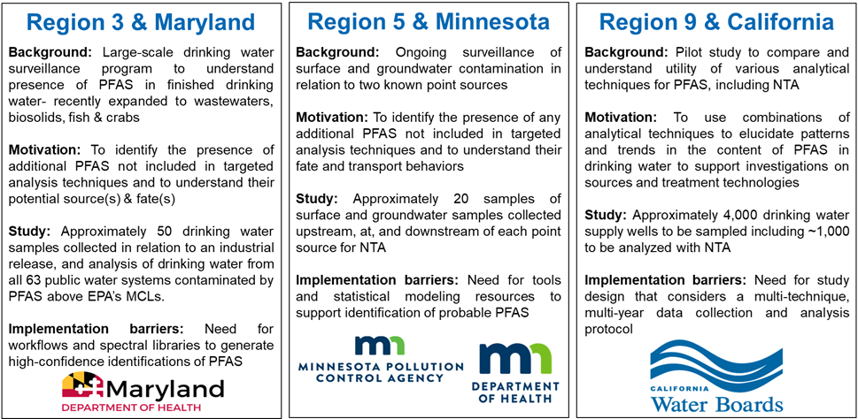
```

The objective of the ROAR project was to empower the state laboratories to independently apply NTA in their management of PFAS and other contaminants of emerging concern by providing access to ORD's pool of HRMS and NTA knowledge and tools developed by ORD’s research programs. ORD’s role was to provide guidance for all aspects of NTA study design and implementation as shown in **Figure 2**, as well as adapt data processing workflows to accommodate state operating conditions and independent applications. ORD also sought to contribute as a research partner to address the scientific questions under consideration in each study. 

```{r, echo=FALSE, out.width="100%", fig.cap="**Figure 2.** Elements of NTA studies discussed in this toolkit."}
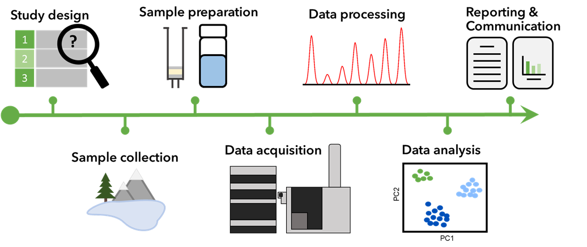
```

Here we introduce the **E**nabling **N**on-**T**argeted **A**na**L**ysi**S** for per- and polyfluoroalkyl substances (**ENTA**i**LS**) Toolkit, which summarizes the scientific training, guidance, and workflows developed by ORD as part of the ROAR project. The following sections detail NTA study design and implementation, with a detailed focus on an PFAS NTA data processing workflow. This workflow is detailed step-by-step and utilizes only vendor-neutral and open source tools to prevent the need for additional software licenses. This specific implementation of the workflow is not the only, nor necessarily the most recommended, way of processing PFAS NTA data, but is an inexpensive, straightforward implementation of a workflow for newcomers to NTA data processing.  

The ENTAiLS Toolkit is intended to provide novice NTA users with the appropriate background, context, and tools to implement NTA studies within their environmental monitoring programs. Intermediate or advanced NTA users may wish to consult **Appendices A-E**, which offer summarized guidance and best practices, quality assurance and quality control (QA/QC) considerations, and a summary of the data processing workflow. 

### Definitions and Context
Before providing detailed background and guidance on NTA study design and implementation we offer a quick introduction to the defining characteristics of NTA methods, the data they produce, and their role in the analysis of PFAS as a diverse class of chemicals. NTA method using liquid chromatography (LC) with HRMS are employed due to their amenability to a wide variety of chemical classes (e.g., polar and non-polar, low and moderate volatility) and sample matrices (e.g., aqueous, extracts of biological and environmental media). 


In NTA methods using LCHRMS, chemicals are first separated based on chemical properties using liquid chromatography and then manipulated within a high-resolution mass spectrometer based on their mass-to-charge ratio (m/z). Chemical features are defined based on the unique combination of their measured m/z and chromatographic retention time. For the typical NTA method employing LC-HRMS, we can expect the measurement of thousands of chemical features in almost any sample. Chemical features measured in a single sample or across multiple samples can be represented as in **Figure 3**, where each dot represents a unique chemical feature.

```{r, echo=FALSE, out.width="100%", fig.cap="**Figure 3.** Illustration of chemical features across a set of samples based on their mass and retention time."}
library(ggplot2)
data=read.csv("C:\\Users\\HWHITEHE\\OneDrive - Environmental Protection Agency (EPA)\\Profile\\Desktop\\General Work\\Manuscripts\\Translational\\Toolkit\\docs\\features.csv",header=TRUE)
ggplot(data,aes(x=Mass,y=RT))+geom_point(size=2)+theme_minimal()+labs(x="Mass",y="Retention Time (min)")
```

Chromatographic peaks are generated using the mass spectrometry instrument response, such as a total ion chromatogram (TIC) of all eluting ions, or an extracted ion chromatogram (XIC) of a single ion as shown in **Figure 4A** below, with the retention time of a chemical feature dependent on the chromatographic method used. Chemicals are detected as ions by the mass spectrometer and displayed as mass spectra, which are described in greater detail in subsequent sections, but can be displayed as the measured m/z and intensity/abundance of each ion, as shown in **Figure 4B** and **4C**. The types of mass spectra are dependent on the data acquisition methods used; when tandem mass analysis methods are used (e.g., LC-MS/MS) both MS1 and MS2 (or MS/MS) spectra are generated. MS1 spectra display ions measured in a sample at a given retention time while MS2 spectra display the fragments generated from precursor ion(s) measured in the MS1 spectra. The most common data acquisition methods used for NTA of PFAS are described in more detail in the data acquisition section.

```{r, echo=FALSE, out.width="100%", fig.cap="**Figure 4.** A) Extracted ion chromatogram of a chemical feature (m/z of 248.9458). B) MS1 spectra containing the ions observed at the retention time of the peak, including the ion for the chemical feature. C) MS2 spectra for the chemical feature showing the fragments ions observed."}

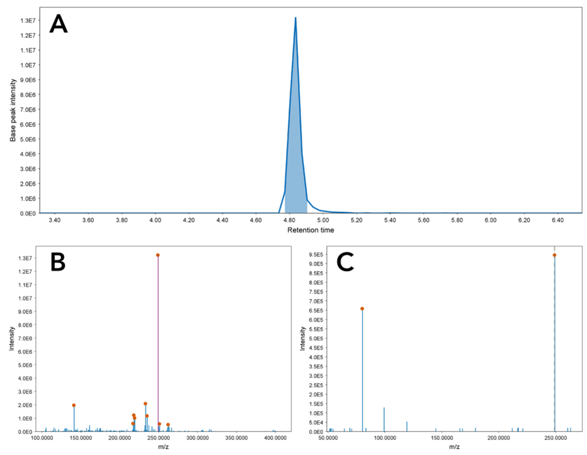
```

The retention time and mass spectral data generated by NTA methods can be used to support different approaches for translating chemical features to a chemical identity. Two approaches for determining a chemical identity from a chemical feature are suspect screening analysis and de novo NTA, also called non-targeted screening (NTS), untargeted analysis, or just non-targeted analysis (NTA). The differences between suspect screening analysis and NTA are [defined in detail by the Best Practices for Non-Targeted Analysis (BP4NTA)](https://nontargetedanalysis.org/glossary/) workgroup, but can be generally summarized as:

> **Suspect Screening Analysis**: Uses HRMS/NTA data acquisition but limits the scope of analysis based on (often large) predefined lists or libraries that contain reference data for chemicals of interest such as retention time, exact mass, fragment ions, and more to narrow the scope of data acquisition and/or data processing. Often combined with confirmatory analysis techniques that may be traditional methods.  
>
> **Non-Targeted Analysis**: Uses generalized HRMS data acquisition in order to characterize the chemical composition of a sample without any a priori knowledge of the chemical composition. NTA methods may use lists or libraries to aide in annotation of compounds, but the data acquisition and processing methods are not limited to those lists. Often requires manual examination of unknowns for confirmation/identification.  


While not limited by predetermined lists or data, NTA methods are still limited by the measurable chemical space of the methods used. [Chemical space can be defined as](https://link.springer.com/article/10.1007/s00216-022-04434-4) *“the constituents of a sample across a multidimensional swath of chemical properties”*. More generally, chemical space represents all possible chemicals within a range of physicochemical properties imposed by the sampling, preparation, and analysis processes. See **Figure 5** below for an illustration of how method decisions limit the detectable chemical space. Targeted methods likewise have a scope defined by each step of the study, but it is more significant for NTA methods because they seek to measure a larger chemical space (i.e., more chemicals) than that of traditional targeted analysis methods.

```{r, echo=FALSE, fig.cap="**Figure 5.** The intersection of each step of an NTA study and its reduction of the detectable chemical space. Image taken from [Black *et al.* (2023)](https://link.springer.com/article/10.1007/s00216-022-04434-4)."}

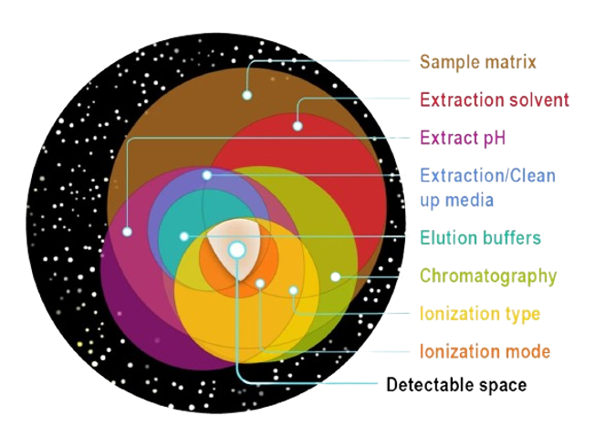
```

The limits of chemical space for an NTA method are useful to differentiate when compounds *aren’t present* rather than *can’t be detected* in study samples due to the methods used. Because PFAS constitute such a diverse class of compounds, no single analytical method or technique is applicable to the entire PFAS chemical space. A number of analytical techniques have been developed and employed to measure PFAS and are typically categorized by the type of PFAS they can measure, as shown in **Figure 6** below.

```{r, echo=FALSE, out.width="100%", fig.cap="**Figure 6.**Analytical techniques used to measure PFAS. Boxes represent the relative narrowing of chemical space from total fluorine techniques like PIGE to targeted LC-MS/MS measurements. Image taken from [McDonough *et al*. (2019)](https://www.sciencedirect.com/science/article/pii/S2468584418300515)."}

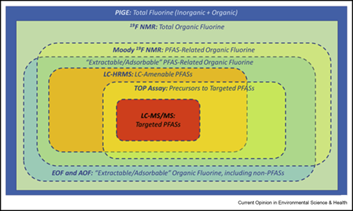
```

There are a variety of techniques that seek to measure total fluorine or total organic fluorine including Particle-Induced Gamma-Ray Emission (PIGE) spectroscopy, Combustion Ion Chromatography (CIC), and Fluorine-19 Nuclear Magnetic Resonance (NMR) spectroscopy. These techniques offer the best estimation of all PFAS present in a sample, including both polymeric and non-polymeric forms, though these methods are unable to describe the individual chemical(s) present. A combination of analytical techniques is often utilized to measure both total fluorine and individual PFAS in order to identify and close a fluorine mass balance within a system.   

Individual chemical identification can be achieved using LC-HRMS or targeted LC-MS/MS, though, these methods have historically focused on anionic, small-molecule PFAS. Other PFAS may be more appropriate for similar techniques like gas chromatography mass spectrometry (GC-MS) and GC-MS/MS. If a critical study goal is to identify all potential PFAS in an environmental sample, it is important to use a combination of analytical techniques to measure total PFAS and identify individual chemicals present. While NTA using LC-HRMS methods expands on traditional targeted analysis methods it is still unable to measure certain PFAS, including polymeric or volatile PFAS that may be better suited for total fluorine or GC-MS/MS techniques, respectively.   

Like all methods, tracking the presence and abundance of chemicals in NTA is reliant on quality assurance and quality control (QA/QC) procedures. Because of the breadth of chemical space in NTA, QA/QC is central to all aspects of the study where chemical or data processing artifacts can be introduced. This includes sample collection, preparation, data acquisition and data processing and is especially critical for PFAS due to their ubiquity in the environment, consumer goods, and laboratory supplies.   

**Quality Assurance (QA)** is verification that a process is performing within specifications across all aspects of the system. **Quality Control (QC)** is the process established to ensure accurate results are achieved and to measure any non-conformance; for example, that sample results are within expectations for the developed method/sample preparation protocols. Good QA/QC practices rely on both proper planning for QA/QC samples and proper analysis of QA/QC data. In a worst-case scenario, bad QA/QC practices result in inaccurate data interpretation and/or prevent resolution of research questions. Poorly planned QA/QC reduces the confidence of certain results and limits the type of data that can be defensibly reported. Poorly analyzed QA/QC data obfuscates issues at the instrumental, method, or preparative levels and results in inaccurately reported results. The following sections include detailed guidance for the generation of QA/QC data during sample collection, sample preparation, and data acquisition to support study goals and ensure data quality.   


\newpage
##  PFAS NTA Study Guidance and Best Practices 

Environmental and public health laboratories play a key role in defining environmental presence of chemicals across different matrices and populations. Within these labs, and collectively, there is a strong need to develop and apply analytical methods to more comprehensively measure unknown chemicals, define their presence and concentrations in the environment, and ultimately understand associated risks.  

As described previously, targeted analyses methods are the gold-standard technique used to measure PFAS concentrations. For environmental health laboratories, that means one of a small number of validated methods produced by a regulatory agency such as the [EPA](https://www.epa.gov/water-research/pfas-analytical-methods-development-and-sampling-research) or the [United States Food and Drug Administration (FDA)](https://www.fda.gov/food/process-contaminants-food/testing-food-pfas-and-assessing-dietary-exposure). These targeted methods are highly validated, rooted in relatively narrow chemical lists, and make use of commercially available reference and internal standards to provide transparent and defensible quantitative data. In comparison, NTA methods are open-ended and exploratory, without a pre-defined list, and lack reference materials or multi-lab validation studies that are common for routine, standardized chemical assessment. Consequently, NTA methods must be carefully designed to ensure reproducible, defensible outputs and may still be difficult to compare across laboratories. A comparison of key aspects of targeted analysis and NTA methods are shown in **Table 1**. 


```{r, echo=FALSE}
library(knitr)
library(kableExtra)
FluoroMatchOutput2=read.csv("C:\\Users\\HWHITEHE\\OneDrive - Environmental Protection Agency (EPA)\\Profile\\Desktop\\General Work\\Manuscripts\\Translational\\Toolkit\\docs\\Tables\\Comparison.csv",check.names=FALSE)

FluoroMatchOutput2 %>%
kable(caption ="**Table 1.** Comparison of key aspects of targeted and NTA studies.",format="html", align="c",html_font="Lato") %>%
kable_styling(full_width=F, html_font= "Lato", bootstrap_options=c("striped", "hover","responsive"))
```

For environmental and public health laboratories whose infrastructure is built around applying validated methods, it follows that the lack of standardization and guidance for NTA is a key barrier to its widespread application. In lieu of a validated regulatory method, the subsequent sections present guidance on NTA study design, sample collection and preparation, and data acquisition with respect to PFAS in aqueous matrices. The guidance and best practices recommended may also be applicable to other systems (e.g., biological, soils, sediments). Special considerations are required for PFAS due to their ubiquity in the environment, consumer goods, and laboratory supplies encountered when preparing samples, and we note that studies investigating different analyte classes or in different matrices may have different best practices or considerations with respect to study implementation. Further, some aspects of the data annotation make use of PFAS specific chemical features but could be updated or omitted as necessary. The guidance and best practices plus the recommended QA/QC samples described in detail here are summarized in **Appendix A** and **Appendix B**, respectively.   

\newpage
### Study Design

[The Best Practices for Non-Targeted Analysis (BP4NTA)](https://nontargetedanalysis.org/reference-content/methods/study-design/) working group defines study design as *“the compilation of parameters and procedures used to perform and qualify a set of measurements”*.  While a modest definition, the significance of study design to the success of an NTA study cannot be understated. Study design can be analogized to planning a vacation—there are minimal requirements like deciding on a destination and going, but the experience is better if you prepare in advance for all the other considerations like finding accommodations and restaurants, purchasing attraction tickets, and more. Intricate study design, likewise, while not strictly mandatory, ensures that a study can actually answer scientific questions and does more than meet the technical minimum of processing samples. NTA studies significantly benefit from identifying study goals in advance and being aware of what questions can and cannot be answered with NTA. 

#### Defining Study Goals
Identifying the primary questions(s) or hypotheses should be the first step of study design, but compared to targeted analysis, the open-ended and exploratory potential of NTA makes it tempting to overlook. Targeted analysis methods yield very specific, detailed information that answers questions of equal specificity. For example:  

* EPA Method 524 – can measure the concentration of benzene in water at >0.04 µg/L. 
* FDA Method 4645 – can measure the concentration of atrazine in a fish tissue sample at >1ng/g.
* EPA Method 1694 – can measure the concentration of ibuprofen in biosolid waste at > 50 ng/g.  

NTA methods, in comparison, can yield complex qualitative data within the context of environmental measurements; as when using targeted measurements, these studies may seek to address a variety of goals, a few of which are described below and summarized in **Table 2**.   

**1. Determine the presence of chemicals of concern:** This type of study is relatively limited in scope, focusing only on defining if chemicals of interest are present or absent in collected samples. The number of samples collected may be as few as one but still requires fundamental QA/QC practice to ensure instrument performance.  

**2. Investigate origin and impact of specific point sources:** This type of study focuses on the comparison of sample(s) with an expected impact from a point source (e.g., manufacturing facility, wastewater treatment plant) to samples without impact. An example would be the comparison of upstream vs. downstream surface water in the vicinity of an effluent pipe. These studies rely on the difference between the background/control and impacted samples to demonstrate that chemicals measured in downstream samples are related to the point source. When possible, these studies should include samples collected directly from the point source (e.g., product or process waste) to demonstrate the source contains the detected chemicals. Additional study specific considerations include:  

* Background/control sample(s) should be the same matrix as the impacted sample(s) and, as much as possible, should reflect the same time and conditions to minimize introduced differences in samples.  
* The use of basic statistics to test the similarity or difference of abundance for chemicals identified downstream vs. upstream.  

**3. Measure the distribution of chemicals across time, space, and/or matrices (e.g., water, soil, plants, animals, people):** This type of study focuses on the measurement of chemicals with respect to one or more non-chemical variables. These studies build upon the measures of abundance and presence/absence described in previous studies to then describe or understand the frequency, abundance, and distribution of measured chemicals in relation to time, space, matrix, and/or other factors. These studies require the development of detailed hypotheses to support and inform all aspects of study design, sample collection and preparation, data acquisition, processing, analysis, and reporting. In addition to the considerations given above, specific considerations include:  

* Each sample of a different matrix will require matrix-specific QA/QC samples to be prepared and may require different sample preparation techniques or analysis methods. Different methods for preparation will lead to different measurable chemical space, so chemical results may not be directly comparable between matrices.  
* Samples collected from the same locations or sites at different time points should use both positive and negative controls to account for temporal effects in the sample background from collection, preparation, and acquisition.  
  * Samples collected at different times can either be prepared and analyzed at the time of collection (e.g., separately) or prepared and analyzed together. If separate, use positive and negative controls to ensure comparability. If together, choose appropriate preservation and storage methods to ensure sample stability.   
* Higher-level statistics that factor in geospatial, temporal, or multivariate components will be required to account for dependent variables being tested and control for other metadata available (e.g., population level information, data collected from surveys).   

**4. Estimate or model the fate and transport of pollutants:** This type of study focuses on the measurement of chemicals in order to investigate their fate and transport across a system. Once in the environment, chemicals may degrade or transform through abiotic and biotic processes to form new intermediate and/or terminal products. These transformation or degradation pathways may be previously described using experimental data, predicted data (*in silico*), or may be otherwise unknown and require *de novo* structural elucidation or identification using NTA data. Similarly, these studies will also investigate the distribution of the chemicals across a system (upstream vs. downstream of a point source, across time, space, or matrix) and require the same considerations as described above. Additional considerations not already described include:

* The use of experimental and/or predicted transformation pathways to inform sample preparation, data processing, and data analysis to ensure measurement of anticipated transformation products.  
* Significant time may be required during data processing and analysis to support de novo structural elucidation and development of transformation pathways.  
* Data analysis will be dependent on the combination of higher-level statistics and computational modeling approaches to investigate or simulate the relationship of transformation products to their precursors across a system.  

**5. Establish the association of chemicals with other factors:** This type of study seeks to use data generated to relate the observations of an NTA study to outcomes or effects measured outside of those measured by NTA. For example, to link observed chemicals in serum to health outcomes or identify biomarkers of a non-chemical stressor. Data generation for this purpose builds upon the same fundamentals of other described studies but also requires additional metadata and reference data to support the comparison and connection to NTA data.  

```{r, echo=FALSE}
library(knitr)
library(kableExtra)
studyDesign=read.csv("C:\\Users\\HWHITEHE\\OneDrive - Environmental Protection Agency (EPA)\\Profile\\Desktop\\General Work\\Manuscripts\\Translational\\Toolkit\\docs\\Tables\\studyDesign.csv",check.names=FALSE)

studyDesign %>%
kable(caption ="**Table 2.** Summary of study goals often considered for NTA studies.",format="html", align="c",html_font="Lato") %>%
kable_styling(full_width=F, html_font= "Lato", bootstrap_options=c("striped", "hover","responsive"))
```

While NTA is a powerful tool that can be employed to achieve many different study goals, it is important to note that addressing research questions with qualitative data and relative abundances alone can be difficult. Quantitative estimates of concentration are often important to address certain study questions such as:  

* Do measured concentrations exceed statutory guidelines (e.g., drinking water limits)?  
* Can chemical levels represent a risk based on known toxicological/fate/exposure information?  

Estimating concentrations from NTA measurements requires special considerations that are outside of the scope of this toolkit. Studies interested in addressing questions that require concentrations should consider the use of complimentary techniques, namely targeted analysis methods, to generate quantitative data for chemicals with available analytical standards and reference data. The use of NTA to generate concentration estimates requires the collection of additional study samples and preparation of additional QA/QC samples to generate and track quantitative data. Approaches for estimating concentrations using NTA data is an active field of research with recent advancements in [computational methods](https://link.springer.com/article/10.1007/s00216-022-04118-z) and the [development of performance metrics](https://link.springer.com/article/10.1007/s00216-023-05117-4) for quantitative non-targeted analysis strategies. 


\newpage
### Sample Collection
When planning sample collection it is important to consider the:

1. Study goal(s) and the samples that will need to be collected to support each research question.  
2. Chemical space being studied and any potential biases that can be introduced during sampling.  
3. QA/QC samples that should be generated in support of the intended analysis.  

Sample collection methods should be chosen with respect to the chemical space of both the analytes and the matrices being investigated. When using NTA to extend the analysis of chemical classes with a targeted method, such as PFAS, there are often existing guidance documents. [EPA maintains a collection of sampling guidance documents](https://www.epa.gov/esam/sample-collection-information-documents-scid) for various analytes including chemicals, biotoxins, and pathogens. This collection can be searched based on analyte of interest and information from existing methods that describe appropriate sample size, sample containers, holding time, and preservation techniques. Similarly, guidance for sample collection based on matrix is also available from various resources. For example, the analysis of various chemicals in drinking water has been previously summarized by [EPA Regional Offices](https://www.epa.gov/sites/default/files/2017-04/documents/quick-guide-drinking-water-sample-collection-2ed-update-508.pdf). Note that within the context of NTA, it is likely that limited guidance is available for all potential analytes of interest and the combination and testing of different guidance and/or collection methods may be required.   

For PFAS specifically, many federal and state agencies have developed detailed sample collection guidance documents to support their PFAS testing strategies. These include:   


> **Federal**
>
> * [EPA](https://www.epa.gov/water-research/pfas-analytical-methods-development-and-sampling-research)
> * [United States Geological Survey USGS](https://pubs.usgs.gov/publication/ofr20241001/full)

> **States**
>
> * [California](https://www.waterboards.ca.gov/drinking_water/certlic/drinkingwater/documents/pfos_and_pfoa/ddw-pfas-sampling-guidance-nov-2022.pdf)
> * [Maryland](https://mde.maryland.gov/programs/permits/WaterManagementPermits/Documents/WPPRP-PFAS-Guidance.pdf)
> * [Massachusetts](https://www.mass.gov/doc/field-sampling-guide-for-pfas/download)
> * [Michigan](https://www.michigan.gov/pfasresponse/-/media/Project/Websites/PFAS-Response/Sampling-Guidance/General.pdf?rev=6217442052bf4fedb89bbf786560d645)
> * [Minnesota](https://www.pca.state.mn.us/sites/default/files/p-eao2-27.pdf)
> * [New Jersey](https://www.nj.gov/dep/watersupply/pdf/pfna-pfas-sampling-guidance-for-nj-water-systems.pdf)
> * [New York](https://extapps.dec.ny.gov/docs/remediation_hudson_pdf/pfassampanaly.pdf)
> * [Rhode Island](https://health.ri.gov/publications/guidelines/PFAS-testing.pdf)

Each of these documents generally discusses the necessary steps for sample collection and how to limit PFAS contamination. Notably, many of these documents are conservative in their requirements and give restrictions on supplies, equipment, containers, etc. intended to minimize bias in PFAS sampling.  

#### **QA/QC Considerations for Sample Collection**
Previous research has investigated the effects of both positive (e.g., sampling contamination) and negative (e.g., PFAS losses) bias in PFAS sampling with select publications summarized below.  

**_Positive Bias_**  
The introduction of PFAS during sample collection, preparation, and storage has been researched for select targeted PFAS analytes. Previous work includes that of [Rodowa *et al*. (2020)](https://pubs.acs.org/doi/10.1021/acs.estlett.0c00036) that examined the potential for PFAS contamination from items that are commonly restricted on PFAS sampling guidance. These items included Teflon tape, ice packs, and aluminum foil among others. Their investigation considered different materials and routes of contamination during laboratory preparation, staging, sampling, and shipping of collected samples. Through targeted analysis they found that most materials had no detections of approximately 50 PFAS. For products that introduced detectable amounts of select PFAS they noted that excessive, unrealistic amounts of the material would be needed to reach detection limits. Other studies, including [Denly *et al*. (2019)](https://onlinelibrary.wiley.com/doi/10.1002/rem.21614) and [Bartlett & Davis (2018)](https://onlinelibrary.wiley.com/doi/10.1002/rem.21549) reported similar observations where restricted products contributed low or no measurable PFAS contamination. 

Importantly, these previous studies have only used targeted analysis in their focus on select products and their potential for contamination. As such, the potential of PFAS contamination when using NTA methods is poorly described or understood. Given a lack of data to support the use or restriction of particular products or sampling techniques it can be beneficial to use conservative guidance as the foundation for PFAS NTA sampling. For PFAS NTA studies we can account for positive bias using various QA/QC samples during sample collection. When use of a specific product, consumable, or equipment is necessary to support sampling, it should also be used to prepare control samples that reflect the possible routes of contamination. These samples can be examined using the same acquisition methods and data processing workflows as study samples to ensure the product is PFAS-free, or to investigate which PFAS are present. These QA/QC samples are summarized in **Table 3** below. 

```{r, echo=FALSE}
library(knitr)
library(kableExtra)
FluoroMatchOutput2=read.csv("C:\\Users\\HWHITEHE\\OneDrive - Environmental Protection Agency (EPA)\\Profile\\Desktop\\General Work\\Manuscripts\\Translational\\Toolkit\\docs\\Tables\\QAQC1.csv",check.names=FALSE)

FluoroMatchOutput2 %>%
kable(caption ="**Table 3.** Types of QA/QC samples that can be included during aqueous sample collection to account for positive bias.",format="html", align="c",html_font="Lato") %>%
kable_styling(full_width=F, html_font= "Lato", bootstrap_options=c("striped", "hover","responsive"))%>%
footnote(general= "*A suitable n varies but should aim to represent a coherent unit or “batch” of samples. It is determined by a variety of factors including sample matrices and sample collection methods, number of sampling teams, etc. Reasonable values for n may be 5, 10, 20, or more for larger studies based on what each set of blanks is intended to represent.")
```

**_Negative Bias_**  
The loss of PFAS during sample collection, preparation, and storage has been researched for select targeted PFAS analytes. Previous work has examined the effect of various sample preparation steps across different matrices. Relevant publications include that of [Sörengård *et al*. (2020)](https://linkinghub.elsevier.com/retrieve/pii/S0021967319308155), [Lath *et al*. (2019)](https://pubmed.ncbi.nlm.nih.gov/30735967/), and [Higgins & Luthy (2006)](https://pubs.acs.org/doi/10.1021/es061000n). The body of research generally demonstrates that PFAS loss is dependent on fluorinated tail chain length and functional groups. Longer fluorinated chain lengths typically have greater loss in aqueous matrices due to their hydrophobicity (i.e., reduced solubility), with shorter fluorinated chain lengths performing worse in organic matrices. [Short-chain compounds and PFAS with certain functional groups](https://pmc.ncbi.nlm.nih.gov/articles/PMC9772059/), like sulfonamides (e.g., perfluorooctanesulfonamide (PFOSA)), can exhibit sample preparation losses from volatility, especially when sample extracts are completely dried down. Many of these losses can be accounted for through the use of isotopically-labeled internal standards, but this approach is seldom an option in NTA methods. As such, “missing” detections should always be considered in the context of the sample collection and preparation scheme. 

Once samples have been collected it is important to consider: 

1. If sample preservation is required for the analytes being investigated.    
2. The allowable holding time based on the chosen analytical method.  
3. The allowable storage conditions based on the chosen analytical method.  

Standardized methods, including EPA Methods 1633, 537.1 and 533 for PFAS, include requirements for preservation, storage conditions, and sample holding times. These existing requirements are again specific to the analytes included in each method and will not address any additional analytes measured through NTA but may be generalizable to a larger class of chemically similar species. 

#### Preservation
It is critical during sample storage and preparation to prevent the loss of analytes due to chemical or biological agents that may be present in the samples. For PFAS various targeted methods have employed the use of different preservatives, including:  

* [Limiting light exposure to prevent deterioration](https://www.epa.gov/cwa-methods/cwa-analytical-methods-and-polyfluorinated-alkyl-substances-pfas#method-1633)  
* [Using TRIZMA® to sequester free chlorine](https://cfpub.epa.gov/si/si_public_record_report.cfm?dirEntryId=348508&Lab=CESER&simpleSearch=0&showCriteria=2&searchAll=537.1&TIMSType=&dateBeginPublishedPresented=03%2F24%2F2018)  
* [Using ammonium acetate to sequester free chlorine](https://www.epa.gov/sites/default/files/2019-12/documents/method-533-815b19020.pdf)  
* [Using sodium hydroxide to prevent conversion of fluorinated carboxylic acids](https://www.epa.gov/system/files/documents/2021-07/8327.pdf)  
* [EPA researchers](https://www.jove.com/t/59142/identifying-per-polyfluorinated-chemical-species-with-combined) have also used nitric acid as a preservation technique.  

In general, the selection of a preservative should consider the matrix being investigated, the types of chemical or biological agents that could induce transformation or degradation, and the compatibility of the any preservative used with downstream preparation and acquisition methods. Nitric acid, for example, may not affect perfluorinated species but can cause transformation for many precursor molecules, and TRIZMA® or other buffers may be incompatible with some mass spectrometry preparation techniques.   

#### Holding Times and Storage Conditions
Holding times define the maximum amount of time a sample or its extract may be held prior to its preparation and analysis. Holding times are often specific for both the sample and the sample extracts. For PFAS targeted analyses using EPA methods, most samples must be extracted and analyzed within 28 days of collection, though some are more restrictive at 14 days. Guidance for the appropriate time and storage conditions of samples and sample extracts have been investigated by researchers. [Previous EPA reports](https://www.epa.gov/sites/default/files/2020-01/documents/pfas_methods-sampling_tech_brief_7jan2020-update.pdf) have identified a 28 day hold time in combination with plastic storage containers as optimal for PFAS in drinking water samples. [Other studies](https://serdp-estcp.mil/projects/details/e429fdce-3f0f-4ca4-8013-2b1449428372) have examined the stability of select PFAS in surface and wastewaters and found that PFAS were most stable when frozen. Similar to what was described for negative PFAS biases, [additional work](https://pubs.acs.org/doi/10.1021/acs.est.9b03859) has demonstrated that matrix type and PFAS type play a role in storage stability. 

Container material for PFAS sample and extract storage has been researched in detail with conflicting results. Specifically, the choice between plastic or glass for PFAS sample preparation and storage has demonstrated that both plastic and glass can cause loss of PFAS to the storage container. Research has highlighted that losses can be concentration, matrix, and analyte dependent for both glass and plastic containers. These losses are often found to be reversible using slight method adjustments, for example, rinsing the sample container with organic solvent to recover select sorbed PFAS. Additionally, [plastic containers can sometimes introduce PFAS to samples](https://www.epa.gov/pesticides/epa-releases-new-methodology-detect-low-levels-pfas-plastic-containers) due to the presence of PFAS intentionally and unintentionally added to the plastic. The use of plastic or glass in PFAS sample collection and storage is then an important decision to make and researchers should consider the analytes and matrices being investigated. Whatever the decision, the use of blanks as described in **Table 3** can capture the introduction of background species, and the processing of a spiked sample, as described in **Table 6** later, can help characterize the potential for losses.  


<div class="alert alert-success" role="alert">
**Relevant publications:**  
Zenobio, J. E., Salawu, A. O., Han, Z., and Adeleye, A. S. Adsorption of per- and polyfluoroalkyl substances (PFAS) to containers. *Journal of Hazardous Materials Advances*. **7(4)**. (2022). https://doi.org/10.1016/j.hazadv.2022.100130  
Lenka, S. P., Kah, M., and Padhye, L. P. Losses of Ultrashort- and Short-Chain PFAS to Polypropylene Materials. *ACS ES&T Water*. **3(8)**, 2700-2706 (2023). https://doi.org/10.1021/acsestwater.3c00191
 </div>


\newpage
### Sample Preparation
Sample preparation is the process of converting collected samples to extracts ready for data acquisition. Identification of analytical method(s) to use for sample preparation should ideally occur during Study Design and will be based on the:

1. Analyte classes or chemical space being measured.  
2. Matrix(es) of samples being investigated.  
3. Acquisition method to be utilized.  

Existing analytical methods can come from a variety of sources, including those summarized in **Table 4**. In addition to the considerations given above, the sample preparation is also defined by the requirements for data reporting and communication. For example, if a study requires the reporting of the presence and exact concentrations of select PFAS in surface water samples, then a targeted method may be preferred. If the end-use further requires a multi-lab validated or accepted regulatory method, something like EPA Method 1633 may be required.  

```{r, echo=FALSE}
library(knitr)
library(kableExtra)
FluoroMatchOutput2=read.csv("C:\\Users\\HWHITEHE\\OneDrive - Environmental Protection Agency (EPA)\\Profile\\Desktop\\General Work\\Manuscripts\\Translational\\Toolkit\\docs\\Tables\\Methods.csv",check.names=FALSE)

FluoroMatchOutput2 %>%
kable(caption ="**Table 4.** Sources of analytical methods and their typical characteristics.",format="html", align="c",html_font="Lato") %>%
kable_styling(full_width=F, html_font= "Lato", bootstrap_options=c("striped", "hover","responsive"))
```

Studies utilizing NTA have several key questions to consider when choosing and adapting existing analytical methods for sample preparation. These are: 

1. Is the published method reasonable? Have they demonstrated a high-level of accuracy, robustness, and applicability?  
2. If there are different matrices being studied, should a different sample preparation approach be utilized? What aspects can be modified?  
3. If there are different analysis methods used (i.e., triple quadrupole MS, etc.) are there aspects of the method that need to be changed for amenability to LC-HRMS?  

Additionally, method selection for NTA should be considerate of the larger chemical space measured by NTA and, by extension, the need for generalizability with NTA methods. For NTA of PFAS, most sample preparation methods rely on the well-characterized sample preparation methods used in targeted analyses. Several of these methods are described below.

#### Organic solvent extractions
One of the most generic extraction methods for NTA of PFAS is extraction with an organic solvent, commonly methanol, acetonitrile, and/or isopropanol among others. Combining relatively small sample masses (0.1 to 1 gram) with moderate volumes of solvent (up to 20 mL) of solvent, extraction is often performed using sonication or shaking to encourage PFAS transfer to the extraction solvent. A single extraction usually takes place over 30 minutes to an hour and may include multiple, sequential extractions to improve extraction efficiency and/or to isolate different analytes with different solvents. Extraction efficiency can also be improved in these methods using different additives, for example, the addition of sodium hydroxide or other bases is common to encourage the extraction of anionic PFAS. These methods are suitable for samples with limited mass and perform best when the sample matrix is relatively simple. For more complex matrices (e.g., soils, sediments, tissues and more) extracts may be further cleaned up using one of the methods described below.  

#### QuEChERS
QuEChERS, an acronym for the quick, easy, cheap, effective, rugged, and safe nature of the extraction method was first developed in 2002 for the analysis of pesticides in various food products. QuEChERS can be divided into two key steps, extraction of the sample, followed by a clean-up step. The extraction step begins like that described above, using a combination of water and organic solvent. Next, excess salts are added to encourage phase partitioning between the aqueous and organic layers, followed by sonication and centrifugation to encourage extraction and accelerate separation. Many PFAS are readily soluble in organic solvents due to their hydrophobic carbon-fluorine tail and will migrate to the organic layer, which is retained. Most QuEChERS methods further use dispersive solid phase extraction (dSPE) clean-up steps to further isolate PFAS from other compounds. dSPE clean-up works off the same fundamental principles as cartridge SPE methods described below but use a loose stationary phase. QuEChERS has been employed for the measurement of PFAS from food matrices by [FDA](https://www.fda.gov/media/131510/download), for the extraction of PFAS from [plastics](https://pubs.acs.org/doi/10.1021/acs.estlett.3c00083), and from [biological tissues](https://pubs.rsc.org/en/content/articlelanding/2018/ay/c8ay01478g). These methods are suitable for samples with complex matrices but typically require larger sample masses (5 grams is typical) than other methods. 


#### Solid phase extraction
The predominant technique used to extract or clean-up water samples containing PFAS uses solid phase extraction. As the name suggests, solid phase extraction (SPE) uses a solid material to isolate or extract analytes of interest from a liquid phase. The underlying principles of SPE are the same as those for liquid chromatography; using physicochemical properties to manipulate the retention and elution of an analyte from a solid phase. Like the flexibility and variability of liquid chromatography columns and mobile phases, SPE methods can be customized and optimized for analytes and matrices of interest. **Table 5** below, adapted from [ThermoFisher Scientific](https://www.thermofisher.com/us/en/home/industrial/chromatography/chromatography-sample-preparation/sample-preparation-consumables/solid-phase-extraction-consumables/spe-phase-solvent-selection.html), shows different separation mechanisms used in SPE. Various SPE guides have been developed by vendors including [ThermoFisher Scientific](https://assets.thermofisher.com/TFS-Assets/CMD/Application-Notes/ai-brccsspeapbook-hypersep-columns-aibrccsspeapbook-en.pdf), [Sigma Aldrich](https://www.sigmaaldrich.com/deepweb/assets/sigmaaldrich/marketing/global/documents/581/355/t402150.pdf), [Phenomenex](https://phenomenex.blob.core.windows.net/documents/13868f78-8e68-4e8f-8eb7-d36ec8787b93.pdf), and [Waters](https://www.waters.com/nextgen/us/en/education/primers/beginner-s-guide-to-spe.html) among others. Each of these guides offer information on the fundamental principles of SPE and display the different cartridges offered. The selection of a SPE cartridge and method to use is dependent on the analyte and sample matrix which has prompted vendors and researchers to generate tools that ease the cartridge selection. Agilent, for example, offers a [selection tool](https://www.agilent.com/search/gn/spe-selector) to assist in determining the optimal SPE cartridge and method to use based on experimental conditions.  

```{r, echo=FALSE}
library(knitr)
library(kableExtra)
FluoroMatchOutput2=read.csv("C:\\Users\\HWHITEHE\\OneDrive - Environmental Protection Agency (EPA)\\Profile\\Desktop\\General Work\\Manuscripts\\Translational\\Toolkit\\docs\\Tables\\SPE.csv",check.names=FALSE)

FluoroMatchOutput2 %>%
kable(caption ="**Table 5.** Various SPE separation methods and their mechanisms. Adapted from [ThermoFisher Scientific](https://www.thermofisher.com/us/en/home/industrial/chromatography/chromatography-sample-preparation/sample-preparation-consumables/solid-phase-extraction-consumables/spe-phase-solvent-selection.html).",format="html", align="c",html_font="Lato") %>%
kable_styling(full_width=F, html_font= "Lato", bootstrap_options=c("striped", "hover","responsive"))
```

For PFAS, there are a limited number of SPE methods that have been used previously. These methods can be used as either the primary extraction technique (isolating PFAS from aqueous samples) or as a clean-up step from organic solvent or other extractions (diluting an extract in water and running through an SPE cartridge). Because the major focus of PFAS research to-date has been on anionic PFAS, the predominant SPE method used for PFAS has been weak anion exchange (WAX) SPE. These cartridges are considered multi-mode cartridges that employ both the ion exchange and reverse phase separation methods described above. A significant portion of PFAS, especially those included in traditional targeted analysis methods, are strong acids that are readily deprotonated, making them amenable to ion exchange using positively charged stationary phases. Additionally, the hydrophobic carbon-fluorine tail present in many PFAS allow them to be manipulated with reverse phase interactions using stationary phases with sufficient non-polar characteristics. [EPA Method 1633](https://www.epa.gov/cwa-methods/cwa-analytical-methods-and-polyfluorinated-alkyl-substances-pfas#method-1633) and [EPA Method 533](https://www.epa.gov/sites/default/files/2019-12/documents/method-533-815b19020.pdf) both use WAX cartridges for the analysis of PFAS in aqueous matrices and in solids, biosolids, and tissue samples for Method 1633. 

Other SPE methods for the isolation of PFAS include the use of polystyrenedivinylbenzene cartridges that employ reversed phase interactions like in [EPA Method 537.1](https://cfpub.epa.gov/si/si_public_record_Report.cfm?dirEntryId=343042&Lab=NERL) and the use of [hydrophilic-lipophilic balanced copolymer (HLB)](https://www.mdpi.com/2673-4532/5/2/12) that has retention for a wide variety of analytes. SPE methods work well for a variety of analytes and matrices, though often narrow the observable chemical space significantly based on retention and elution characteristics. It is possible to expand the chemical space using [stacked SPE](https://www.chromatographyonline.com/view/advances-in-solid-phase-extraction-to-improve-the-analysis-of-per--and-poly-fluorinated-alkyl-substances) in order to retain and isolate analytes with dissimilar physicochemical properties, essentially combining the chemical space of two extraction techniques. 

#### QA/QC Considerations for Sample Preparation

As described for sample collection, care must be taken during sample preparation to limit the amount of negative and positive bias introduced, especially since NTA is sensitive to a larger chemical space than targeted analysis. Common elements included in sample preparation to track QA/QC include the use of isotopically-labeled internal standards and various blanks and controls prepared alongside samples. 

**_Internal Standards_**: are chemical standards that are spiked into samples (before and/or after extraction) that can be used to identify analyte loss or gain during sample preparation, define matrix effects, and ultimately enable accurate quantification of native compounds. Internal standards should not be present naturally in samples and should produce a stable, validated response when using the method. Internal standards should properly represent the chemical space of your analytes of interest and have applicability to the native compounds included in the study. Isotopically-labeled analogs of representative compounds fulfill the role of internal standards well and offer the best representation of matrix effects on study analytes, while not being found in native samples. Unfortunately, not all chemicals have isotopically-labeled internal standards available for purchase. 

Many PFAS methods, including EPA Method 1633, use two sets of isotopically-labeled internal standards during sample preparation. The first is defined as an extracted internal standard (EIS) and is added to samples at the beginning of the extraction process. EIS are used to determine the extraction efficiency or recovery of native analytes in study samples and can be used to perform isotope-dilution quantification. The second is defined as a non-extracted internal standard (NIS) and is added to a sample extract immediately before sample injection. NIS are used to examine analytical batch effects, sample matrix effects, or other effects due to instrument performance. Different standardized methods, like EPA Methods 533 and 537.1, use different terms for these types of internal standards making it important to examine the exact use and purpose of any internal standard in different analytical methods. 


**_QA/QC Samples_**: A variety of blanks and controls can be prepared alongside samples to measure negative and positive PFAS bias in sample preparation as shown in **Table 6** below. 

```{r, echo=FALSE}
library(knitr)
library(kableExtra)
FluoroMatchOutput2=read.csv("C:\\Users\\HWHITEHE\\OneDrive - Environmental Protection Agency (EPA)\\Profile\\Desktop\\General Work\\Manuscripts\\Translational\\Toolkit\\docs\\Tables\\QAQC2.csv",check.names=FALSE)

FluoroMatchOutput2 %>%
kable(caption ="**Table 6.** QA/QC samples that can be included during sample preparation.",format="html", align="c",html_font="Lato") %>%
kable_styling(full_width=F, html_font= "Lato", bootstrap_options=c("striped", "hover","responsive"))%>%
footnote(general= "*A suitable n is determined by a variety of factors including sample matrices and preparation method complexity. The ideal number should provide at least one set of controls and spikes for each “set” of related samples. Reasonable values for n may be 5, 10, 20, or more for larger sample numbers. .")
```

The frequency at which these QA/QC samples are prepared varies across existing methods. At a minimum, each QA/QC sample should be prepared alongside each preparation of a batch of samples. Conservative approaches and methods may require them to be prepared every 10 or 20 samples for large sample batches. Additional QA/QC samples may be required in different sample preparation methods or may be necessary to properly address the research questions identified during study design. 


\newpage
### Data Acquisition

Data acquisition refers to the process of measuring prepared samples using instrument specific acquisition methods. For the purposes of this discussion, we focus on liquid chromatography-high resolution mass spectrometry (LC-HRMS) measurement, although certain aspects can be swapped out (e.g., gas for gas chromatography). As shown in **Figure 7** below, data acquisition can be split into three major phases with each described in more detail below. 

1. **Sample separation**: resolving complex mixtures of chemicals into distinct peaks.
2. **Ionization**: generating ions that can be manipulated and measured.
3. **Mass analysis**: manipulating and measuring ions based on a discrete mass-to-charge.


```{r, echo=FALSE, out.width="100%", fig.cap="**Figure 7.** Schematic of key phases of LC-HRMS data acquisition."}


```

#### Sample Separation

For analysis of PFAS in aqueous matrices the predominant separation method employed is liquid chromatography. LC is a technique that uses the interaction of a stationary column phase and analytes dissolved in a flowing mobile phase to separate chemicals based on the differences in their interaction. In LC, the primary physiochemical property used to drive separation is the polarity of the analytes. The general principle *like interacts with like* tells us that non-polar analytes should have interactions with other non-polar analytes and vice versa for polar analytes. Using this principle, the most common LC technique, called reverse phase chromatography, uses a non-polar stationary phase to preferentially retain non-polar analytes in a sample, as summarized in **Figure 8** below. Over the course of a typical chromatographic run, the composition of the mobile phase is changed from polar to non-polar, ensuring that analytes flow through the column in an order roughly consistent with their polarity. 

```{r, echo=FALSE, out.width="75%", fig.cap="**Figure 8.** Diagram illustrating the fundamentals of reverse phase liquid chromatography. [Image source](https://commons.wikimedia.org/wiki/File:Reverse_Phase_Gradient_Elution_Schematic.svg)."}

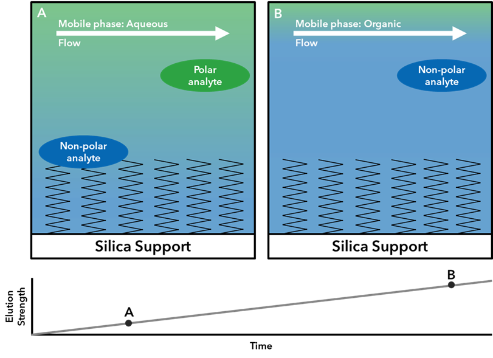
```

Many PFAS of interest are water soluble but have significant non-polar carbon-fluorine tails that make reverse phase LC a suitable choice for separation. However, some PFAS with significant polarity, for example, ultra-short PFAS without a long carbon-fluorine tail, are not retained by the stationary phase and perform poorly using these methods. A plethora of LC methods for the separation of PFAS are available from academic, commercial, industrial, and government labs, including modifications for the analysis of shorter and longer-chain PFAS. While these methods are typically designed for targeted analysis of PFAS, they remain suitable for use in NTA methods provided that chemical space is considered (e.g., short-chain methods are used when interested in short-chain PFAS).  

#### Ionization 

Mass spectrometry techniques perform their analysis of chemicals based on mass-to-charge (m/z), requiring chemicals to be in an ionized state (i.e., have a charge). The most common ionization technique used for the analysis of PFAS with LC-HRMS is electrospray ionization (ESI). This is a *soft ionization* technique, meaning it introduces little energy to a molecule, producing a molecular ion and few fragment ions. This contrasts with highly fragmentary *hard ionization* techniques used in gas chromatography.   

In ESI, mobile phase from the LC travels through a fine needle at a high voltage to produce a spray of charged droplets. The polarity of the applied voltage can either be positive or negative and is chosen based on the properties of the analytes of interest. The ionization efficiency of any given analyte is impacted by its chemical structure, including its hydrophobicity, molecular weight, and certain chemical moieties. Analytes most compatible with ESI are those that readily form ions in solution (e.g., acids and bases) or those that can be induced with charge. 


> **Bases** are ionized in solution at lower pH values and form positively-charged ions (cations). Common bases include amines, ketones, and other functional groups which can act as proton acceptors.  
>
> **Acids** are ionized in solution at higher pH values and form negatively-charged ions (anions). Common acids include alcohols, carboxylic or sulfonic acids, and other functional groups which an act as proton donators.  

After charged droplet formation, evaporation of solvent due to high temperatures leads to the production of individual, desolvated ions that enter the mass spectrometer for mass analysis. This process is illustrated in **Figure 9** below.  

```{r, echo=FALSE, out.width="75%", fig.cap="**Figure 9.** Mechanism of electrospray ionization."}

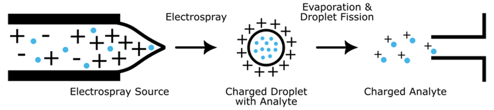
```

Solution chemistry and sample matrix play a significant role in the efficiency of ionization in ESI. Different mobile phase additives can be used to alter both chromatographic performance and the efficiency of ionization. Common mobile phase additives include ammonium acetate, ammonium formate, formic acid, and acetic acid. The choice of mobile phases additive to use is dependent on the chromatographic method and on the acid-base characteristics of the chemical space of interest. Mobile phase choice also impacts ionization, with more highly organic (non-polar) mobile phase compositions yielding better ionization.   

Sample matrix can play a significant role in ionization efficiency. Matrix effects are due to co-eluting compounds in samples that compete for available charge or otherwise alter the process of ionization. Matrix effects can be reduced with improved sample preparation or dilution and can be identified through the use of isotopically-labeled internal standards.   

During ionization, additional artifact ions can be generated alongside or in place of the molecular ion of the analyte of interest.   

* **Adduct ions** are formed when additional components of the system form a complex with the analyte.  
* **In-source fragments** occur when the energy from ionization causes the analyte molecule to break apart.  
* **Dimers (and other multimers)** occur when an analyte complexes with one or more molecules of itself.  

The identification of adducts, in-source fragments, and multimers can be helpful during annotation, structural elucidation, and assignment of chemical identity. Various software or [calculators](https://fiehnlab.ucdavis.edu/staff/kind/metabolomics/ms-adduct-calculator/) can be used to identify adducts and multimers in MS data. Identification of in-source fragments often requires understanding of the typical behaviors of the studied analytes and the fragments they produce.  

As an example, the PFAS hexafluoropropylene dimer acid (HFPO-DA, GenX), exhibits all of the in-source artifacts described above, as shown in **Figure 10** below. In this spectrum of GenX, the molecular ion at 329 Da is significantly less abundant than the dimers, adduct, and in-source fragments generated during ionization. Because of the relatively low abundance of molecular ion for GenX targeted analysis methods developed by EPA use the in-source fragment at 285 Da as the precursor ion in place of the molecular ion.


```{r, echo=FALSE, out.width="75%", fig.cap="**Figure 10.** MS1 spectra of GenX using ESI negative with ammonium acetate as the mobile phase additive. [Image adapted from Mullin *et al*. (2020)](https://www.sciencedirect.com/science/article/pii/S0165993619302341?via%3Dihub)."}

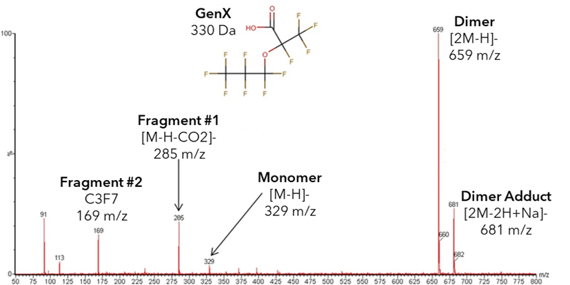
```

For the analysis of PFAS most methods utilize ESI operated in negative ionization mode with ammonium acetate used as a mobile phase additive. Many PFAS, including those of historical significance that are included in targeted analysis methods, are strong acids that are readily deprotonated in solution. Though, newer methods employ ESI+ to examine cationic PFAS or other ionization methods to examine neutral or zwitterionic PFAS. 


#### Mass Analysis  

Mass analyzers are what distinguish the different types of mass spectrometers, although all utilize applied electromagnetic fields to manipulate the movement ions based on their mass-to-charge ratio. Notably, mass analyzers only separate or manipulate ions based on their m/z and are *not* necessarily detectors. Mass spectrometers are often comprised of one-or-more mass analyzers and a detector. A variety of mass analyzers exist and have been described and compared in detail elsewhere (see Additional Resources below).  

**Mass analyzers** use applied electromagnetic fields to manipulate, and ultimately separate generated ions based off their mass-to-charge (m/z).  

**Detectors** used in mass spectrometers include electron multipliers which use dynodes to convert the ions into electrons and amplify the output so that it can be measured with standard electronics. Some mass-spectrometers, including Orbitraps described below, combine the detection and mass analysis while measuring ion-oscillations within a trap cell.   

Using multiple mass analyzers in a single instrument is very common in modern platforms and is commonly called **tandem mass spectrometry**, with a few common configurations.  

**Triple quadrupole mass spectrometers** use three successive quadrupoles to filter and fragment ions. These platforms are heavily employed for targeted quantitative analysis. The general mechanism of action for triple quadrupole mass spectrometers is:  


1. The first quadrupole (Q1) acts as a filter to select ions for fragmentation.
2. The second quadrupole (Q2) fragments selected precursor ions from Q1 into product ions.
3. The final quadrupole (Q3) acts as a filter to select ions after fragmentation.

**High Resolution Mass Spectrometers** are most commonly configured similarly to triple quadrupoles but replace the final quadrupole mass analyzer with a high resolving power analyzer (e.g., able to distinguish masses that differ by 0.001 amu). The two most common types of high-resolution mass analyzers are: 

> **Quadrupole Time of Flight (QTOF) mass spectrometers**: which determine molecular masses based on how long they take to traverse a long flight tube.   
>  
>  
> **Orbitrap mass spectrometers**: which collect ions in a trap cell and determine ion masses based on their oscillation frequency in the trap.  

The general mechanism of action for QTOF and Orbitrap mass spectrometers is: 

1. A quadrupole mass analyzer that acts as a filter to select ions.  
2. A collision cell that fragments precursor ions into product ions.  
3. A time-of-flight (TOF) or ion trap (Orbitrap) mass analyzer with high resolving power that separates ions based on their m/z.  

High-resolution mass spectrometers are commonly employed for NTA since their mass measurement accuracy permits the advanced data processing discussed later in this toolkit. 


<div class="alert alert-success" role="alert">
**Additional Resources**  
Haag, A.M. Mass Analyzers and Mass Spectrometers. *In: Mirzaei, H., Carrasco, M. (eds) Modern Proteomics – Sample Preparation, Analysis and Practical Applications. Advances in Experimental Medicine and Biology*, **vol 919.** https://doi.org/10.1007/978-3-319-41448-5_7  
Li C., Chu S., Tan S., Yin X., Jiang Y., Dai X., Gong X., Fang X., Tian D.. Towards Higher Sensitivity of Mass Spectrometry: A Perspective From the Mass Analyzers. *Front Chem*. **9** (2021).  https://doi.org/10.3389/fchem.2021.813359  
https://www.acdlabs.com/blog/a-beginners-guide-to-mass-spectrometry-mass-analyzers/ </div>


#### Mass Spectra
The main output of a mass spectrometer is a mass spectrum, typically represented as a plot of the m/z value versus intensity of the measured ions. Mass spectra display:

* The m/z of ions.   
* The relative abundance of each ion.  

The m/z measured and ion abundance can ultimately help to elucidate:   

* The structure of each feature.  
* The concentration of each feature.   


Different types of spectra can be generated depending on the type of experiment or scan being performed by the mass analyzer. Common acquisition methods are summarized in **Figure 11**.

```{r, echo=FALSE, out.width="75%", fig.cap="**Figure 11.** Types of acquisition methods used by triple quadrupole mass spectrometers. Image adapted from Agilent Technologies."}

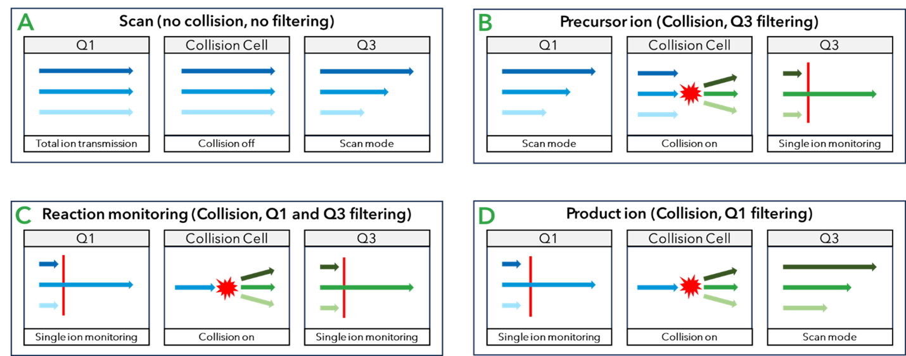
```

When using QTOF or Orbitrap mass spectrometers the Q3 filtering step can return a full mass spectrum, so methods are defined primarily by the precursor selection process. The two main types of acquisition methods used in NTA are defined below and illustrated in **Figure 12**. 

```{r, echo=FALSE, out.width="75%", fig.cap="**Figure 12.** Comparison of data dependent and data independent acquisition methods for NTA. Image adapted from [Kransy and Huang (2021)](https://pubs.rsc.org/en/content/articlelanding/2021/mo/d0mo00072h)."}

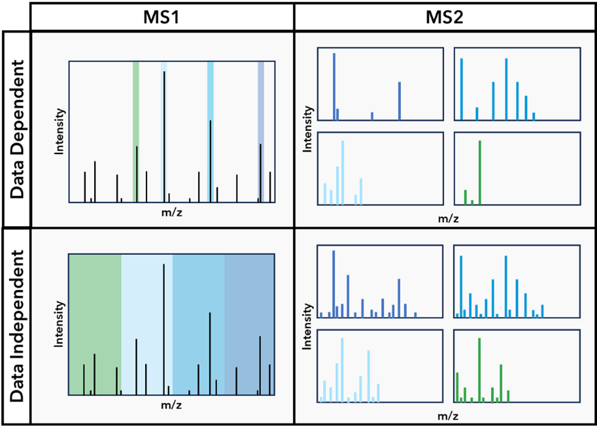
```

#### Data-Depdendent Acquisition (DDA)

Data-dependent acquisition (DDA, sometimes “information dependent acquisition” - IDA) uses successive scan and reaction monitoring steps to collect both MS1 (precursor ion) and MS2 (fragment ion) information such that both MS and MS/MS scans are interwoven. The general process for DDA is:

1. Acquire MS1-level spectra.  
2. Selectively isolate and fragment precursor ions.  
3. Measure MS/MS fragmentation spectra.  
4. Repeat.  

DDA methods can be optimized to control the exact time spent on step #1 and step #2 to ensure that sufficient MS1 and MS2-level data can be acquired across the entire chromatographic run where analytes are being introduced into the mass spectrometer. 

Because NTA methods are generalized to measure a larger chemical space, it is largely impossible to collect MS2-level (fragmentation) data for all precursor ions observed using DDA methods. Therefore, precursor ions are selected for fragmentation based on their relative abundance, absolute abundance, and/or by pre-selection using inclusion lists (hence, data-dependent acquisition). The speed of conducting the steps in DDA is one of the distinguishing features between different instrument platforms and is also a key point of optimization for NTA methods. The time dedicated to MS/MS scans needs to be balanced between collecting MS/MS for molecular characterization and collecting MS1 scans across sample peaks for feature finding and/or quantitation.  

Specific parameters that can be optimized to control DDA efficiency include:  


> **Number of MS/MS Events**: The number of MS/MS events per precursor scan (e.g., Top 2 vs Top 12).    
> **Repeat count**: How many MS/MS scans to collect for each “chosen” precursor (e.g., 1 MS/MS scan per precursor).   
> **Exclusion duration / Exclusion Window**: Period of time to avoid collecting MS/MS for a precursor again (e.g., after this scan ignore this precursor for the next 30s).   
> **Mass Width of Exclusion**: Ignore precursor masses within a certain mass window (e.g., select only monoisotopic precursor mass).   
> **Targeted Inclusion / Exclusion**: Target or exclude specific masses from selection (e.g., Always collect data from high priority PFAS ions, regardless of abundance; ignore known background ions).  

One approach to improve coverage while having a limited number of MS2 scans is to use iterative DDA methods. This method records the precursor ions selected for MS2 in a single injection and excludes those precursor ions for selection in the next injection, allowing the number of precursor ions selected for fragmentation to increase with each successive injection. Some instrument control software offers built-in iterative DDA acquisition methods including the [vendor-neutral IonDecon software](https://innovativeomics.com/software/iondecon/) produced by Innovative Omics. The data processing workflow described here is applicable to DDA-style data and is the preferred data type for this workflow. 

#### Data-Independent acquisition

Data-independent acquisition (DIA) methods do not select specific precursors, and instead generate fragmentation spectra from mass ranges in an unbiased manner. This technique (and its variants) has been referred to with a variety of names including Sequential Windowed Acquisition of all Theoretical fragment ions (SWATH), All-Ion Fragmentation, MSE, or MS/ALL. For DIA, the primary tradeoff is between scan frequency and the mass isolation window. Using a narrow isolation window (e.g., 20 m/z) gives cleaner spectra with fewer possible precursors but results in a very low scan density, as more individual windows need to be scanned for complete coverage. Wider scan windows (e.g., 200 m/z) allow more frequent collection of spectra, but  become increasingly confounded by fragments from multiple precursors. Because fragmentation spectra generated by DIA methods can contain fragments from many molecules, they often require deconvolution to identify the relationship of fragment ions to one another and to precursor ions, which can increase the time and complexity of data processing. Many open source software are not compatible with any or all DIA-style data. The primary data processing software used here (mzmine) is compatible with only select DIA data. 

#### QA/QC Considerations for Data Acquisition
As with sample collection and preparation it is important to include various QA/QC samples for instrument and method performance. Common elements include the use of various blanks and controls summarized in **Table 7**.

```{r, echo=FALSE}
library(knitr)
library(kableExtra)
FluoroMatchOutput2=read.csv("C:\\Users\\HWHITEHE\\OneDrive - Environmental Protection Agency (EPA)\\Profile\\Desktop\\General Work\\Manuscripts\\Translational\\Toolkit\\docs\\Tables\\QAQC3.csv",check.names=FALSE)

FluoroMatchOutput2 %>%
kable(caption ="**Table 7.** QA/QC samples to include during data acquisition.",format="html", align="c",html_font="Lato") %>%
kable_styling(full_width=F, html_font= "Lato", bootstrap_options=c("striped", "hover","responsive"))%>%
footnote(general= "*A suitable n is determined by a variety of factors including sample matrix and response, where especially complex matrices or those with significant analyte abundance should have more solvent blanks included in the sequence. Reasonable values for n may be 5, 10, 20, or more for larger batches.")
```

#### Analytical Sequence and Run Order
Analytical sequence and run order are [defined in detail by BP4NTA](https://nontargetedanalysis.org/reference-content/methods/data-acquisition/#analytical-sequence), but can be summarized as the combination of the study samples and QA/QC samples injected and analyzed by the instrument. Careful design of analytical sequences and the order of study and QA/QC samples within each batch is critical to minimize the effect of variable method and instrument performance within and across batches. Aspects to consider when building analytical sequence and run order are described in **Table 8**. 

```{r, echo=FALSE}
library(knitr)
library(kableExtra)
FluoroMatchOutput2=read.csv("C:\\Users\\HWHITEHE\\OneDrive - Environmental Protection Agency (EPA)\\Profile\\Desktop\\General Work\\Manuscripts\\Translational\\Toolkit\\docs\\Tables\\QAQC4.csv",check.names=FALSE)

FluoroMatchOutput2 %>%
kable(caption ="**Table 8.** Aspects to consider when building an analytical sequence and run order.",format="html", align="c",html_font="Lato") %>%
kable_styling(full_width=F, html_font= "Lato", bootstrap_options=c("striped", "hover","responsive"))
```


##  NTA Data Processing Workflow   

Much of study design, sample collection, sample preparation, and data acquisition can make use of methods and approaches used in targeted analysis of PFAS. Data processing, however, proceeds very differently for NTA studies and cannot rely on the same approaches used in targeted analyses. Data processing often requires the most time and effort for NTA studies to translate raw LC-HRMS data to identified chemicals. The workflows and tools used for data processing then have a significant effect on the results generated for an NTA study. Here, all ROAR data was processed using the data processing workflow shown in **Figure 13**. 

```{r, echo=FALSE, out.width="100%", fig.cap="**Figure 13.** Data processing workflow used to process ROAR data."}
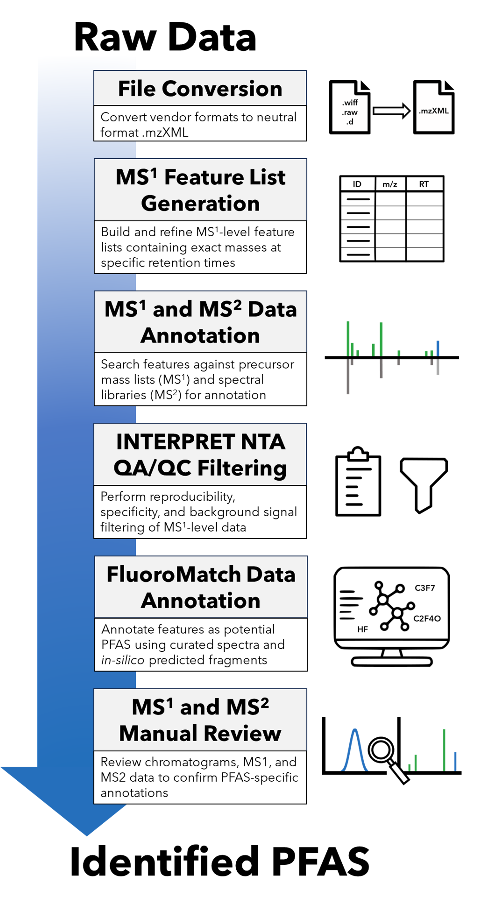
```

This workflow relies on the use of tools and software that are vendor-neutral and open source. This means that regardless of instrument used the workflow can be implemented without the need to purchase software or additional resources. The workflow uses a combination of tools developed within ORD, like INTERPRET NTA, CompTox Chemicals Dashboard, and the Analytical Methods and Open Spectra (AMOS) database, as well as free-to-download tools like mzmine, FluoroMatch and SIRIUS. The use of each tool, including specific protocols used, are detailed in the following sections and summarized in **Appendix C**.

\newpage
### Data Conversion (MSConvert)
MSConvert is a tool packaged within [ProteoWizard](https://www.nature.com/articles/nbt.2377), a third-party, open source software suite designed to support proteomics research. MSConvert can be used to convert vendor-specific file formats into vendor-neutral formats that can be utilized by other NTA software and tools. MSConvert offers conversion into a variety of file types including .ms2, .mzML, and .mzXML, among others. During conversion, a variety of parameters or thresholds can be set to further refine or isolate the data (e.g., retention time and scan filtering, number of data points). Similar parameters or thresholds are also available in downstream data processing software (mzmine). Here, MSConvert is used to take the raw data files into .mzXML files that can be imported into mzmine. The parameters used for MSConvert to support importing HRMS data into mzmine are summarized in **Appendix D**.

> **Software download link:** https://proteowizard.sourceforge.io/download.html  
>	**Version used:** 3.0.23226  
>	**Documentation:** https://proteowizard.sourceforge.io/tools/msconvert.html  

<div class="alert alert-success" role="alert">
**Relevant publication:** Chambers, M., Maclean, B., Burke, R. *et al.* A cross-platform toolkit for mass spectrometry and proteomics. *Nat Biotechnol* **30**, 918–920 (2012). https://doi.org/10.1038/nbt.2377 </div>  

#### MSConvert Protocol

>**A. Open MSConvert**  
>
>  * Navigate to the ProteoWizard installation folder and open the file named *“MSConvertGUI.exe”*
>  * The software should open in a new window, as shown in **Figure 14** below  
```{r, echo=FALSE, out.width="100%", fig.cap="**Figure 14.** MSConvert GUI."}
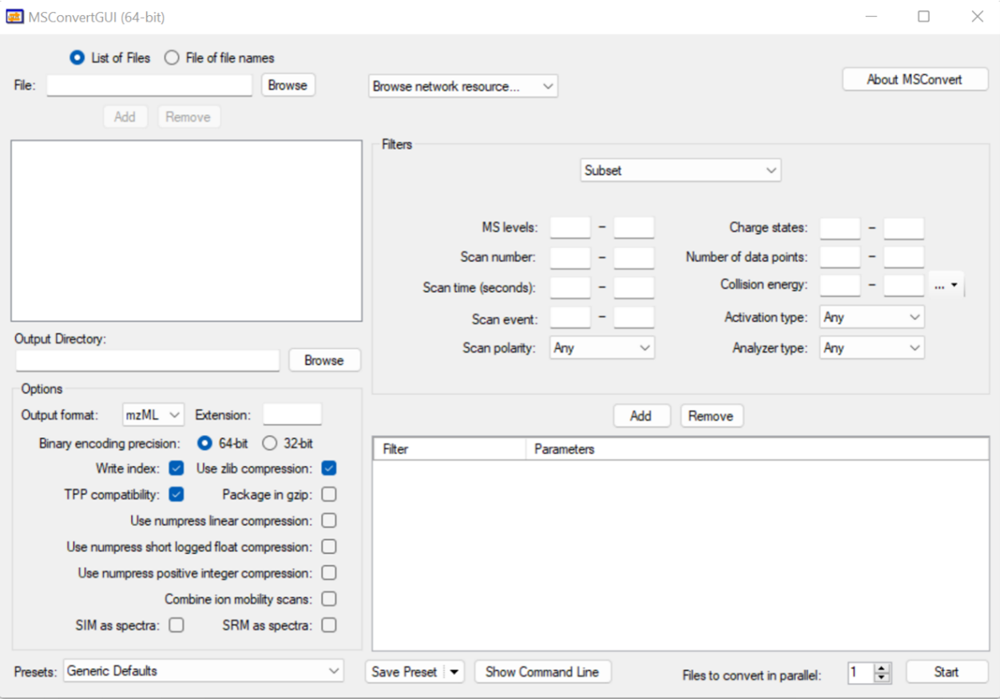
```

>**B. Import data files**  
>
>  * Select “Browse” in the top left and navigate to the file location 
>    * If importing more that one file, the files will automatically be brought into the import box below
>    * If importing more than one file, the files will automatically be brought into the import box. If importing a single file, select “Add” to bring it in

>**C. Select output directory**  
>
>  * Click “Browse” in the middle left and navigate to the desired output location

>**D. Under “Options”**  
>
>  * Adjust Output Format to .mzXML using the drop-down box 
>  * Ensure 64-bit, Write Index, TPP compatibility, and Use zlib Compression are selected


>**E. Under "Filters"**  
>
>  * In the drop-down box select "Peak Picking"     
>     * In the "Algorithm" drop-down box ensure "Vendor…" is selected  
>     * In *MS levels* input a "1" in the left box and nothing in the right box  
>     * Click "Add" in the middle of the page and the Peak Picking filter should appear in the white box underneath  
>
>  * In the drop-down box select "Subset"  
>     * In *MS levels* input a "1" in the left box and nothing in the right box  
>     * In *Number of data points* input a “2” in the left box and nothing in the right box  
>     * If the raw data contains both negative and positive polarity modes in a single file, use the _Scan polarity_ drop-down to select a single polarity    
>     * Click "Add" in the middle of the page and the Peak Picking filter should appear in the white box underneath  

<div class="alert alert-info" role="alert">
**Optional:** To return to these parameters quickly click the down-arrow on the "Save Preset" button found in the bottom-middle and select "Save Preset As", give the preset a name and hit "Ok" to save.</div>

Begin conversion by hitting “Start”. A new window should open, as shown in **Figure 15**, that shows the conversion progress for each individual file. Any errors will show in the progress bar and in the text below. 

```{r, echo=FALSE, out.width="75%", fig.cap="**Figure 15.** MSConvert status window during conversion.", fig.align = "center"}
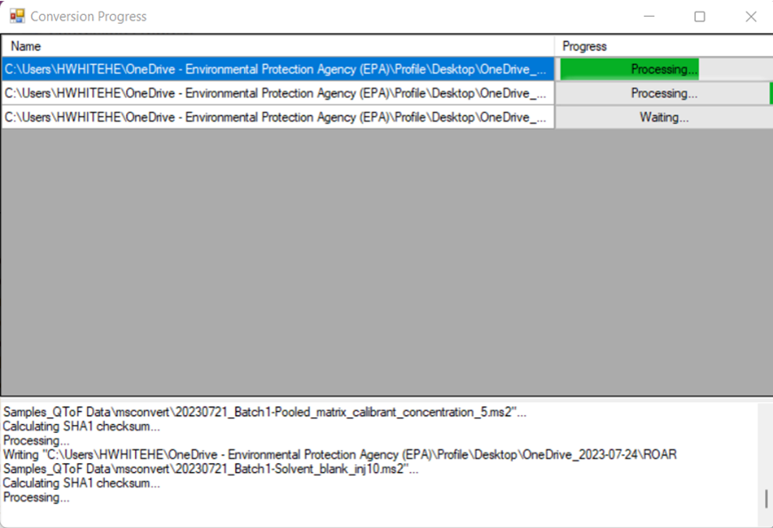
```

##### Final things to know:

* These parameters have been tested and work well with DDA-acquired HRMS data collected in Centroid mode. Additional filters or adjustments to the filters here may be necessary when working with DIA or with Profile mode data.

* A single raw data file containing scans with both positive and negative polarity data should have the positive and negative mode scans isolated prior to feature list building with mzmine. Isolate scans by polarity by running MSConvert twice using the Subset Filter for Scan Polarity

* Data generated by SCIEX instruments may have both .wiff and .wiff2 raw data files acquired (in addition to the .wiff.scan and .timeseries.data files also generated). Both .wiff and .wiff2 files are compatible with this version of MSConvert and the described protocol. Older versions of MSConvert do not support .wiff2 files. Note that the .wiff or .wiff2 files need to be in the same folder as their .wiff.scan and .timeseries.data files for proper conversion  


\newpage
### MS1 Feature List Building and MS2 Spectral Searching (mzmine)
[mzmine](https://www.nature.com/articles/s41587-023-01690-2) is a third-party, open source software that can be used to generate peak lists from NTA data. mzmine can intake various vendor-specific and neutral file types and perform peak picking, feature identification, alignment, recursion (gap-filling), and feature filtering. mzmine can be used to examine both MS1 and MS2-level data but is designed primarily for DDA-style MS2 data, though, some DIA-style data can be utilized in mzmine. mzmine can also be used to perform feature annotation using MS1 precursor mass searches and MS2 spectral library searches. The modules and parameters used for mzmine are summarized in **Appendix E**.

> **Software download link:** https://github.com/mzmine/mzmine/releases  
>	**Version used:** 3.9.0  
>	**Documentation:** https://mzmine.github.io/mzmine_documentation/index.html

<div class="alert alert-success" role="alert">
**Relevant publication:** Schmid, R., Heuckeroth, S., Korf, A. *et al*. Integrative analysis of multimodal mass spectrometry data in MZmine 3. *Nat Biotechnol* **41**, 447–449 (2023). https://doi.org/10.1038/s41587-023-01690-2. </div>

#### mzmine Protocol

**1. Open mzmine and Import Raw Data**  

>**A. Navigate to the downloaded mzmine folder**  
>
>  * Select “MZmine.exe”   
>  * After opening the window shown in **Figure 16** should appear (note that this may take a few moments to open)
```{r, echo=FALSE, out.width="100%", fig.cap="**Figure 16.** mzmine main window.", fig.align = "center"}
knitr::include_graphics("Figures/MZMineGUI.png")
```
 
>**B. Import raw data files**  
>
>  * On the top ribbon click on "Raw Data Methods" then on "Raw Data Import" 
>  * A folder navigator box should open to allow navigation to the folder where the mzXML files from MSConvert are stored  
>  * Select all files (i.e., all sample types like blanks, spiked, and study samples should be imported) and press "Open" 
>  * The raw data files will begin to import, with their progress indicated in the 'Tasks" panel on the right/middle of the screen  
>  * Once a file reaches 100% it's file name should appear in the left panel under the *"MS Data Files"* 

**2. Perform Crop Filtering**  
Crop filtering is defined in the mzmine documentation as:  

<div class="alert alert-info" role="alert">
*“This module performs cropping of raw data files based on the user-defined parameter range defined by user. This allows user to obtain a new raw data file that contains only the information from the range of interest.”* </div>  

In this protocol crop filtering is used to remove any scans in the imported .mzXML files that may be empty (i.e., no data within the scan either from acquisition or from data conversion thresholds used). Crop filtering may also be useful when only a subset of data (a specific mass or retention time range) is desired for processing; for example, to remove wash or equilibration time from a file.

>**A. Open the dialog box**  
>
>  * On the top ribbon click on "Raw Data Methods" then "Raw data filtering" then "Crop filter"   
>  * This should open a new dialog box as shown in **Figure 17** below 
```{r, echo=FALSE, out.width="100%", fig.cap="**Figure 17.** Crop filter dialog box in mzmine.", fig.align = "center"}
knitr::include_graphics("Figures/MZMineCrop.png")
```

>**B. Set parameters**  
>
>  * Select the raw data files to perform Crop Filtering on using the drop-down box. Here it is easiest to select "All Raw Data Files" from the drop-down box   
>  * Set any desired *scan filters*. Selecting the box "show" should extend the window to include additional parameters to set as described below.  
>     * **Scan number:** If it is known that above/below a certain scan number only contains data that are not important for downstream processing they can be filtered here. Typically, this is more practically performed using a retention time range which can be set below.  
>     * **Retention time:** This retention time filter can be used to remove any data collected before/during the early-eluting “dead time” peaks, which contain unretained chemicals, and during/after the wash step, when the column is flushing, by setting a lower and upper retention time (in minutes).  
>     * **MS level:** This controls which MS levels should be filtered, here it is best to set to "All MS Levels".  
>     * **Polarity:** This can be used when both negative and positive ionization mode data are collected to isolate just a single ionization mode.   
>     * **Spectrum type:** Allows a choice to select different types of acquired data (Centroided, Profile, Thresholded) to process.  
>  * Set the *m/z* for filtering. If all m/z values are of interest, it is best to select the "auto range" button which will use the minimum and maximum observed m/z values across the selected samples to ensure all m/z values are included  
>  * Finally, select the *filter out empty scans* option is selected to ensure empty MS1 and MS2 scans are removed during Crop Filtering  
>  * When done, press "OK". Crop Filtering then begins, and the progress can be tracked in the "Tasks" panel  
>  * When progress is complete new files will appear in the "MS data files" tab that have their name appended with "filtered" 

**3. Perform Mass Detection**  
Mass detection is defined in the mzmine documentation as:

<div class="alert alert-info" role="alert">
*“The mass detection module generates a mass list (i.e., list of m/z values and corresponding signal intensities) for each scan, in each raw data file. During the mass detection, noise filtering is performed based on a user-defined threshold. Additionally, profile raw data are centroided.”* </div>

In this protocol, mass detection is performed twice, once for MS1-level data and once for MS2-level data to allow the selection of an appropriate noise level for MS1 and MS2 data separately.  

>**A. Open the dialog box**  
>
>  * On the top ribbon click on "Raw Data Methods" then Peak Detection" then "Mass Detection"   
>  * This should open a new dialog box as shown in **Figure 18** below 
```{r, echo=FALSE, out.width="100%", fig.cap="**Figure 18.** Mass detection dialog window in mzmine.", fig.align = "center"}
knitr::include_graphics("Figures/MZMineMassDetect.png")
```

>**B. Set parameters** 
>
>  * Select the raw data files to perform Mass Detection on using the drop-down box. Here it is easiest to select "File name pattern" then "select". This will open a new dialog box and "*filtered" should be entered. This will then select all files that have "filtered" in the name with any text before   
>  * Set any desired *scan filters* by selecting the box "Show" which will extend window to include additional parameters. These scan filters will match those seen in the Crop Filtering step. **Note:**  any scan filters set in previous steps should be chosen again here otherwise an error will be given. 
>  * Choose a *mass detector* from the drop-down box. “Centroid” is the default and appropriate for Centroid mode data. Next, click on "setup" to set additional mass detection parameters, which should open a second dialog window
>     * This window contains the most important parameter to set during mass detection: **noise level**. The noise level is defined by mzmine as *"the minimum intensity level for a data point to be considered part of a chromatogram. All data points below this intensity level are ignored."*  
>     * It is recommended that for each new set of data to spend time examining scans with changing noise thresholds to determine an optimal noise threshold. This can be done using the “show preview” box as shown in **Figure 19**
```{r, echo=FALSE, out.width="100%", fig.cap="**Figure 19.** Noise level preview window. When 'Show preview' is selected the window on the right will appear and allow selection of a data file and scan to be displayed in the plot. The plot shows all data points in the scan and peaks that are detected using the current noise level are shown by the red dots at the tops of the peak.", fig.align = "center"}
knitr::include_graphics("Figures/MZMineNoise.png")
```
>     * Choose to turn on or off isotope detection using the *detect isotope signals below noise level*. When checked this will take the masses detected and then search for any isotopic peaks of these masses, regardless of the noise level, allowing small isotopic peaks to be detected  
>  * Once an optimal noise level has been set press "OK" to return to the original dialog box. Then press "OK" to begin Mass Detection. Progress can be tracked in the "Tasks" panel
>  * When complete, no additional files are generated in, rather, each “filtered” file in the “MS data files” has been updated to reflect detected masses, as shown in **Figure 20** below
```{r, echo=FALSE, out.width="100%", fig.cap="**Figure 20.** Raw data overview displaying scans that contain detected masses after mass detection. These are identified with a blue check mark within a circle. Scans that did not contain any detected masses will appear as a red X in a circle. The raw data oerview can be opened by double-clicking any file in the “MS data files” tab.", fig.align = "center"}
knitr::include_graphics("Figures/MZMineMassAfter.png")
```

**4. Perform Chromatogram Builder**  
The chromatogram building module is described in the mzmine documentation as: 

<div class="alert alert-info" role="alert">
*“The module essentially builds an extracted ion chromatogram for each m/z value that was detected over a minimum number of consecutive scans in the LC-MS run. Each data file is processed individually. The mass list associated to each MS1 scan in a data file (see Mass detection module) are taken as input and a feature list is returned as output.”* </div>  

In layman terms, building chromatograms allows the relationship of each scan to the next to be constructed and used for downstream processing. In this protocol chromatogram builder is performed on the MS1-level data to generate a feature list for each sample.  

>**A. Open the dialog box**  
>
>  * On the top ribbon click on “Feature detection" then "LC-MS" then "ADAP Chromatogram Builder" 
>  * This should open a new dialog box as shown in **Figure 21** below 
```{r, echo=FALSE, out.width="100%", fig.cap="**Figure 21.** Chromatogram Builder dialog box.", fig.align = "center"}
knitr::include_graphics("Figures/MZMineBuilder.png")
```

>**B. Set parameters** 
>
>  * Select the raw data files to perform Mass Detection on using the drop-down box. Here it is easiest to select "File name pattern" then "select". This will open a new dialog box and "*filtered" should be entered. This will then select all files that have "filtered" in the name with any text before   
>  * Set any desired *scan filters* by selecting the box "Show" which will extend window to include additional parameters. These scan filters will match those seen in the Crop Filtering step. **Note:**  any scan filters set in previous steps should be chosen again here otherwise an error will be given  
>     * **Ensure the _MS level filter_ is set to MS1 only to generate feature lists for MS1-level data**  
>  * Set the *minimum consecutive scans* which defines the minimum number of times a mass should be observed sequentially in order to be built into a chromatogram. This value should be set based on the number of expected data points that were collected across chromatographic peaks
>  * Set a *minimum intensity for consecutive scans* which is defined as the summed value these consecutive scans must exceed in order for the mass to be built into a chromatogram. This value is set based on the intensities observed for features in a chromatogram and is best set by studying the peak heights of MS1-level data. This can be assessed while examining Noise level during Mass detection
>  * Set a *minimum absolute height*. This value is set based on the highest point in a chromatogram and is best set by studying the peak heights of MS1-level data. This can be assessed while examining Noise level during Mass detection
>  * Set the *m/z tolerance*. This is the maximum difference that any m/z can be for it to be built into the same chromatogram  
>     * There are two values, one given in m/z and another in ppm. mzmine takes whichever value is greater for any given mass. These values should be set based on reasonable expectations of HRMS data and based on an understanding of the instrument used and its typical mass accuracy. Normal values range from 0.001-0.002 Da and 3-10 ppm
>  * When done, press "OK". Chromatogram builder begins and the progress can be tracked in the "Tasks" panel at the bottom  
>  * When a file reaches 100% a new peak list appears in the "Feature lists" tab on the left side of the screen. Wait for all files to finish before moving onto the next processing step. 


**5. Perform Chromatogram Resolving**  
The chromatogram resolving module is described in the mzmine documentation 

<div class="alert alert-info" role="alert">
*“During the EICs building, overlapping and partially co-eluting features are retained as single features in the feature list. As a local minimum in the EIC trace might correspond to the valley between two adjacent, partially-resolved peaks, the Local minimum resolver utilizes such minima to split "shoulder" LC peaks into individual features (i.e., chromatographic resolving).”* </div>  

In layman’s terms Chromatogram Resolving is performed to separate a chromatogram (representing a single mass across many retention times) into individual peaks (a single mass at select retention times to represent a single peak). During Chromatogram Resolving the MS2 level data is paired to the MS1-level features so that any peak (a single mass at select retention times) can be connected to any MS2 scans collected for that mass. 

>**A. Open the dialog box**  
>
>  * On the top ribbon click on "Feature detection" then "Chromatogram resolving" then "Local minimum resolver" 
>  * This should open a new dialog box as shown in **Figure 22** below 
```{r, echo=FALSE, out.width="100%", fig.cap="**Figure 22.** Local minimum chromatogram resolver dialog box in mzmine.", fig.align = "center"}
knitr::include_graphics("Figures/MZMineResolver.png")
```

>**B. Set parameters** 
>
>  * Select the feature lists to perform chromatogram resolving on using the drop-down box. Here it is easiest to select "All feature lists"   
>  * Select the *MS/MS scan pairing* check box. When selected this feature takes the detected MS2-level masses and merges the respective scans to the MS1-level data contained in the feature lists. Once this box is selected click the "Show" button to expand the parameters for MS/MS scan pairing  
>     * Set the *MS1 to MS2 precursor tolerance*. This is the maximum difference that the precursor mass for an MS2 scan can be to the MS1 mass in the feature list 
>        * There are two values, one given in m/z and another in ppm. mzmine takes whichever value is greater for any given mass. These values should be set based on reasonable expectations of HRMS data and based on an understanding of the instrument used and its typical mass accuracy  
>     * Set the *retention time filter* to limit the retention time range for pairing MS2 scans to MS1 features. Select "Use tolerance" in the first drop-down and "absolute" in the next drop down and input a retention time range (in minutes) in the dialog box  
>     * Optionally set a *minimum relative feature height* and a *minimum required signals* using their check boxes and dialog boxes
>     * **Note:** All other options relate to ion mobility data and can be used if ion mobility data is available  
>  * Set the *dimension* to "Retention time" using the drop-down  
>  * The remaining parameters are described briefly here but are described in greater detail in the mzmine documentation, which can be found [here](https://mzmine.github.io/mzmine_documentation/module_docs/featdet_resolver_local_minimum/local-minimum-resolver.html)  
>     * Set the *chromatographic threshold level*. This value reduces data points in each scan to improve search efficiency and is represented as a percentage. In general, the higher the value here the more data points removed is and the fewer the resulting peaks  
>        * mzmine documentation recommends starting with 90 or 95% and only decreasing as needed  
>     * Set the *minimum search range* for the dimension. When retention time was selected as the dimension this is defined as the minimum retention time window where the algorithm will search for peaks. Narrow retention time ranges can lead to cut-off peaks and large ranges can lead to poor resolution of peaks  
>        * A reasonable default value is 0.05. Refer to the mzmine documentation for additional information  
>     * Set a *minimum relative height*, which restricts the final feature list to only having peaks which are a certain percentage of the most-abundant peak in the chromatogram. When set to 0% all peaks are selected regardless of their relative height  
>     * Set the *minimum absolute height*, which can be equal to or near the noise threshold or minimum heights set during mass detection and chromatogram building
>     * Set the *min ratio of peak top/edge* which relates to the ratio of signal between the apex and sides of a peak  
>        * mzmine documentation recommends starting with a value between 1.7 to 2. See mzmine documentation for detailed discussion of this parameter
>     * Set the *peak duration range* for the dimension chosen. When retention time was selected as the dimension this is defined as the acceptable retention time widths of chromatographic peaks  
>        * This parameter should be set based on an understanding of the instrument, method, and analyte performance and is set as both a minimum and a maximum
>     * Finally, set the *minimum number of scans*, or points across a peak that should be observed to retain a peak  
>  * When done, press "OK". Resolving then begins and the progress can be tracked in the "Tasks" panel  
>  * When a file reaches 100% a new feature list appears in the "Feature lists" tab on the left side of the screen. Wait for all files to finish before moving onto the next processing step  


**6. Perform 13C Isotope Filtering**  
The 13C Isotope Filter module is described in the mzmine documentation as:

<div class="alert alert-info" role="alert">
*“The 13C isotope filter module aims at filtering out the features corresponding to the 13C isotopes of the same analyte. The algorithm considers each feature individually and checks for the presence of potential 13C-related peak(s) in the feature lists. When an isotope pattern meeting the user-defined tolerances (e.g., m/z, retention time [RT]) and requirements (e.g., monotonic shape) is found, the information is saved, and only the feature corresponding to the most intense isotope is retained in the feature list. It must be noted that 13C peaks are searched within the feature list, and not in the raw data.”* </div>  

In layman's terms this processing step will identify isotopic peaks using an algorithm. After identifying isotopic peaks of a monoisotopic mass, mzmine will then record the charge state and the isotope ratios in the feature information of the monoisotopic peak and then remove the features of isotopes from the feature lists.  

>**A. Open the dialog box**  
>
>  * On the top ribbon click on "Feature list methods" then "Isotopes" then "13C Isotopes filter" 
>  * This should open a new dialog box as shown in **Figure 23** below 
```{r, echo=FALSE, out.width="100%", fig.cap="**Figure 23.** 13C isotope filter dialog box in mzmine.", fig.align = "center"}
knitr::include_graphics("Figures/MZMine13Iso.png")
```

>**B. Set parameters** 
>
>  * Select the feature lists to perform 13C Isotope Filtering on using the drop-down box. Here it is easiest to select "File name pattern" then "select". This will open a new dialog box and "*resolved" should be entered. This will then select only files that have "resolved" in the name with any text before  
>  * Set a *m/z tolerance* that will be used to define the maximum distance that a feature can be from the expected distance for an isotopic peak
>     * There are two values, one given in m/z and another in ppm. mzmine takes whichever value is greater for any given mass. These values should be set based on reasonable expectations of HRMS data and based on an understanding of the instrument used and its typical mass accuracy  
>  * Set a *retention time tolerance* which defines the maximum time difference that a feature can be from the retention time of the monoisotopic peak to identify the feature as an isotopic peak  
>  * Ensure the *monotonic shape* box is selected. When selected this ensures that a monotonically decreasing height of an isotope pattern must be observed to identify a feature as an isotope
>  * Ensure the *representative isotope* is set to “Most intense" using the drop-down box. This option tells mzmine which feature to report as the monoisotopic mass, either the feature that is most intense or the lowest m/z  
>  * When done, press "OK". 13C isotope filtering then begins and the progress can be tracked in the "Tasks" panel  
>  * When a file reaches 100% a new feature list appears in the "Feature lists" panel on the left side of the screen. Wait for all files to finish before moving onto the next processing step  


**7. Perform Isotope Pattern Finder**  mzmine documentation as: 

<div class="alert alert-info" role="alert">
*“The module searches isotope patterns for each feature in selected feature lists by going back to the mass spectra. Starting from the feature m/z the algorithm will first backtrack any possible preceding isotope signals using a list of delta masses created from elements, their stable isotopes, and an m/z tolerance. In a second step, all picked potential isotope m/z values are used to search next isotope (with higher m/z). This is done for each charge state."* </div>  

In this protocol Isotope Pattern Finder is used to identify isotopes of elements that are anticipated to be present in the chemical classes measured and remove these isotope features from the feature lists. 

>**A. Open the dialog box**  
>
>  * On the top ribbon click on "Feature list methods" then "Isotopes" then "Isotope pattern finder" 
>  * This should open a new dialog box as shown in **Figure 24** below 
```{r, echo=FALSE, out.width="100%", fig.cap="**Figure 24.** Isotope pattern finder dialog box in mzmine.", fig.align = "center"}
knitr::include_graphics("Figures/MZMineIsoFind.png")
```

>**B. Set parameters** 
>
>  * Select the feature lists to perform Isotope Pattern Finder on using the drop-down box. Here it is easiest to select "File name pattern" then "select". This will open a new dialog box and "*deisotoped" should be entered. This will then select only files that have "deisotoped" in the name with any text before 
>  * Refine *chemical elements* by selecting which elements the finder will look for isotopes of. The default elements are H, C, N, O, S and additional elements can be selected from the "setup" option  
>  * Set a *m/z tolerance* that will be used to define the maximum distance that a feature can be from the expected distance for an isotopic peak
>     * There are two values, one given in m/z and another in ppm. mzmine takes whichever value is greater for any given mass. These values should be set based on reasonable expectations of HRMS data and based on an understanding of the instrument used and its typical mass accuracy  
>  * Next, set the *maximum charge* that should be considered when looking for isotope patterns. This can be set based on the classes of analytes and matrix being measured  
>  * When done, press "OK". Isotope Pattern Finder then begins and the progress can be tracked in the "Tasks" panel  
>  * When a file reaches 100% no new feature lists will appear, as isotopes found by Isotope Pattern Finder will be appended to the existing "deisotoped" feature lists


**8. Perform Alignment**  
The Join Aligner module is described in the mzmine documentation as: 

<div class="alert alert-info" role="alert">
*“This method aligns detected peaks in different samples through a match score. This score is calculated based on the mass and retention time of each peak and ranges of tolerance specified in the parameter setup dialog.”* </div>  

In this protocol Alignment is performed to create a single feature list that represents all features observed across all samples. 


>**A. Open the dialog box**  
>
>  * On the top ribbon click on "Feature list methods" then "Alignment" then "Join Aligner" 
>  * This should open a new dialog box as shown in **Figure 25** below 
```{r, echo=FALSE, out.width="100%", fig.cap="**Figure 25.** Join Aligner dialog box in mzmine.", fig.align = "center"}
knitr::include_graphics("Figures/MZMineAlign.png")
```

>**B. Set parameters** 
>
>  * Select the feature lists to perform Isotope Pattern Finder on using the drop-down box. Here it is easiest to select "File name pattern" then "select". This will open a new dialog box and "*deisotoped" should be entered. This will then select only files that have "deisotoped" in the name with any text before 
>  * Set a *m/z tolerance* that will be used to define the maximum distance that a feature can be from the expected distance for an isotopic peak
>     * There are two values, one given in m/z and another in ppm. mzmine takes whichever value is greater for any given mass. These values should be set based on reasonable expectations of HRMS data and based on an understanding of the instrument used and its typical mass accuracy  
>  * Set a *weight for m/z* which is defined by mzmine as *"This is the assigned weight for m/z difference at the moment of match score calculation between peak rows. In case of perfectly matching m/z values the score receives the complete weight."*
>     * The default weight for m/z is 20  
>  * Set a *retention time tolerance* which defines the maximum time difference that a feature can be from the next feature to be considered the same RT for alignment  
>     * For any compounds that have the potential for isomeric peaks to be present, this value should be set with the isomeric profiles in mind  
>  * Set a *weight for RT* which is defined by mzmine as *"This is the assigned weight for RT difference at the moment of match score calculation between peak rows. In case of perfectly matching RT values the score receives the complete weight."*  
>     * The default weight for RT is 10  
>  * When done, press "OK". Alignment then begins and the progress can be tracked in the "Tasks" panel  
>  * When Alignment is done a single feature list is generated that contains all the aligned features across all samples


**9. Perform Gap-Filling**  
Gap-filling is described in the mzmine documentation as: 

<div class="alert alert-info" role="alert">
*“When a feature cannot be identified/quantified in [a] certain sample [it] will be assigned a zero-intensity value during the feature alignment. This produces gaps in the aligned feature table, commonly referred to as missing values. There are a number of occasions where, due to suboptimal feature detection, a missing value is assigned even though the peak is actually present. Some chromatographic features in an aligned feature list may not be detected in every sample for several reasons… To account for this problem, the user can use the Peak finder module as a secondary, informed feature finding step. The gap-filling module (i.e., 'Peak finder' algorithm) aims at reducing false missing values and 'fill the gaps' by going back to the original raw data and re-integrating the peak area where the peak is expected.”* </div>  

This process can also be referred to as “recursive peak finding” in other software or tools. In layman’s terms, the goals of Gap-Filling is to take the existing feature list and return to raw sample data to ensure any gaps (samples where the feature was not identified in original mass detection) are due to a lack of a peak rather than a data processing limitation. 

>**A. Open the dialog box**  
>
>  * Select the aligned feature list then, on the top ribbon click on "Feature list methods" then "Gap-filling" then "Peak finder"  
>  * This should open a new dialog box as shown in **Figure 26** below 
```{r, echo=FALSE, out.width="100%", fig.cap="**Figure 26.** Gap-Filling dialog box in mzmine.", fig.align = "center"}
knitr::include_graphics("Figures/MZMineGap.png")
```

>**B. Set parameters** 
>
>  * If just the aligned feature list was selected in the main window then “as selected in main window” should be chosen. Otherwise, “specific feature lists” should be chosen to select just the aligned feature list  
>  * Set the *intensity tolerance*. Though the name seems to suggest a relation to the intensity of a peak this parameter is defined by mzmine as *"This value sets the maximum allowed deviation from expected shape of a peak in chromatographic direction"*. This parameter then sets a threshold for acceptable peak shapes
>     * The value is set as a percentage, with higher percentages leading to more non-ideal peak shapes being included in the gap-filled output. 10% is the default value  
>  * Set a *m/z tolerance* that will be used to define the maximum distance that a peak can be from the specific feature to be considered the same m/z for gap-filling
>    * There are two values, one given in m/z and another in ppm. mzmine takes whichever value is greater for any given mass. These values should be set based on reasonable expectations of HRMS data and based on an understanding of the instrument used and its typical mass accuracy  
>  * Set a *retention time tolerance* which defines the maximum time difference that a feature can be from the next feature to be considered the same RT for alignment  
>     * For any compounds that have the potential for isomeric peaks to be present, this value should be set with the isomeric profiles in mind  
>  * Finally, set the *minimum number of scans*, or points across a peak that should be observed to gap-fill a peak  
>  * When done, press "OK". Gap-Filling then begins and the progress can be tracked in the "Tasks" panel  
>  * When Gap-filling is done a single peak list is generated that contains all the gap-filled, aligned features across all samples
 


**10. Perform Duplicate Peak Filtering **  
Duplicate peak filtering is described in the mzmine documentation as: 

<div class="alert alert-info" role="alert">
*“Some features in the dataset can show duplicates, which appear during feature recognition and alignment of samples. The duplicates falsify the exploratory analysis of data and are removed in mzmine. This filter can help eliminate misaligned feature list rows after the gap-filling process.”* </div>  

Duplicate feature filtering is important to run following gap-filling to ensure any features whose mass and/or retention time were updated during gap-filling are still able to be considered unique (i.e., not within the same mass and retention time tolerance of another feature).

>**A. Open the dialog box**  
>
>  * Select the gap-filled, aligned peak list then on the top ribbon click on "Feature list methods" then "Feature list filtering" then "Duplicate peak filter" 
>  * This should open a new dialog box as shown in **Figure 27** below 
```{r, echo=FALSE, out.width="100%", fig.cap="**Figure 27.** Duplicate Peak Filtering dialog box in mzmine.", fig.align = "center"}
knitr::include_graphics("Figures/MZMineDupe.png")
```

>**B. Set parameters** 
>
>  * If just the aligned, gap-filled feature list was selected in the main window then “as selected in main window” should be chosen. Otherwise, “specific feature lists” should be chosen to select just the aligned, gap-filled feature list
>  * Set the *filter mode* which defines how the occurrences and signals from any duplicate features are combined. New average is the default mode  
>     * See the mzmine documentation for more detail on each mode  
>  * Set a *m/z tolerance* that will be used to define the maximum distance that a peak can be from the specific feature to be considered the same m/z for gap-filling
>    * There are two values, one given in m/z and another in ppm. mzmine takes whichever value is greater for any given mass. These values should be set based on reasonable expectations of HRMS data and based on an understanding of the instrument used and its typical mass accuracy  
>  * Set a *retention time tolerance* which defines the maximum time difference that a feature can be from the next feature to be considered the same RT for alignment  
>     * For any compounds that have the potential for isomeric peaks to be present, this value should be set with the isomeric profiles in mind  
>  * When done, press "OK". The Duplicate Peak Filter then begins and the progress can be tracked in the "Tasks" panel  
>  * When complete a single peak list is generated that contains all features that are unique, without duplicates 


**11. Perform MS1 Precursor Mass List Searches**  
Local Compound Database Search is described in the mzmine documentation as: 

<div class="alert alert-info" role="alert">
*“This method assigns identity to features according to their m/z. Additionally, retention time, mobility, and collision cross section (CCS) values can be provided to restrict the annotation... The user has to provide a database of m/z values (or neutral masses, formulae, SMILES strings to calculate m/zs from) and retention times in .csv format.”* </div>  

In this protocol this module is used to generate MS1-level precursor mass lists to annotate potential compounds of interest based on observed m/z values. Precursor mass lists can be built from existing chemical lists, like those on the [CompTox Chemicals Dashboard](https://comptox.epa.gov/dashboard/chemical-lists), from suspect screening lists, or from other studies/reports relevant to the analyte classes of interest.  

>**A. Open the dialog box**  
>
>  * Select the aligned, gap-filled, duplicate filtered feature list then on the top ribbon click on "Feature list methods" then "Annotation" then "Search precursor mass" then "Local compound database (CSV) search" 
>  * This should open a new dialog box as shown in **Figure 28** below 
```{r, echo=FALSE, out.width="100%", fig.cap="**Figure 28.** Precursor Mass List Search dialog box in mzmine.", fig.align = "center"}
knitr::include_graphics("Figures/MZMinePrecursor.png")
```

>**B. Set parameters** 
>
>  * If just the aligned, gap-filled, filtered feature list was selected in the main window then “as selected in main window” should be chosen. Otherwise, “specific feature lists” should be chosen to select just the aligned, gap-filled, filtered feature list  
>  * Next, use the database file to import a CSV that contains lists of compounds and their relevant information that can be used to perform the MS1 precursor matching  
>     * At a minimum, this file should contain a precursor m/z and a name for each chemical. Chemicals should be given in rows with columns given as the specific parameter (e.g. m/z or name). Additional columns can be included, such as those given as defaults in the dialog box  
>  * Select which columns are contained in the CSV file that was imported
>     * Check boxes tell mzmine which columns to check for  
>     * Column name (CSV) tells mzmine what the column is named in the imported file
>     * The data type (mzmine) column tells the user what data or information the column should contain
>     * Column names can be adjusted to match what is in the CSV file exactly to ensure accurate import
>  * Set a *m/z tolerance* that will be used to define the maximum distance that a peak can be from the specific feature to be considered the same m/z for gap-filling
>    * There are two values, one given in m/z and another in ppm. mzmine takes whichever value is greater for any given mass. These values should be set based on reasonable expectations of HRMS data and based on an understanding of the instrument used and its typical mass accuracy  
>  * Set a *retention time tolerance* which defines the maximum time difference that a feature can be from the next feature to be considered the same RT for alignment  
>     * For any compounds that have the potential for isomeric peaks to be present, this value should be set with the isomeric profiles in mind  
>  * When done, press "OK". The MS1 Precursor Search module begins and the progress can be tracked in the "Tasks" panel  
>  * When complete the aligned, gap-filled, duplicate filter peak list will be appended with compound database hits and will include several new columns with relevant information 


**12. Perform MS2 Spectral Library Searches**  
The Spectral Library Search is defined in mzmine documentation as: 

<div class="alert alert-info" role="alert">
*The spectral library search module can be performed on feature lists, individual features (contained in feature list rows), or single scans. Depending on the MS level (MS1 or MS2), all corresponding query scans (e.g., extracted from the rows) will be matched against selected spectral libraries that were previously imported.* </div>  

MS2 Spectra Library Searches allow users to import and search against MS2 spectral library databases. These databases can be from public repositories ([MassBank of North America](https://mona.fiehnlab.ucdavis.edu/downloads), [MassBank EU](https://github.com/MassBank/MassBank-data/releases/tag/2024.06), [GNPS](https://external.gnps2.org/gnpslibrary), etc..) or from spectral libraries curated by the user. Supported library file formats include .mgf, .msp, .json, and .jdx file types. See the [mzmine documentation](https://mzmine.github.io/mzmine_documentation/module_docs/id_spectral_library_search/spectral_library_search.html) for more information and for links to publicly-available MS2 spectral libraries. 

Here spectral libraries curated by ORD through the Analytical Methods and Open Spectra (AMOS) database are used for spectral library searching. [AMOS](https://epa.figshare.com/articles/presentation/AMOS_the_EPA_database_of_analytical_methods_and_open_mass_spectral_database_supporting_non-targeted_analysis/23961105?file=42013800) is a cheminformatics tool that was developed to intake a vast number of open access methods, spectra, and reference data for chemicals and provides a web application that maps these data to chemical identifiers and additional reference information. While not yet accessible as a publicly-available tool the curated HRMS MS2 spectra can be used to perform spectral library searching to support annotation of chemicals in NTA data. Reference spectra from AMOS were first limited to LC-MS/MS amenable compounds, separated based on their ionization mode, and packaged as a .msp file for use in mzmine to perform spectral library searching included in the .zip file below.
```{r echo=FALSE}
xfun::pkg_load2(c("htmltools", "mime"))
xfun::embed_file("AMOS MS2 Spectra.zip")
```


>**A. Import the spectral library**  
>
>  * On the top ribbon click on "Feature list methods" then "Annotation" then "Search spectra" then "Import spectral libraries" 
>  * This should open a new dialog box as shown in **Figure 29** below 
```{r, echo=FALSE, out.width="100%", fig.cap="**Figure 29.** Import Spectral Library dialog box in mzmine.", fig.align = "center"}
knitr::include_graphics("Figures/MZMineImport.png")
```
>  * Navigate to the folder location where the spectral library is saved and double-click to select it
>  * Press "OK" when done to begin importing the spectral library
>  * When done, the spectral library will appear under the "Library" tab on the left
>  * This spectral library can be viewed by right-clicking on the library and selecting "Libraries to feature lists" which will generate a new feature list for the library that can be opened/viewed just as other feature lists are


>**A. Open the search dialog box**  
>
>  * Select the aligned, gap-filled, duplicate filtered feature list then on the top ribbon click on "Feature list methods" then "Annotation" then "Search spectra" then "Spectral library search"
>  * This should open a new dialog box as shown in **Figure 30** below 
```{r, echo=FALSE, out.width="100%", fig.cap="**Figure 30.** Spectral Library Search dialog box in mzmine.", fig.align = "center"}
knitr::include_graphics("Figures/MZMineSpectraSearch.png")
```

>**B. Set parameters** 
>
>  * If just the aligned, gap-filled, filtered feature list was selected in the main window then “as selected in main window” should be chosen. Otherwise, “specific feature lists” should be chosen to select just the aligned, gap-filled, filtered feature list
>  * Set the *spectral libraries to search against* as "All imported libraries"  
>  * Set *scans for matching* to "MS2 (all scans)”  
>  * Set a *precursor m/z tolerance* and *spectral m/z tolerance* that will be used to define the maximum distance for both the precursor m/z in the spectral library and the feature list  
>     * There are two values, one given in m/z and another in ppm. mzmine takes whichever value is greater for any given mass. These values should be set based on reasonable expectations of HRMS data and based on an understanding of the instrument used and its typical mass accuracy
>  * Set the *minimum matched signals* which is the number of fragment ions that must be matched between the feature list spectra and the library spectra to be considered a match  
>     * Consider the spectra included in the spectral library and if compounds that have low fragmentation (i.e. less than 3 fragments) are present. If low fragmentation compounds are present this parameter should be set accordingly to ensure these compounds can still be matched in the feature list if present
>  * Finally, set the similarity matching parameter using the drop-down box. There are several algorithms that can be chosen, with “weighted cosine similarity” being default
>     * See the mzmine documentation for more information
>  * When done, press "OK". The MS2 Spectra Search module then begins and the progress can be tracked in the "Tasks" panel
>  * When complete the aligned, gap-filled, duplicate filter peak list will be appended with spectra database hits and will include several new columns with relevant information 


**13. Export the final feature list**  
There are multiple options for exporting data out of mzmine that include export to CSV (discussed here), and export for integration into other software or tools as described in the [mzmine documentation](https://mzmine.github.io/mzmine_documentation/tool_integration.html). For CSV exports there are several options to export feature lists out of mzmine for use in Excel, R, or other software. Here, two different export options are described. 


>**A. Full, detailed .csv**  
>
>  * Select the aligned, gap-filled, and filtered peak list then on the top ribbon click "Feature list methods" then "Export feature list" then "CSV”
>  * This should open a new dialog box as shown in **Figure 31** below 
```{r, echo=FALSE, out.width="100%", fig.cap="**Figure 31.** Export CSV dialog box in mzmine.", fig.align = "center"}
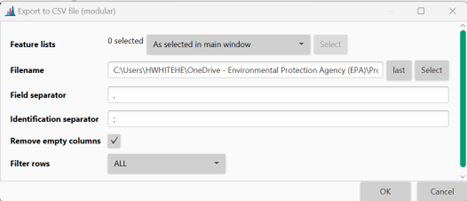
```
>  * In b.	In this dialog box use the "select" button next to *filename* to navigate to a folder location where the CSV should be saved and give the file a name
>  * Click “OK” to save the file to the chosen location

>**B. Limited results .csv**  
>
>  * Select the aligned, gap-filled, and filtered peak list then on the top ribbon click "Feature list methods" then "Export feature list" then "CSV (Legacy from MZmine2”
>  * This should open a new dialog box as shown in **Figure 32** below 
```{r, echo=FALSE, out.width="100%", fig.cap="**Figure 32.** Export CSV dialog box in mzmine.", fig.align = "center"}
knitr::include_graphics("Figures/MzmineCSV2.png")
```
>  * In b.	In this dialog box use the "select" button next to *filename* to navigate to a folder location where the CSV should be saved and give the file a name
>  * In the *export common elements* box ensure that “export row ID”, “export row m/z”, and “export row retention time” are selected. Other elements may be optionally selected as desired 
>  * In the *export data file elements* box ensure that “peak area” is selected. Other elements may be optionally selected as desired. 
>  * Click “OK” to save the file to the chosen location


**14. Save the mzmine project**  
To return to processed data in mzmine without re-processing data save the work as a project.

>**A. Save a project **  
>
>  * On the top ribbon select "project" then "save project as"  
>  * Use the navigator box to point to a folder location where the project should be saved and give the project a name
>  * Set the *project type* to either “standalone (large/flexible)” or “referencing (small)”
>     *  “Standalone” is best when the save file needs to be shared or opened on multiple computers as this option keeps all necessary elements within the save file
>     * “Referencing” is best when the project will only be opened on one computer and when the raw data files associated with the project will not be moved from their current location
>  * Press “OK” when done. Progress is shown in the "Tasks in progress panel"
>  * To open the project in the future use the top ribbon to select "Project" then "Open project"

##### Final things to know:  

* These parameters have been tested and work well with DDA-style HRMS data collected in Centroid mode. Additional filters or adjustments to the steps here are necessary when working with DIA or with Profile mode data.  

* Not all algorithms or modules used in this protocol are appropriate for all DDA-style HRMS data. Different algorithms may be more suitable for data with high noise, data with sub-optimal chromatographic performance, or data with other analytical performance issues or limitations.  

* When possible, use native or isotopically-labeled standards spiked into sample(s) to examine the behavior of each processing step to ensure suitability of the steps performed.  

* Data files that contain both positive and negative mode data should be processed separately to ensure any parameters set, thresholds used, and/or or mass lists and spectral libraries can be set based on polarity. Raw data files imported into mzmine should have their scans separated by polarity either during file conversion using MSConvert or during Crop Filtering and subsequent steps in mzmine  

*  mzmine is a RAM-dependent software and performs best on systems with more (> 32GB) RAM. On systems with less RAM anticipate slower processing times.   
    * A dataset containing ~200 files can be processed on a computer with 96GB of RAM in approximately 15 minutes using the modules described here. 


\newpage
### MS1 Feature List QA/QC Processing 
NTA methods are more generalized than targeted analysis methods. This generalizability allows measurement of a wider chemical space but adds complexity to data quality evaluation and control. The initial data processing steps often identify hundreds to thousands of chemical features in a single sample. It is time and resource intensive to manually investigate every feature for overall quality. Many experienced NTA users have developed their own QA/QC practices or approaches to ensure data quality, but standardized guidance and tools for QA/QC of NTA data are limited. EPA's INTERPRET NTA (**Inter**face for **P**rocessing, **Re**viewing, and **T**ranslating **NTA** data) is a tool that automates NTA data processing in accordance with data review and QA/QC practices of EPA and consensus best practices of the international research community.  

INTERPRET NTA uses three workflows: one for MS1 data processing, chemical candidate assignment, and metadata retrieval; one for MS2 feature annotation using in silico predicted MS2 spectra; and one for merging MS1 and MS2 outputs. This section will describe the background and use of the MS1 data processing workflow, with specific focus on functionality related to QA/QC review. INTERPRET NTA relies on the collection of replicate data, either from analytical replicates, sample collection replicates, or sample preparation replicates. INTERPRET NTA can process LC-HRMS data produced from any instrument and data acquisition software, regardless of manufacturer. Detailed information on INTERPRET NTA data requirements and parameter selection procedures is given below.   

INTERPRET NTA is currently hosted on a password protected web page with access limited to internal EPA users and direct EPA collaborators. Only the MS1 workflow was used for the ROAR project, with partners following the guidance and protocol described below. INTERPRET NTA is under continuous development in support of the evolving needs of EPA and its partners. Components of INTERPRET NTA used for the ROAR project are undergoing security and accessibly review to become public facing and fully open. INTERPRET NTA source code and additional documentation can be found at: https://github.com/quanted/nta_app/.  


#### INTERPRET NTA Logic 
INTERPRET NTA was designed, in part, to improve the performance and reporting of QA/QC procedures in NTA studies. Guiding principles include: 1) following the most current QA/QC recommendations of the international research community; 2) providing practitioners an interactive means to visually inspect their data; and 3) equipping QA/QC managers to efficiently review and document study quality. Fundamental logic of MS1 feature review is encapsulated in four steps (**Figure 33**).

```{r, echo=FALSE, out.width="100%", fig.cap="**Figure 33.** Key INTERPRET NTA QA/QC processing steps demonstrated on five MS1 features measured in one method blank (red x-axis) and three sample replicates (black x-axes). Major QA/QC filtering decisions are shown throughout steps 1-4. The red shaded feature denotes a spiked “tracer” analyte."}
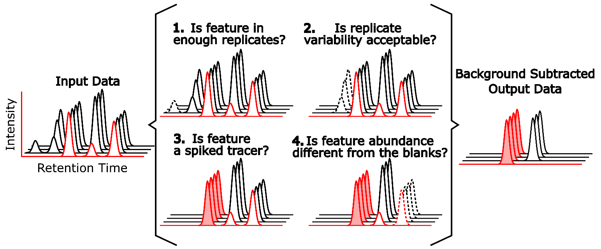
```

Steps 1 and 2 (**Figure 33**) relate to the reproducible detection of features across replicates. Specifically, step 1 considers the number of detections across replicates and step 2 considers the measurement variability across replicate detections. Features that are not reproducible in samples (dashed peak) can be removed to ensure only high-quality features are maintained for analyses. Step 3 uses an input file of named chemicals alongside their expected monoisotopic masses and retention times to identify and flag specific features as “tracers”. A “tracer” is any known chemical spiked into study samples at a detectable concentration. Tracers are chosen to be relevant to the detectable chemical space being investigated and are generally isotopically-labeled compounds. As described previously, tracer measurements are useful to track method performance. Specifically, tracer measurements within and across sample groups allows users to directly investigate method performance using visual and tabular outputs.  

Step 4 of INTERPRET NTA filtering logic relates to the identification of feature occurrences in study sample at levels exceeding those observed in designated blanks. An NTA study can include a variety of blanks that allow assignment of “background” features to sample collection, preparation, or data acquisition steps. Background signals of features measured in these blanks should be accounted for in study samples to ensure accurate evaluation of the abundance trends (e.g., difference in abundance levels across analytes). Feature occurrence should only be considered “real” if the measured abundance exceeds blank values by a defined threshold. A minimum reporting limit (MRL) estimate can be made using replicate measures of the blanks. Specifically, mean and standard deviation estimates across blank replicates can be used to define the MRL, with the user selecting a standard deviation multiplier of 3, 5, or 10 (the 3× multiplier yields the lowest MRL and the 10× multiplier yields the highest MRL for any features measured in blank replicates). Sample occurrences with abundances lower than the MRL can be treated as non-detects, with features removed from further consideration if all sample occurrences are deemed “non-detects”. For sample occurrences where the measured intensity is greater than the estimated MRL, the intensity is blank-subtracted using the blank mean such that the abundances in the final output table account for contribution from samples alone and not blanks.   

Additional QA checks include flagging potential duplicate features (those with both a mass and retention time within the same defined windows), adduct features (those that differ by discrete masses that relate to known adduct forms), and neutral loss features (those that differ by discrete masses that relate to known neutral losses). These flags are included in the output table for user review.   


#### Data Structure Requirements
INTERPRET NTA was developed to support the analysis of LC-HRMS data from both ESI negative and ESI positive acquisition. Some studies may use both modes, where others may only focus on one, depending on the chemical space being investigated. Users may submit data from one or both modes when executing INTERPRET NTA jobs. If submitted together,INTERPRET NTA will generate one set of outputs in which data from both positive and negative mode inputs are combined.  

INTERPRET NTA QA/QC filtering logic relies on the use of both blank and sample replicates to perform replicate threshold, coefficient of variation (CV), and MRL filtering, as well as blank subtraction. Replicate data may arise from the use of replicates during sample collection, sample preparation, or, most commonly, data acquisition. It is suggested that users include, at minimum, three analytical replicates per sample and blank, where a single extract is injected multiple times using the same instrument & data acquisition method as part of a randomized run sequence. If replicate analysis occurs across multiple batches, users are encouraged to include replicates across batches and to randomize replicates within each batch.   

Many studies utilize a variety of blank types (e.g., solvent or double, trip, field, equipment, lab, method, or matrix) but not all blanks are designated as a “blank” for INTERPRET NTA processing. INTERPRET NTA requires identifying a single set of blanks for MRL filtering and blank subtraction. The blank(s) used are decided by the user and should represent the most complete and relevant background possible, e.g., matrix blanks. **Appendix B** offers a description of the different blank types and their utility in an NTA study. When isotopically-labeled tracers are utilized in a study, the blank(s) used for processing should also contain these compounds at a spiking concentration identical to that in study samples to allow direct assessment of method performance.   

While the tracer and run sequence files are not required inputs for INTERPRET NTA logical filtering, they are necessary to generate some of the method performance outputs. The use of tracers and run sequence tables was described earlier; here the run sequence can be input with sample group designations to build run sequence plots for each tracer that show the performance of that tracer across the run sequence, relative to each sample group. The use of tracer and run sequence files substantially increases the depth of INTERPRET NTA outputs and allows users to directly investigate method performance.  

INTERPRET NTA uses both mass tolerance and retention time tolerance windows to aide in identification of tracers, adducts, neutral losses, and duplicate features. To ensure these tolerances are utilized properly, input data must have the appropriate precision relative to the measurement technique used, here LC-HRMS. Mass tolerances can be set in units of Da or ppm and should be set with an understanding of the typical performance of the instrument and methods used (typically no more than 0.002 Da or 10 ppm for an HRMS system). Retention time tolerances are set with units of minutes.  


#### Input Files and Parameters
All MS1 workflow input files are tables in CSV format. When using mzmine as the upstream data processing software, the exported CSV of the MS1 feature list can be used with minor modifications. Each input file has specific structure and required columns and headers, as described below. Outputs of alternative open source or vendor-specific data processing software can also be used as INTERPRET NTA inputs given appropriate formatting of the CSV files. Selectable input parameters are accessed by the user through a GUI interface; these selectable parameters are summarized in **Table 9**. 

```{r, echo=FALSE}
library(knitr)
library(kableExtra)
MZmine3Output=read.csv("C:\\Users\\HWHITEHE\\OneDrive - Environmental Protection Agency (EPA)\\Profile\\Desktop\\General Work\\Manuscripts\\Translational\\Toolkit\\docs\\Tables\\webappInput.csv",check.names=FALSE)

MZmine3Output %>%
kable(caption ="**Table 9.** Description of input parameters and files for INTERPRET NTA.",format="html", align="l",html_font="Lato") %>%
kable_styling(full_width=F, html_font= "Lato", bootstrap_options=c("striped", "hover","responsive"))
```

The primary input to the MS1 workflow is a detection matrix containing a list of MS1 features with required columns (**Table 10**), such as mass or m/z, retention time, and instrument responses (e.g., peak areas) across a set of samples. Feature level information columns are typically given first in the input, though an exact order is not required. Regarding instrument responses across samples, submitted values should be numeric, with an appropriate level of precision based on the utilized method and upstream data processing software. Both empty cells and cells containing a numeric value of “0” are treated as non-detects. Because of the logic and filtering steps performed, instrument responses should not be imputed, normalized, or otherwise transformed prior to INTERPRET NTA processing. 

Columns containing instrument responses of features in samples must be named such that sample and blank replicates can be identified by INTERPRET NTA. The identification of replicate samples is done with single-character differences, for example “MySample_a”, “MySample_b”, and “MySample_c” would be identified as three replicates of a single sample with the name “MySample”. Single-character differences may be letters as shown here or as numbers. Additional columns (e.g., initial annotations from upstream data processing) beyond those described above may also be included in the input detection matrix. These columns are treated as pass-through columns that are unaltered during INTERPRET NTA processing. A minimal example detection matrix is attached below. This example matrix contains a limited number of features and samples but includes all required inputs. One additional column, “CompoundID”, is included to track the unique feature IDs assigned during upstream processing. This variable is treated by INTERPRET NTA as a pass-through column.


```{r echo=FALSE}
xfun::pkg_load2(c("htmltools", "mime"))
xfun::embed_file("detectionMatrix.csv")
```

```{r, echo=FALSE}
library(knitr)
library(kableExtra)
MZmine3Output=read.csv("C:\\Users\\HWHITEHE\\OneDrive - Environmental Protection Agency (EPA)\\Profile\\Desktop\\General Work\\Manuscripts\\Translational\\Toolkit\\docs\\Tables\\detectionFile.csv",check.names=FALSE)

MZmine3Output %>%
kable(caption ="**Table 10.** Required columns and their description in the input Positive and Negative mode files (detection matrices).",format="html", align="l",html_font="Lato") %>%
kable_styling(full_width=F, html_font= "Lato", bootstrap_options=c("striped", "hover","responsive"))
```

A Tracer File and Run Sequence File(s) are additional, optional inputs to the MS1 workflow. The tracer file contains a list of tracer compounds spiked into some or all samples and blanks at detectable concentrations. Requirements of the tracer file includes the name, anticipated ionization mode, exact mass, and the expected retention time of each tracer (**Table 11**). Depending on experimental design and study objectives, separate tracer input files may be prepared for spiked native and isotopically-labeled compounds. If separate tracer files are prepared, the user should run INTERPRET NTA twice, once with each tracer file, to separately capture visual and tabular results. Additional columns beyond those described may also be included in the tracer file. These columns will be treated as pass-through columns with their contents unaltered during INTERPRET NTA processing. An example tracer file is attached below. This example matrix contains the isotopically-labeled compounds present in EPA Method 1633. One additional column, “Formula”, is included as a pass-through column to track the DSSTox Substance Identifier (DTXSID) of each compound through steps of INTERPRET NTA processing.

```{r echo=FALSE}
xfun::pkg_load2(c("htmltools", "mime"))
xfun::embed_file("tracerFile.csv")
```

```{r, echo=FALSE}
library(knitr)
library(kableExtra)
MZmine3Output=read.csv("C:\\Users\\HWHITEHE\\OneDrive - Environmental Protection Agency (EPA)\\Profile\\Desktop\\General Work\\Manuscripts\\Translational\\Toolkit\\docs\\Tables\\tracerFile.csv",check.names=FALSE)

MZmine3Output %>%
kable(caption ="**Table 11.** Required columns and their description in the input Tracer files.",format="html", align="l",html_font="Lato") %>%
kable_styling(full_width=F, html_font= "Lato", bootstrap_options=c("striped", "hover","responsive"))
```

The run sequence file(s) contain a list of all samples included in the input detection matrices alongside sample groupings that identify the samples within user-defined groups. The requirements of this list includes the name of samples (exactly matching the names used in the input detection matrices) and the sample grouping as summarized in **Table 12**. When both positive and negative detection matrices are input a run sequence file should be prepared for both matrices. An example run sequence file that is paired to the example input detection matrix is attached below. 

```{r echo=FALSE}
xfun::pkg_load2(c("htmltools", "mime"))
xfun::embed_file("runSequence.csv")
```

```{r, echo=FALSE}
library(knitr)
library(kableExtra)
MZmine3Output=read.csv("C:\\Users\\HWHITEHE\\OneDrive - Environmental Protection Agency (EPA)\\Profile\\Desktop\\General Work\\Manuscripts\\Translational\\Toolkit\\docs\\Tables\\runFile.csv",check.names=FALSE)

MZmine3Output %>%
kable(caption ="**Table 12.** Required columns and their description in the input Run Sequence files.",format="html", align="l",html_font="Lato") %>%
kable_styling(full_width=F, html_font= "Lato", bootstrap_options=c("striped", "hover","responsive"))
```

#### Output Files and Visuals
After submission of an INTERPRET NTA job, the user is directed to a new webpage where a unique job identifier and status update are displayed. Successful runs will return a “get results” button that links to a .zip file containing the complete results.  

Within the .zip folder the user will find files that each begin with the "Project name" (defined by the user) followed by a description of the individual file:    

* An excel sheet named identified by "_WebApp_results.xlsx"
* A CV scatter plot identified by "_cv_scatterplot.png"

**If the user loaded run sequence & tracer files, they should also see**:

* A heatmap identified by "_occurence_heatmap.png"
* Tracer plot(s) identified by "tracer_plot_MODE_#.png"
  * Note that MODE will be given as either "neg" or "pos" depending on which data were loaded into INTERPRET NTA and if there were tracers for that mode
  * The number identifies when there are multiple plots generated. The INTERPRET NTA will put up to 16 tracers in a single .png. When more tracers are present, more plots are generated
  
If INTERPRET NTA is run multiple times, it is important to note that unique .zip files will be generated for each run. An example .zip file containing the output from the example input is attached, and the individual output files are described in detail below.  

```{r echo=FALSE}
xfun::pkg_load2(c("htmltools", "mime"))
xfun::embed_file("INTERPRET_NTA.zip")
```
  
**_CV Scatter Plot_**  
The CV scatter plot (example shown in **Figure 34**) contains two subplots representing the mean abundance versus the measured CV of each sample occurrence. Information on the left subplot shows occurrences in samples that were identified as the "Blanks" in INTERPRET NTA input files, while the right subplot shows occurrences in all other samples. In each plot, the x-axis is dynamically adjusted to reflect the range of mean abundances across all samples, while the y-axis is fixed to a CV range of 0 – 2.5. In each subplot, a red-dashed line identifies the CV threshold set by the user when inputting parameters; bolded text above the line shows the exact CV value used. Red dots identify sample occurrences linked to tracers (from the tracer input file); all other occurrences are grey.
 
The CV scatter plot can be used to assess the trends and relationship of CVs observed for tracers, compared to all other features, and to set user expectations for reasonable CV values produced by their analytical methods and data processing tools. Typically, tracers are spiked at concentrations that are known to be well-above any measured or estimated instrumental and method detection limits. Accordingly, tracers are expected to have mean abundances that reflect this spiking level (relative to any measured or estimated dynamic range for an instrument and method). Since the tracers are spiked, CVs should be low if the instrument and method are operationally stable. Under suitable spiking concentrations, many HRMS-NTA methods can produce CV levels close to that of targeted methods, and often below 0.5. For context, many targeted analysis methods allow CV tolerances of +/- 0.3. As NTA methods are rarely validated in the same way as targeted methods, there is limited guidance for setting an allowable CV threshold for any given NTA method. 


```{r, echo=FALSE, out.width="100%", fig.cap="**Figure 34.** Example CV scatter plot produced by INTERPRET NTA."}
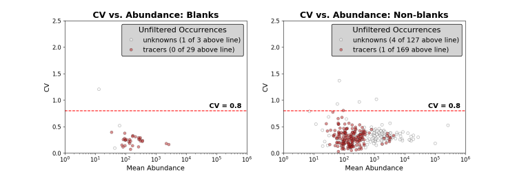
```

**_Occurrence Heatmap_**  
The occurrence heatmap is a representation of the processing outcomes for all features across study samples. The plot is oriented with features along the bottom axis and samples along the side axis. Within the plot each cell represents a sample occurrence, with the color of the cell denoting the data quality decision for that occurrence. Cells shaded gray are non-detects, defined as those for which the sample occurrence had no peak area in the input file OR those that were found to be below the calculated MRL. Cells shaded red are occurrences where the feature was reproducibly detected above the MRL, but with a CV value greater than the threshold set by the user. Cells in white are those that were reproducibly detected, above the MRL, with a CV value at or below the threshold set by the user.  
 
The occurrence heatmap can be used to assess the effect of the CV threshold set by the user on the entire data set and to compare the number of detected/flagged/measured occurrences across each sample type. For example:  

* The sample identified as the "blank" for INTERPRET NTA processing should show no detections (completely gray row).
* Other types of blank samples should also show few or no detections (mostly gray row).
* Samples that are in neat solvent (i.e., matrix-free) should likely show some detections (especially if spiked with native compounds).
* Samples that are in matrix will likely show the most detections and have some amount of "flagged" detections where the CV threshold was exceeded.  

If a CV threshold was set too high you might see no red cells (i.e., everything passed CV threshold). If a CV threshold was set too low you might see an excess of red cells (i.e., very few things passed CV threshold). This can be used alongside other outputs to help decide if your CV threshold should be adjusted. An example occurrence heatmap is shown in **Figure 35**.

```{r, echo=FALSE, out.width="100%", fig.cap="**Figure 35.** Example occurrence heatmap produced by INTERPRET NTA."}
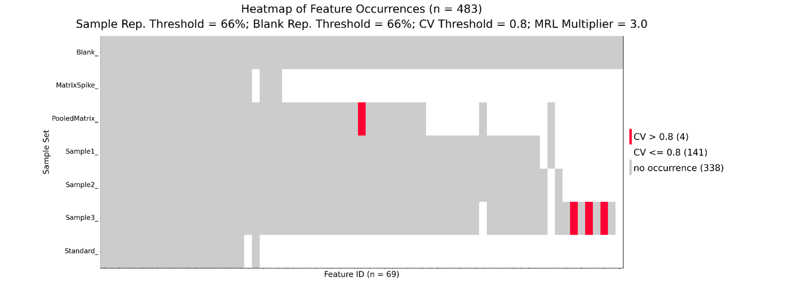
```

**_Tracer run sequence plots_**   
The tracer run sequence plots represent the detections of tracers (identified from the input tracer files) across the analytical sequence (identified from the input run sequence file). Each tracer run sequence plot is split into upwards of 16 subplots, each representing a difference tracer. The tracers of each subplot are identified in the subtitle. For each subplot the x-axis represents a numerical order of the run sequence, and the range is set dynamically based on the number of individual samples in the input data. For each subplot the y-axis represents the abundance of that tracer across the samples, and the range is dynamically set based on the observed abundance. Within each subplot the points may be colored based on a sub-grouping identified in the input run sequence file (e.g., Blank, Sample, Spiked).   
 
The tracer run sequence plots should be used to assess the trends and relationship of tracers in the study. Of specific interest is examining batch or run sequence effects. For example:  

* If the analytical sequence includes batches of samples run on separate days, the user may observe blocks of samples where tracer response is higher/lower than others.
* If the analytical sequence includes many samples, or samples with especially difficult or "dirty" matrices, the user may observe a decrease in the response across the analytical sequence. 

Run sequence plots also allow general examination of total detection frequency across samples. Sub-groupings (e.g., Blank, Sample, Spiked) shown in the plots may also highlight matrix effects such ion suppression (all samples with matrix have lower response than samples in neat solution) or ion enhancement (all samples with matrix have higher response than samples in neat solution). Realistically, these plots often display a combination of run sequence and matrix effects that may require detailed consideration or examination. An example tracer run sequence plot is shown in **Figure 36**.

```{r, echo=FALSE, out.width="75%", fig.cap="**Figure 36.** Example tracer run sequence plots generated by INTERPRET NTA."}
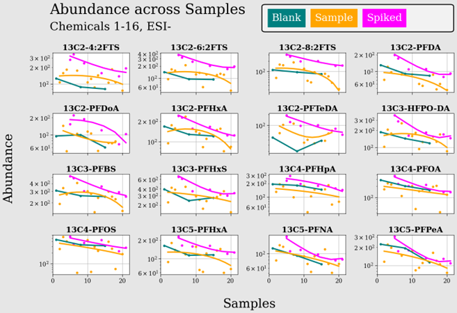
```

**_Excel output_**  
The output excel file from INTERPRET NTA contains all information used to make the plots and reports to the user which features passed QA/QC processing, as well as any annotations identified during processing (**Table 13**).  The data contained on the Final Occurrence Matrix sheet is used as the final data frame of features (defined by a mass and retention time), and responses of those features in samples (as blank-subtracted means), for all downstream analyses (FluoroMatch) and aggregation and reporting of identifications.  

```{r, echo=FALSE}
library(knitr)
library(kableExtra)
MZmine3Output=read.csv("C:\\Users\\HWHITEHE\\OneDrive - Environmental Protection Agency (EPA)\\Profile\\Desktop\\General Work\\Manuscripts\\Translational\\Toolkit\\docs\\Tables\\excel.csv",check.names=FALSE)

MZmine3Output %>%
kable(caption ="**Table 13.** Description of sheets and their contents from INTERPRET NTA's Excel output.",format="html", align="l",html_font="Lato") %>%
kable_styling(full_width=F, html_font= "Lato", bootstrap_options=c("striped", "hover","responsive"))
```


\newpage
### MS1 and MS2 PFAS-Specific Annotations (FluoroMatch)
FluoroMatch is a third-party, open source software that can be used to provide PFAS-specific annotations of MS1 and MS2 level data. FluoroMatch allows users to perform PFAS annotations on data that has undergone conversion and feature list building (FluoroMatch Modular) but can also be used on raw, unprocessed data (FluoroMatch Flow). FluoroMatch uses diagnostic fragment ions to build spectra from both real acquired spectra of PFAS and from in silico predictions of fragmentation for PFAS. Notably, FluoroMatch identifies spectra of PFAS in homologous series and uses the presence of those homologous series in sample data as checks for probable-PFAS features. PFAS annotations provided by FluoroMatch are scored using both a FluoroMatch-specific schema and using the well-described [Schymanski scale](https://pubs.acs.org/doi/10.1021/es5002105). Additional information on FluoroMatch can be found at the following links to its website and relevant publications. 

<div class="alert alert-success" role="alert">
**Relevant publications:**  
Koelmel, J.P., Stelben, P., McDonough, C.A. *et al*. FluoroMatch 2.0—making automated and comprehensive non-targeted PFAS annotation a reality. *Anal Bioanal Chem* **414**, 1201–1215 (2022). https://doi.org/10.1007/s00216-021-03392-7  

Koelmel, J. P., *et al*. Toward Comprehensive Per- and Polyfluoroalkyl Substances Annotation Using FluoroMatch Software and Intelligent High-Resolution Tandem Mass Spectrometry Acquisition. *Analytical Chemistry* **92(16)**, 11186-11194 (2020).
	
Koelmel, J. P., *et al*. Interactive software for visualization of nontargeted mass spectrometry data—FluoroMatch visualizer. **Exposome** **2(1)** (2022). </div>

In this protocol, only FluoroMatch Modular is used, with INTERPRET NTA filtered feature lists as input. FluoroMatch Modular contains functional elements of FluoroMatch that run as scripts rather than through the FluoroMatch graphical interface.   

>**Software download:** https://innovativeomics.com/software/fluoromatch-flow-covers-entire-pfas-workflow  
**Version used:** 2.6  
> **Documentation:** [Link to active manual and troubleshooting guide](https://yaleedu-my.sharepoint.com/:w:/g/personal/jeremy_koelmel_yale_edu/EWCTPDQIUNlLrSyHFXvaSN0BHAVNeX1S2Il8U1E-GpDBMg?rtime=SwZr_M4E3Ug)

#### FluoroMatch Protocol
To run FluoroMatch Modular an input folder needs to be generated. This input folder needs to contain both an MS1-level feature list (as a .csv) and raw data files (as .ms2) that contain MS2-level scans for features contained in the MS1 feature list. After that, an R script is run that allows users to point to input file locations and set parameters.  

**1. Generate a peak list**  
Peak lists can be generated by various software including both vendor specific or proprietary tools and by third-party open source software like mzmine. FluoroMatch Modular requires a peak list to be input as a CSV file that has the general structure of samples (columns) against features (rows) that includes:   


* _First row_: cells contain names for columns  
* _First column_: contains a unique identifier for each row (here, a numeric feature ID)  
* _Second column_: contains a m/z for the feature  
* _Third column_: contains a retention time for the feature  
* _All remaining columns_: contains a specific sample and the observed response/peak area for that sample in each feature  

This protocol focuses on the use of mzmine outputs as the input peak list for FluoroMatch. When EPA’s INTERPRET NTA has been used to perform QA/QC filtering on the feature list, the output filtered feature list from INTERPRET NTA should be used as the input peak list. An example output feature list from mzmine using the “CSV (Legacy from mzmine)” export is shown in **Table 14** for reference. This feature list has been reduced to just 10 features in 3 samples for brevity. All required elements for FluoroMatch processing of this input peak list, as described above, are present in the mzmine output. This file can be used without modification of its contents.  

```{r, echo=FALSE}
library(knitr)
library(kableExtra)
MZmine3Output=read.csv("C:\\Users\\HWHITEHE\\OneDrive - Environmental Protection Agency (EPA)\\Profile\\Desktop\\General Work\\Manuscripts\\Translational\\Toolkit\\docs\\Tables\\MZmine3Output.csv",check.names=FALSE)

MZmine3Output %>%
kable(caption ="**Table 14.** Example mzmine output for preparation.",format="html", align="l",html_font="Lato") %>%
kable_styling(full_width=F, html_font= "Lato", bootstrap_options=c("striped", "hover","responsive"))
```

To ensure the input peak list and its ionization mode is appropriately recognized by FluoroMatch Modular the file should be saved as a .csv with the file name “peakArea_*IonMode*” where *IonMode* is either “POS” or “NEG”. For example, data collected in negative mode ionization should be saved as “peakArea_NEG”.   

**2. Convert raw data files to .ms2 file types**  
Similar to requirements for mzmine, FluoroMatch requires raw data files to be converted into a vendor-neutral file format, here .ms2, for processing with FluoroMatch Modular. 

<div class="alert alert-warning" role="alert">
**Note:** FluoroMatch is a RAM-dependent software, meaning it requires sufficient RAM to process data in a timely manner. The greater the number of raw data files included in FluoroMatch the longer it will take to generate an output. However, the more raw data files given to FluoroMatch, the more MS2-level information available to generate MS2-level annotations. This is true for DDA-style MS2 files, where only a subset of MS1 features in a precursor scan are taken for MS2 fragmentation and data acquisition (usually based on the abundance of the MS1 feature).</div>

Optimizing the number of loaded raw files should be done to maximize the number of annotations while minimizing redundant computations which increase processing time. Things to consider (from an experimental design and post-processing perspectives) include:

* If data were collected in triplicate and there is no significant difference in the performance of each sample replicate (i.e., run sequence data examined during QA/QC processing show no significant differences across batches) then a raw data file from only one sample replicate can be used.  
* Raw data files of any pooled samples (i.e., those that contain all or some portion of study samples pooled together) can be used to reduce the number of raw data files from individual study samples.    
* Raw data files from QA/QC samples (e.g., trip blanks, field blanks, spiked samples, etc..) can be excluded if they are not anticipated to contain any additional MS2 scans not potentially captured by other study samples or QA/QC samples (e.g., method blanks or method spikes).   

Raw data files may be converted using MSConvert using the same process described previously to generate .mzXML files for mzmine. The specific parameters to use for conversion to .ms2 are given below.   


>**A. Under “Options”**  
>
>  * Adjust Output Format to .ms2 using the drop-down box  
>  * Ensure 64-bit, Write Index, TPP compatibility, and Use zlib Compression are selected  
>  

>**B. Under "Filters"**  
>
>  * In the drop-down box select "Peak Picking"     
>     * In the "Algorithm" drop-down box ensure "Vendor…" is selected  
>     * In *MS levels* input a "2" in the left box and “2” in the right box  
>     * Click "Add" in the middle of the page and the Peak Picking filter should appear in the white box underneath  
>
>  * In the drop-down box select "Subset"  
>     * In *MS levels* input a "2" in the left box and “2” in the right box  
>     * In *Number of data points* input a “2” in the left box and nothing in the right box  
>     * If the raw data contains both negative and positive polarity modes in a single file, use the _Scan polarity_ drop-down to select a single polarity    
>     * Click "Add" in the middle of the page and the Peak Picking filter should appear in the white box underneath  


**3. Rename raw data files**  
Similar to the feature list, the raw data files supplied to FluoroMatch Modular need to be named with important information (polarity, data type) to ensure accurate use and application by FluoroMatch. The basic requirements for these file names are: 

* The files need to contain the string "ddMS2_*IonMode*" to let the software know they are DDA-style data and what *IonMode* (either “NEG” or “POS”) the data were collected in ionization mode  
* The files also need to have relatively short character length (less than 26 characters total) in their names to make sure they're read properly by FluoroMatch
* The ideal naming of these files is “uniqueIdentifier_ddMS2_*IonMode*”  

Packaged within FluoroMatch is a Renaming Tool that allows quick renaming of raw data files to names that contain all necessary information for processing. To use this tool: **To use this tool:**  

> **A. In the downloaded FluoroMatch folder**  
>
>  * Navigate to _“FluoroMatch-2.6\\FluoroMatch_RenamingTool””_  
>    * Open the file “LipidMatch_Rename.exe”. A dialog box shown in **Figure 37** below will appear. 
```{r, echo=FALSE, out.width="50%", fig.cap="**Figure 37.** FluoroMatch Renaming Tool dialog box."}
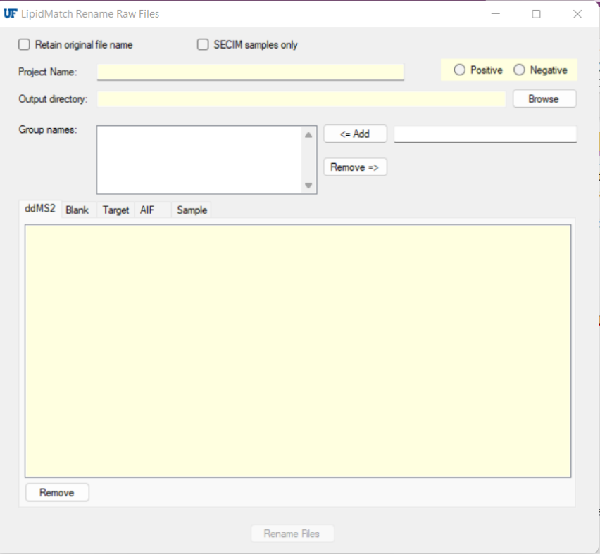
```

> **B. Edit the following fields**  
>
>  * _Project name_: a generic name/identifier that will be present in all renamed files. This should be kept as short as possible  
>  * Select either _“Positive”_ or _“Negative”_ to identify the ion mode  
>  * _Output directory_: Select “Browse” to open a navigation box to direct the renaming tool to a save location  
>  * _Group names_: optional to allow the grouping of samples. See FluoroMatch documentation for more information  

> **C.	Drag and drop raw data**  
>
>  * Drag the raw data files from the file location and drop them into the yellow box under the “ddMS2” tab  

> **D.	Press “Rename files”**  
>
>  * After dropping in the raw data files the “Rename files” button will start the renaming process which should progress quickly. A dialog box will appear when done letting pointing to the location of the output directory  
>  * This output directory will also include an excel file that contains a legend of original file name to the renamed file name to ensure each renamed file can be matched back to its original input file  


**4. Build the input folder**  
To run FluoroMatch, the renamed .ms2 files and the peak list need to be placed in a folder together. This folder needs to be in a location where FluoroMatch will have write access, as FluoroMatch will generate an output folder contained within the input folder. A suitable location for temporary storage is the Desktop or Documents folder. Once this folder is created, paste both the peak list and the .ms2 files into the input folder. Ensure no additional files are present.  

**5. Run FluoroMatch Modular **  
As previously described, FluoroMatch Modular is a script that can be run separate from the FluoroMatch Flow GUI that is contained within the FluoroMatch download.  **To run FluoroMatch Modular:**  

> **A. Open & copy the FluoroMatch Modular  R script**  
>
>  * Navigate to _“\\FluoroMatch-2.6\\FluoroMatch_Modular”_  
>    * Open the file _"FluoroMatch_Modular_2o6”_ (in R, Notepad, or another text-based software)  
>    * Copy all text from the file  

> **B. Open the R GUI used to run FluoroMatch Modular**  
>
>  * Navigate to _"\\FluoroMatch-2.6\\Background_Files_FluoroMatch_Flow\\FluoroMatch_Flow\\R-3.3.3\\bin\\x64"_  
>    * Open the file _"Rgui.exe"_  

> **C. Paste the copied script (from step A) into the GUI (from step B) **  
>
>  * Wait a moment for commands to start running which will appear as red lines of text populating in the command box  
>  * After a few moments a dialog box will appear asking to set parameters  

> **D. Set Parameters **  
>
>  * **Table 15** below shows each new dialog box that will appear in order. Dialog boxes that set a specific parameter can be set to default by typing “d”.  

```{r, echo=FALSE}
library(knitr)
library(kableExtra)
FluoroMatchInput=read.csv("C:\\Users\\HWHITEHE\\OneDrive - Environmental Protection Agency (EPA)\\Profile\\Desktop\\General Work\\Manuscripts\\Translational\\Toolkit\\docs\\Tables\\FluoroMatchInput.csv",check.names=FALSE)

FluoroMatchInput %>%
kable(caption ="**Table 15.** FluoroMatch Modular input parameters.",format="html", align="l",html_font="Lato") %>%
kable_styling(full_width=F, html_font= "Lato", bootstrap_options=c("striped", "hover","responsive"))
```

> **E. Run FluoroMatch **  
>
>  * After pressing “OK” on the final dialog box FluoroMatch will begin running and will not require any additional user input and the GUI will immediately begin running additional lines of code quickly
>  * After a moment the script will pause on the lines shown in **Figure 38**
```{r, echo=FALSE, out.width="100%", fig.cap="**Figure 38.** FluoroMatch Modular script running."}
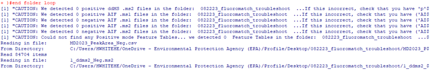
```
>  * Each "CAUTION" line reports that those particular file types were not found in the input folder. As long as a peak list and at least one .ms2 file is available for at least one ionization mode, these caution statements will not lead to any errors  
>  * From here, the script starts slowing down and reading in/processing each .ms2 file, which will be the time-consuming step. The best way to track progress at this stage is to scroll down on the script occasionally to ensure new files are being read in  

**6. FluoroMatch output folder**  
When FluoroMatch first runs, the script prepares a folder named “Output” in the same location as the input folder. This folder will progressively fill with FluoroMatch results as the script progresses. Once FluoroMatch Modular is finished, a CSV file named "NegID_FIN" will be in this Output folder. This may take hours (or days) depending on the number of MS2 files used and the number of features being annotated.  

This primary output from FluoroMatch includes columns from both the original input feature list (feature ID, m/z, RT, and the individual sample peak areas) and columns from the annotation of features from FluoroMatch (Score, Series Type, Name, Formula, SMILES, Adduct, Unique, Schymanski scale, Needs Validation, and more). Each row represents a feature, and all features included in the original input file can be found in this output file with their original data and with FluoroMatch annotations. A subset of the first set of columns found in the spreadsheet contents are summarized in **Table 16**. 
 

```{r, echo=FALSE}
library(knitr)
library(kableExtra)
FluoroMatchOutput=read.csv("C:\\Users\\HWHITEHE\\OneDrive - Environmental Protection Agency (EPA)\\Profile\\Desktop\\General Work\\Manuscripts\\Translational\\Toolkit\\docs\\Tables\\FluoroMatchOutput.csv",check.names=FALSE)

FluoroMatchOutput %>%
kable(caption ="**Table 16.** FluoroMatch outputs in 'NEGID_FIN'",format="html", align="l",html_font="Lato") %>%
kable_styling(full_width=F, html_font= "Lato", bootstrap_options=c("striped", "hover","responsive"))
```

After these columns, the spreadsheet includes the same sample columns given in the input file, which represent the abundance of the feature across each sample. After these sample abundance columns, the spreadsheet has several remaining columns that summarize the annotations made based on the fragments, precursor mass, and properties of the input data. A subset of these columns is summarized below in **Table 17**.  

```{r, echo=FALSE}
library(knitr)
library(kableExtra)
FluoroMatchOutput2=read.csv("C:\\Users\\HWHITEHE\\OneDrive - Environmental Protection Agency (EPA)\\Profile\\Desktop\\General Work\\Manuscripts\\Translational\\Toolkit\\docs\\Tables\\FluoroMatchOutput2.csv",check.names=FALSE)

FluoroMatchOutput2 %>%
kable(caption ="**Table 17.** Additional FluoroMatch outputs in 'NEGID_FIN'",format="html", align="l",html_font="Lato") %>%
kable_styling(full_width=F, html_font= "Lato", bootstrap_options=c("striped", "hover","responsive"))
```

Additional files contained within the FluoroMatch output folder include those described briefly below. 

* Neg_OnlyIDs_Fragments.csv: contains the fragments identified in the input .ms2 files linked to their tentative IDs in the FluoroMatch library. These are for fragments in the FluoroMatch library that were measured in real spectra.  

* Neg_OnlyIDs_PredFrags.csv: contains the fragments identified in the input .ms2 files linked to their tentative IDs in the FluoroMatch library. These are for fragments in the FluoroMatch library that were measured from *in silico* predicted spectra.  

* Neg_rawMSMS.csv: contains a link of the MS1 level features provided in the input feature list with their MS2 spectra given in the input .ms2 files. For each MS1 feature with an MS2 spectra each fragment of the spectra is in a new row with its m/z, intensity, and neutral loss recorded. When this particular fragment was identified as either a real or predicted fragment match the fragment identity and the mass error (in ppm) is recorded. Additionally, if that fragment is also considered a neutral loss the loss identity and the mass error (in ppm) is recorded.  

* NegIDed_Fragments.csv: contains the original input feature list with columns appended that describe any fragments identified within each feature. Specific columns include the potential ID of the feature, the PFAS class, the number of and specific fragments identified, and the .ms2 files these fragments were found in. These are for fragments in the FluoroMatch library that were measured in real spectra.  

* NegIDed_insilico.csv: contains the original input feature list with columns appended that describe any fragments identified within each feature. Specific columns include the potential ID of the feature, the PFAS class, the number of and specific fragments identified, and the .ms2 files these fragments were found in. These are for fragments in the FluoroMatch library that were measured from *in silico* predicted spectra.  

* NegIDed.csv: contains the original input feature list with columns appended that describe any fragments identified within each feature. Specific columns include the potential ID of the feature, the PFAS class, the number of and specific fragments identified, and the .ms2 files these fragments were found in. These are for all fragments in the FluoroMatch library that were matched in both the "NegIDed_Fragments" and the "NegIDed_insilico" files described above.  


\newpage
### Manual Review
The NTA workflow as it has been described so far relies on automated matching to spectral libraries and precursor mass lists and may use other software tools to aide in the identification of compounds. As a caveat, manual review of automated annotations is best practice to ensure accuracy in reporting chemical features. Manual review encompasses both examination of raw data elements to ensure chemical feature processing was performed correctly and assessment of annotations to validate their confidence. The following portions of the process can be manually reviewed as described. Software used to assist in manual review are summarized in **Appendix C**.  

#### Chromatographic performance using extracted ion chromatograms (XIC)  

XICs display the response of a m/z (or a range of m/z) across the chromatographic window. XICs can be used to examine the chromatographic peak shape of features relative to other features across a sample. Things to examine in a feature XIC include those described below and shown in **Figure 39**:

* Reasonable peak shape (i.e., Gaussian) that is resolved above noise.
* Suitable number of points across the peak (6+ at least, 8+ for quantitative applications).
* Minimal retention time shifting across samples (0.1-0.3 minutes based on method and instrument). 
* Minimal m/z shifting across samples (3-10ppm based on instrument).
* Any presence of isomers or other shouldering peaks.
* Any presence of multiple peaks across the entire chromatographic run.
  * Later-eluting peaks of some low molecular weight compounds may be due to in-source fragmentation of higher molecular weight compounds.


```{r, echo=FALSE, out.width="100%", fig.cap="**Figure 39.** Characteristics of chromatograms to look out for during manual review of XICs."}
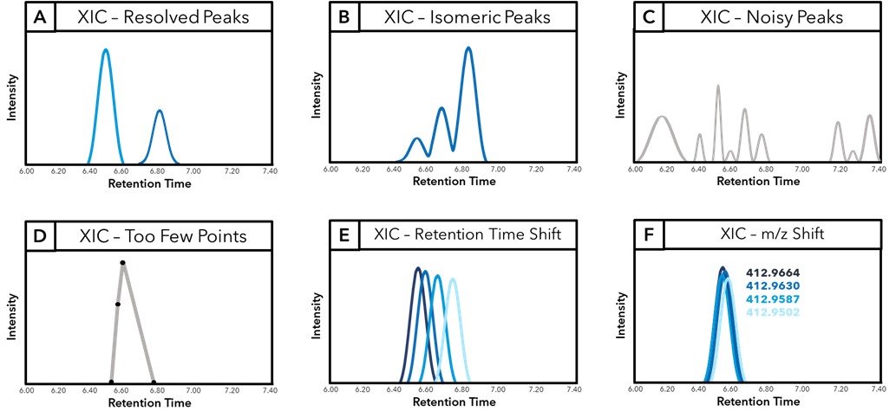
```

When peak shape is poor, highly variable across samples, or incredibly noisy the accuracy of any annotation should be examined with additional data.

#### Precursor ion behavior and isotope profiles using MS1 spectra

Examination of MS1 spectra can confirm the selected feature is not an artefact of data processing. The isotope profile can be examined to ensure the feature is the monoisotopic mass of the feature and not a misassigned isotope of another compound, that the proposed chemical formula produces characteristic isotope peaks (e.g., Cl, Br, S if present), that the charge state is properly assigned (e.g., +1 vs +2), and it’s relative abundance compared to other peaks present in the MS1 spectra, which may be adducts or fragments. The use of isotopically-labeled PFAS may complicate the isotopic profile of native PFAS. For example, a 13C2-PFDA is a common isotopically-labeled compound for native PFDA. The monoisotopic mass of 13C2-PFDA is identical to that of the M+2 isotope of PFDA and will change expected the isotopic profile ratios. Isotopically-labeled PFAS may also be incorrectly assigned as novel PFAS and should be accounted for during data processing. Things to examine in a MS1 spectrum include those described below and shown in **Figure 40**:

* Proportion of precursor ion relative to other ions
* Presence of adduct(s), dimer/multimers, or fragments of the precursor ion (or if the precursor ion appears to be an adduct/multimer/fragment).
  * This is particularly important if there is obvious PFAS presence in the MS/MS spectra but the fragments observed do not support a specific annotation.
* The spacing of each isotopic peak relative to another to examine charge state.


```{r, echo=FALSE, out.width="100%", fig.cap="**Figure 40.** Characteristics of MS1 spectra to look out for during manual review."}
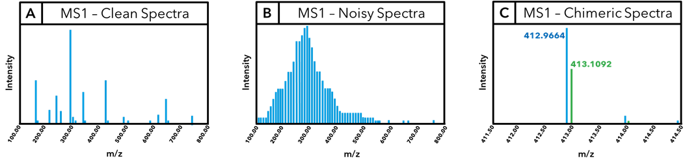
```


When the MS1 spectra contains a relatively weak precursor ion, it may have poor MS2 spectra and any annotation should be examined with additional data. When the isotopic peaks do not align well with the assigned chemical formula the accuracy of the annotation needs to be examined with additional data.   

<div class="alert alert-success" role="alert">
See more information on the use of isotope profiles at the following resources:
https://www.chem.ucalgary.ca/courses/353/Carey5th/Ch13/ch13-ms-2.html  
https://www2.chemistry.msu.edu/faculty/reusch/virttxtjml/spectrpy/massspec/masspec1.htm  
https://www.orgchemboulder.com/Spectroscopy/MS/atomiso.shtml  
https://bmcbioinformatics.biomedcentral.com/articles/10.1186/1471-2105-8-105  
https://fiehnlab.ucdavis.edu/projects/seven-golden-rules  
 </div>


#### Fragmentation using MS2 spectra
MS2 spectra can be used to identify fragments by their individual chemical formula to support the assignment of a unique chemical or to build a probable structure. Things to examine include those described below and shown in **Figure 41**:

* Mass difference from precursor ion peak to the fragment ion peak.
* Mass difference from one fragment ion peak to another.
* Proportion of fragment ion peaks relative to the precursor.
* Proportion of fragment ion peaks relative to each other.
* The presence of common PFAS signatures in MS/MS spectra (see below).


```{r, echo=FALSE, out.width="75%", fig.cap="**Figure 41.** Characteristics of MS2 spectra to look out for during manual review."}

```


> **Common PFAS signatures in MS/MS spectra**  
>  &nbsp;  
> *Features with a suspected carbon-fluorine backbone are likely to show these fragments*: 
>
>  * Peaks separated by a m/z of ~49.9968 Da due to loss of CF2.  
>     * Applies to increasing CF2 units (e.g. C2F4, C3F6…)  
>  * Commonly observed carbon-fluorine fragments that can be compared to the proposed structure: 
>     *	CF3 at 68.9952 Da  
>     * C2F5 at 118.9920 Da  
>     * C3F7 at 168.9888 Da  
>     * C4F9 at 218.9856 Da  
>     * C5F11 at 268.9824 Da  
>     * C6F13 at 318.9792 Da  
>     * C7F15 at 368.9760 Da  
>
>  &nbsp; 
>
> *Features with a suspected sulfonic acid group are likely to show these fragments*:  
>
>  * SO3 at 79.9568 Da  
>  * SO3H at 80.9646 Da  
>  * SO3F at 98.9552 Da  
>  * SO2 at 63.9620 Da
>  * **Note:** Perfluorinated linear sulfonic acid PFAS rarely produce the carbon-fluorine backbone fragments described above.  
>
>  &nbsp;
>
> *Some polyfluorinated species (H-substituted) can show the loss of fluorine through HF.*  
>
> * Appears as peaks separated by a m/z of ~20.0062 Da.  
> * Each additional HF loss corresponds to an additional H in the molecular formula of the species.
>
>  &nbsp;
>
> *Features with carboxylic acids in their proposed structure can show loss of CO2 from precursor ion.*  
>
> * Appears as a peak at [M-H-CO2]- with CO2 equal to [M-H-43.98989 Da].

Use information from the annotation tools to aide in the review of MS2 spectra. These include: 

* FluoroMatch in the "Frags", "Num_Frags", "Files", "Frags.1", "Num_Frags.1", and "Files.1" columns.
  * For example, if FluoroMatch identified a C2F5 fragment, the spectra should be examined for a fragment at approximately 118.9920 Da.
* In mzmine you can right-click on the spectral library hit and select "Show" and then "Spectral DB search results" to view your experimental spectra (top plot) against the library spectra (bottom plot) along with additional information on the spectral library ID as shown in **Figure 42** below.
```{r, echo=FALSE, out.width="75%", fig.cap="**Figure 42.** Comparison of experimental spectra (top plot) with reference spectra (bottom plot) from spectral libary searching in mzmine."}
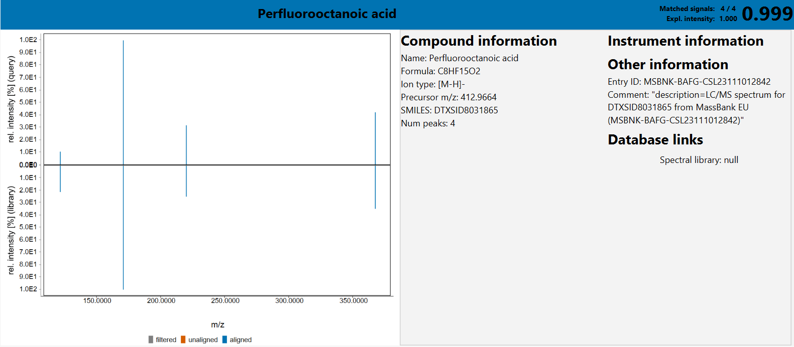
```
* When available, use reference spectra for the proposed chemical to compare. These include curated spectral libraries and publicly-available databases that contain spectra (PubChem, MoNA, MassBank EU, etc..). 

When the MS2 spectra shows fragments that could not be generated by the annotated chemical then the discrepancy should be investigated. Possibilities include an incorrect assignment or fragmentation from a secondary precursor molecule. 

#### Additional tools to use during manual review

<span style=color:##0095d7> **1. SIRIUS** </span>  
[SIRIUS](https://bio.informatik.uni-jena.de/software/sirius/) is an open access software used to investigate MS and MS/MS data to identify chemicals or metabolites in samples. SIRIUS was used in ROAR data to predict molecular formulas, compound classes, and fragmentation relational trees for MS1 and MS2-level data to support manual review efforts. MS1 and MS2-level data were exported from mzmine using the SIRIUS/CSI-Finger ID export option which generates a .mgf file containing spectra for features with both an MS1 isotopic profile and MS2 spectra. This .mgf file was imported directly into SIRIUS 5.8.6 where all features were first given an ion form of [M-H]-. Molecular formula identification (SIRIUS), network-based improved of molecular formula ranking (ZODIAC), fingerprint predication and structure database search (CSI:FingerID) and compound class prediction (CANOPUS) modules were performed using the parameters shown in **Figure 43** below.

```{r, echo=FALSE, out.width="75%", fig.cap="**Figure 43** SIRIUS parameters used to process ROAR data to assist in manual review efforts."}
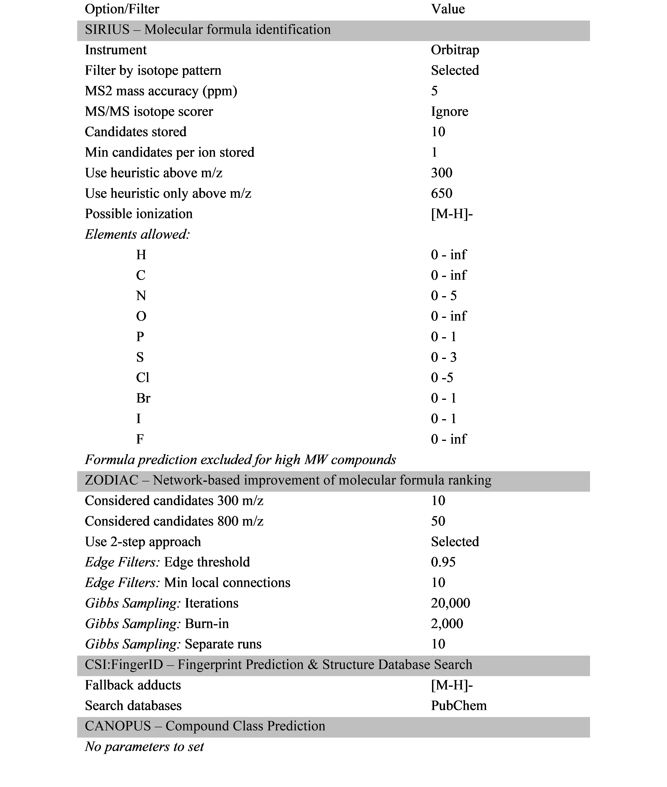
```

Results from SIRIUS can be viewed for individual features as shown in **Figure 44** below. After processing, the summary reports from SIRIUS were exported and aggregated to the MS1-level feature list and used to assist during manual review.

```{r, echo=FALSE, out.width="75%", fig.cap="**Figure 44.** SIRIUS outputs displaying the predicted chemical formulas and fragmentation trees (top) and the predicted chemical fingerprints (bottom) of a feature."}
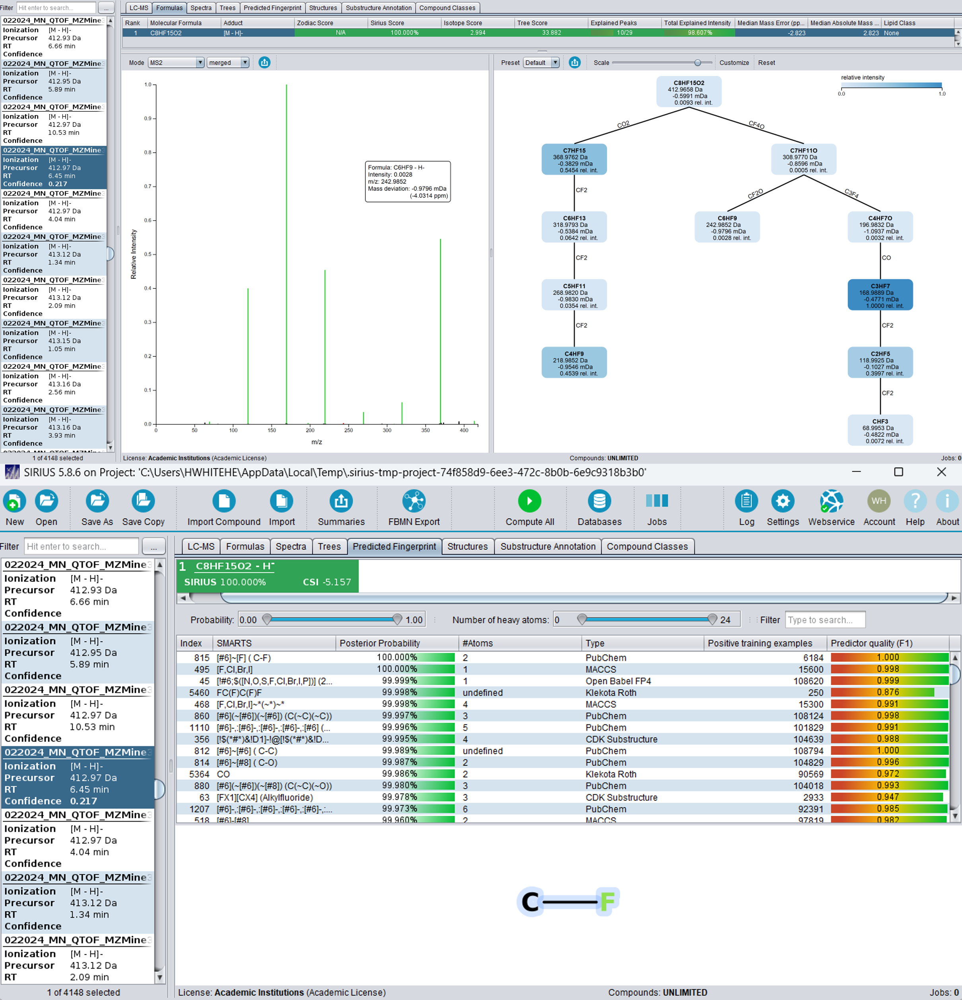
```


<span style=color:##0095d7>**2. mzmine ion identity and spectral similarity networks**</span>  
Within mzmine there are additional modules that can examine the relationship of features based on chromatographic and/or spectral similarity. Ion identity and MS2 spectral similarity networks identity features as adducts or neutral losses of others and identify features with MS2 spectra similarity, respectively. The identification of features within ion identity networks first relies on a correlation grouping module that groups features based on their chromatographic performance (peak shape and/or peak height). Using these groupings the ion identity networking module then uses ion identity libraries, containing selectable adducts and neutral losses, to determine if features can be identified as an adduct or neutral loss. The identification of features within a spectral similarity network relies on an assumption that chemical structures within similar functional groups or substructures can produce similar fragmentation patterns in MS2 spectra. Using this, MS2 spectral similarity is compared by examining the fragments observed in MS2 spectra across features to group features with comparable fragmentation patterns. The parameters used for these modules to support manual review of ROAR data are shown in **Table 18** below.

```{r, echo=FALSE}
library(knitr)
library(kableExtra)
FluoroMatchOutput2=read.csv("C:\\Users\\HWHITEHE\\OneDrive - Environmental Protection Agency (EPA)\\Profile\\Desktop\\General Work\\Manuscripts\\Translational\\Toolkit\\docs\\Tables\\Networking.csv",check.names=FALSE)

FluoroMatchOutput2 %>%
kable(caption ="**Table 18.** Parameters used to perform ion identity and spectral similarity networking in mzmine.'",format="html", align="l",html_font="Lato") %>%
kable_styling(full_width=F, html_font= "Lato", bootstrap_options=c("striped", "hover","responsive"))
```

Outputs from these networks can be visualized in mzmine as shown in **Figure 45** below but may also be exported as annotations in the export from mzmine.

```{r, echo=FALSE, out.width="75%", fig.cap="**Figure 45.**Ion identity and spectral similarity network from mzmine. Nodes within each cluster represent individual m/z, connected by edges that define their relationship. Node size is based on signal intensity, and color based on spectral library annotation score."}
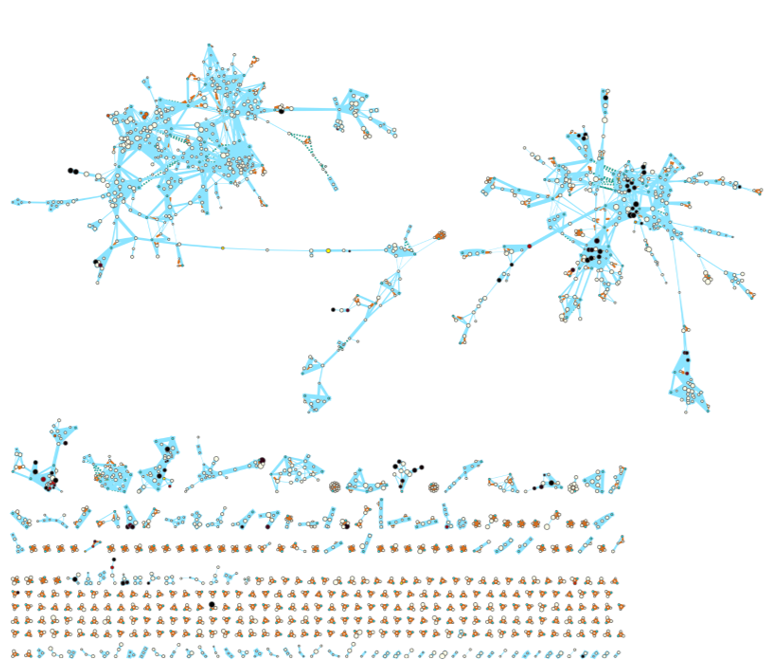
```


<span style=color:##0095d7>**3. enviHomolog**</span>  
A homologous series is defined as a group of compounds that differ only by a repeating unit. For PFAS, this repeating unit is commonly CF2. Though, other units (e.g., C2H2F2, C3F6O, CF2O) are also possible. The identification of homologous series in NTA data relies on looking for features at masses separated by an exact mass equal to the suspected repeating unit (e.g., 49.9968 for CF2) with relatively equal spacing in retention space between them. [enviHomolog](https://www.envihomolog.eawag.ch/) is an online tool (also offered as an R package) that identifies homologous series in NTA data using an input feature list containing masses and retention times. The online interface of enviHomolog is shown in **Figure 46**. Features identified as being within a fluorinated homologous series can aide in identification of chemical identity or PFAS presence.  

```{r, echo=FALSE, out.width="75%", fig.cap="**Figure 46.** enviHomolog online output showing the occurrence of CF2 homologous series in a NTA dataset."}
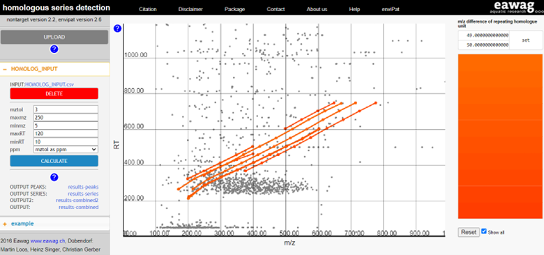
```

<span style=color:##0095d7>**4. CompTox Chemicals Dashboard**</span>   
[CompTox](https://comptox.epa.gov/dashboard/) can be used to determine candidate chemicals based on any DTXSIDs, chemical formulas, or chemical names given for each annotation.

* **DTXSID**: Searching by DTXSID will return just a single hit. Similar substances can sometimes provides hits to aide in manual review and are available on the “Linked Substances” tab on individual chemical pages, as shown in **Figure 47**. 
```{r, echo=FALSE, out.width="75%", fig.cap="**Figure 47.** CompTox page for PFOS showing the Linked Substances tab."}
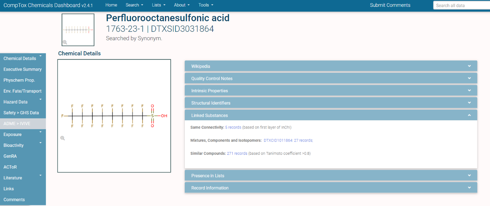
```

* **Chemical formula**: Searching by chemical formula will sometimes return many hits, including various isomeric forms including structural (linear vs. branched vs. cyclic) and positional isomer. There may also be both the neutral and ionic form of molecules. Importantly, there may also be important differences in the basic functional groups of the molecule. For example oxygen my appear as alcohol, ketone, ether, or carboxylic acids which can often be distinguished by MS2 spectral fragments. Understanding the most probable compound based on the measurement itself is helpful (for example, alcohols without additional ionizable groups are typically not measured by LC-MS/MS due to their inherent volatility).

* **Chemical name**: Searching by chemical name is likely to provide ambiguous results if names provided by annotation resources are themselves ambiguous or incorrect. When possible, search by a unique chemical identifier (DTXSID, CAS-RN) to ensure accuracy.

<span style=color:##0095d7>**5. Molecule editing software**  </span>  
Examples of this type of software include paid tools (ChemDraw, ChemSketch, etc.) and free tools such as [PubChem Sketcher](https://pubchem.ncbi.nlm.nih.gov/edit3/index.html). These tools include functionality to draw chemical structures or build structures using standardized notations (e.g., SMILES) as shown in **Figure 48**. Annotations made by spectral library searching in mzmine and those made by FluoroMatch often include the SMILES notation in their annotation. The proposed chemical structure of the annotation can be used to aide in identification of fragments observed in the MS2 spectra. Paid tools like ChemDraw and ChemSketch include options for generating MS/MS fragments from a structure.

```{r, echo=FALSE, out.width="100%", fig.cap="**Figure 48.** PubChem Sketcher showing the generation of a chemical structure from SMILES."}
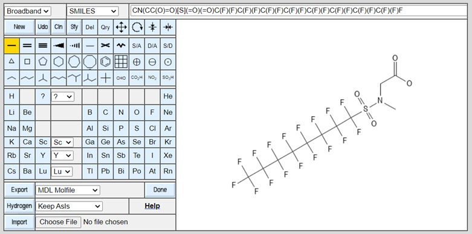
```

<span style=color:##0095d7>**6. Molecular formula to monoisotopic mass calculator**</span>  
[These calculators](https://www.chemcalc.org/) can be used to convert any molecular formula to its monoisotopic mass. This kind of calculator is useful to examine if an MS2 fragment expected based on the chemical formula of an annotation is present in an MS2 spectra.  


<span style=color:##0095d7>**7. Monisotopic mass to molecular formula calculator**</span>  
[These calculators](https://www.chemcalc.org/mf-finder) can be used to convert any monoisotopic mass to potential molecular formulas. This calculator requires a set of permissible elements and maximums/minimums for each. The possible formulas are displayed and ranked based on the ppm and mDa mass differences of the possible chemical formula monoisotopic masses and the input mass. 

<div class="alert alert-warning" role="alert">
**Note:** Smaller masses have fewer possible combinations of atoms. This means the calculator works well for smaller masses and is increasingly ambiguous for larger masses.</div>

This calculator is useful to identify likely chemical formulas of smaller fragments in MS2 spectra or to identify the chemical formula difference between any two fragments in MS2 spectra..

##### Final things to know:

* Manual review can be the most time-intensive aspect of NTA data processing but serves as an essential step to ensure data quality and accuracy.
* Not all features may require intensive manual review or be worth performing manual review on.
* Features in study samples from spiked chemicals (those for which an analytical standard is available and was spiked into at least one sample) can be compared quickly to the performance and response of features in spiked samples.
* Features whose tentative identifications are not being reported (e.g., lower confidence annotations from things like MS1 precursor libraries or formula prediction software) may often not have enough information available to confirm identity or to be promoted to a higher confidence level.
* The use of other data processing tools may introduce the need for additional review to ensure their accuracy in use.
  * For example, the processes performed, and annotations generated, by INTERPRET NTA have additional considerations not described here.


\newpage
### Final Assignment
After all data outputs have been aggregated and manual review performed, final annotations of confirmed and probable structures can be made. The combination of annotation(s) for any given feature define the ability to assign an identity and the confidence of that assignment. 

NTA confidence scales aim to standardize the assignment and reporting of NTA-identified chemicals based on the information supporting that assignment. The most prominent scale for environmental NTA is the Schymanski scale, first published in 2014. 

<div class="alert alert-success" role="alert">
**Relevant publication:** Schymanski E.L., Jeon J., Gulde R., *et al*. Identifying small molecules via high resolution mass spectrometry: communicating confidence. *Environ Sci Technol.* **48 (4)**, 2097-8 (2014). https://doi.org/10.1021/es5002105 </div>


The Schymanski scale is a relatively simple scheme that uses minimum data requirements to generate 5 confidence levels for reporting. Using this scale, a level 1 assignment is the most confident annotation and represents a confirmed structure that has an available reference standard for confirmation against all chromatographic and mass spectrometry parameters. The remaining confidence levels and their minimum data requirements are summarized in **Figure 49** below. 

```{r, echo=FALSE, out.width="75%", fig.cap="**Figure 49.** Schymanski scale used to define the minimum requirements and confidence for reporting NTA data. Image taken from [Schymanski *et al*. (2014)](https://pubs.acs.org/doi/10.1021/es5002105)."}
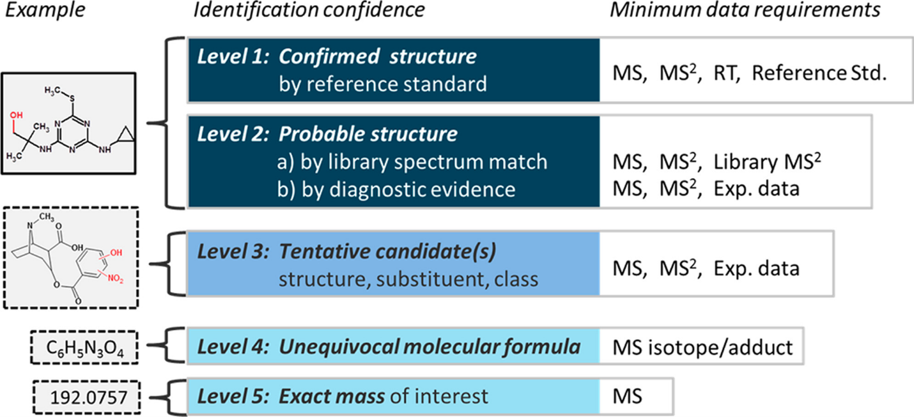
```

In 2022, due to an increase in PFAS specific NTA studies being published, an extension was suggested to incorporate the use of homologous series to support similar structural assignments and codify the use of PFAS-specific characteristics. 

<div class="alert alert-success" role="alert">
**Relevant publication:** Charbonnet J.A., McDonough C.A., Xiao F., *et al*. Communicating Confidence of Per- and Polyfluoroalkyl Substance Identification via High-Resolution Mass Spectrometry. *Environ Sci Technol Lett.* **9 (6)**, 473-481 (2022). https://doi.org/10.1021/acs.estlett.2c00206 </div>  


This adapted scale is summarized in **Figure 50** below, where each level 1-5 has been expanded to include sub-levels that reflect different types and amounts of available data supporting the assignment, but which could be collapsed to the top level for consistency with the original Schymanski scale.  

```{r, echo=FALSE, out.width="75%", fig.cap="**Figure 50.** Charbonnet scale showing adapted confidence levels for PFAS NTA reporting. [Image from Charbonnet *et al*. (2022).](https://pubs.acs.org/doi/10.1021/acs.estlett.2c00206)"}
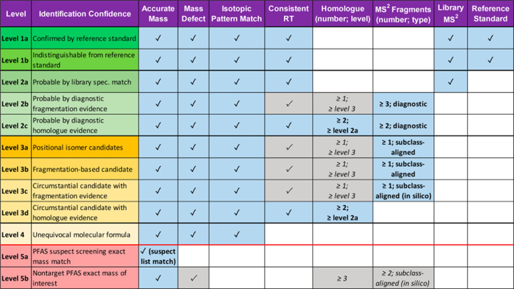
```

For any feature with multiple annotations from different resources (e.g., spectral library searching, FluoroMatch, or precursor mass lists) it is best to use the annotation that provides the highest confidence. However, for features with annotations from multiple resources it is essential to compare these annotations during manual review to confirm their similarity or to examine differences.  
 
Features assigned at a level 1 or 2, those with a confirmed or probable structure, can be defined by a unique chemical identity. This chemical identity is easiest to describe using a unique identifier (like a CAS number or a EPA CompTox Dashboard DTXSID) rather than a potentially ambiguous chemical name. For features assigned at a level 3 it may not be possible to define it as a single chemical identity if the underlying data is unable to delineate structural differences in two (or more) chemicals that share a chemical formula (e.g., positional isomers, linear, vs. branched, vs. cyclic). For circumstances where the exact chemical identity is ambiguous, but there is confidence in the subclass and molecular formula based on the experimental data, a level 3 confidence can be assigned while not assigning a unique chemical identifier (e.g., DTXSID).  
 
Any additional annotations from other resources (in-house spectral libraries, formula prediction tools, molecular networking tools, etc.) can also be used to aide in the assignment of a confidence level and a unique chemical identification. Use the confidence scales described above to decide where these annotations may fall based on the underlying available data. Lower confidence annotations at level 4 and 5 are inherently limited in the experimental data available to generate an annotation of a chemical identity. The ambiguity and uncertainty in these annotations mean that they may not be suitable for reporting to audiences who are not familiar with NTA measurements. It is critical to consider the audience receiving identifications made by NTA when considering what and how to report chemical assignments.  

 
\newpage


## NTA Data Analysis, Reporting, and Communication Guidance
Final reporting of raw NTA data is two-fold. The processed data itself can usually be represented as a feature table consisting of different categories of information as shown in **Figure 51** below.   

```{r, echo=FALSE, out.width="100%", fig.cap="**Figure 51.** Representative feature table generated by NTA."}
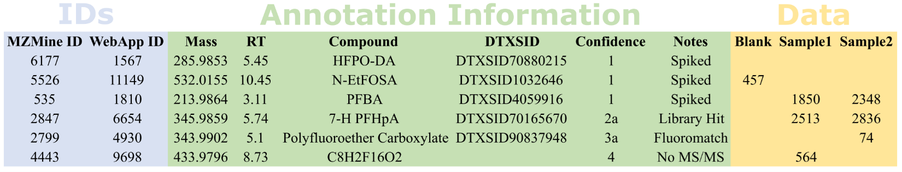
```

The dataset should contain at minimum:  

1. A unique (set) of identifiers for the feature, which may include identifiers for both the feature table and earlier raw tables for programs such as FluoroMatch or mzmine.  
2. An assigned annotation and confidence score, with the option to provide the supporting rationale (e.g., observed fragments, homologous series information) in notes or with additional annotation columns.  
3. Measurement data for each sample and feature, which may be corrected, background subtracted, averaged across replicates, etc.  

The feature table may also optionally link to additional metadata tables, such as additional potential assignments from library hits.  

In addition to the raw data tables reported, NTA data should include information on how the data was generated. As described extensively throughout this document, significant decisions exist at every step of an NTA study, from sampling through to final data processing steps. To support the reporting of data, BP4NTA developed the [Study Reporting Tool (SRT)](https://nontargetedanalysis.org/srt/) as a framework for what information should be reported for each step of a study.  

Broadly, the information to be reported along with study data is similar to reporting in traditional targeted analysis, such as method details, and QA/QC metrics, but also includes information on data processing steps and study design questions. This level of detail is important for interpreting results to, for example, understand the chemical space of the study. 


### Using NTA Data
Report data tables for NTA are only an intermediate result from an NTA study. As the beginning of this toolkit described, NTA studies are oriented towards answering specific research questions which frequently requires additional manipulations and comparisons of data in the minimal output described above. Instructions on this secondary analysis is beyond the scope of this toolkit, although we can provide some general examples. Additional examples and references are available from [BP4NTA’s reference content](https://nontargetedanalysis.org/reference-content/).

Taking the simplest example from the study design section - *Investigate origin and impact of specific point sources* – comparing two samples collected upstream and downstream of a point source, the data can be subjected to different statistical techniques to isolate chemical features. A two-sample statistical comparison (t-test or Mann-Whitney U) to identify statistically significantly different features can yield a massive reduction in the feature table. An example *volcano plot* of the p-value vs. fold-change is a common way to visualize this type of comparison. In **Figure 52**, an NTA experiment with 32,000 features can be reduced to only ~ 500 features by focusing only on the features significantly increased in the downstream sample (red). This further provides statistical evidence that the source contributes these chemicals to downstream impacted samples. A similar comparison could be used for any two-group comparison; for example, to define features added/removed by treatment processes, to identify metabolic transformations, or explore chemical markers associated with exposed/unexposed sample groups. 

```{r, echo=FALSE, out.width="50%", fig.cap="**Figure 52.** Volcano plot for a two-sample comparison mapping the abundance difference (x-axis) against statistical significance (Bonferroni corrected Mann-Whittney p-value, y-axis). Filtering the dataset using statistical significance and abundance fold-changes above a factor of two (red and blue features) reduces the number of features by 99%."}
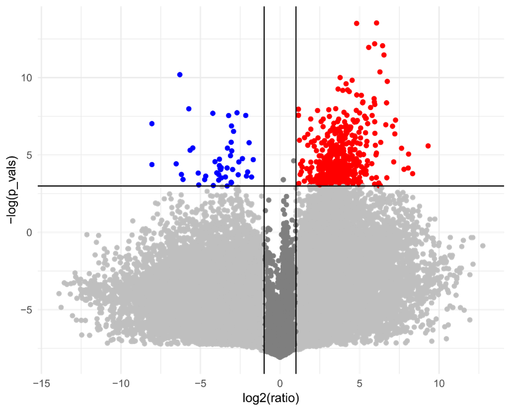
```

A slightly more sophisticated example may require additional data treatment; measuring the distribution in space/time, you can apply geospatial or higher order statistics. As an example, in [Washginton *et al*. (2020)](https://www.science.org/doi/full/10.1126/science.aba7127) when attempting to assign a PFAS subclass to a particular manufacturer, soil samples were analyzed by NTA and the scaled abundances mapped to generate concentration contours with an appropriate weighting algorithm as shown in **Figure 53**. The distribution is clearly centered on a single source and related to manufacturing at that location. 

```{r, echo=FALSE, out.width="50%", fig.cap="**Figure 53.** Contour lines for the sum of a specific PFAS subclass detected in soil samples from Southwest New Jersey. Contours were generated using inverse-distance weighted averages of scaled PFAS abundance. Geospatial distribution shows a single, clear source manufacturer. Reproduced from [Washginton *et al*. (2020)](https://www.science.org/doi/full/10.1126/science.aba7127)."}
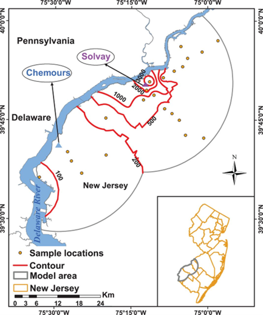
```

Other multidimensional techniques can be used to make sense of trends and/or associations between chemicals and samples. For instance, in the work of [McCord & Strynar](https://pubs.acs.org/doi/full/10.1021/acs.est.8b06017) sampling was conducted over a period of weeks with eight sampling events. Hierarchical clustering of features was used to find groups of similarly changing unknowns as shown in **Figure 54**, which could be used as evidence they were derived from the same source.  

```{r, echo=FALSE, out.width="75%", fig.cap="**Figure 54.** Normalized abundance time trends for two clusters of PFAS from a time-course river sampling. After clustering, features separated into similarly trending groups, shown in blue and green. Image produced from [McCord & Strynar (2019)](https://pubs.acs.org/doi/full/10.1021/acs.est.8b06017)."}
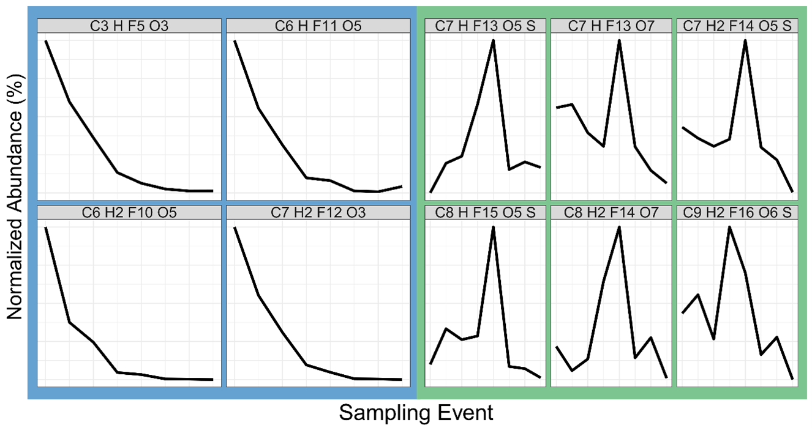
```

Other clustering techniques, such as k-means clustering, can be used to examine the relationship of samples based on the observed response of features across samples. As shown in **Figure 55A** a plot of the clusters formed using k-means clustering identifies samples that are closely related based on the observed feature abundances. In this example there are four distinct clusters formed from 17 samples of ground and surface waters collected. Samples were collected in a watershed with known impacts from two PFAS point sources at locations, up, at, and downstream to each point source with mixing expected at further downstream locations. These clusters identified using k-means can be used to build heatmaps like that in **Figure 55B** that displays all features (x-axis) across all samples (y-axis) with the intensity of the measured abundance (shaded cells). These heatmaps can be refined at the feature and sample levels to investigate specific relationships and can be useful for understanding different interactions.   

```{r, echo=FALSE, out.width="100%", fig.cap="**Figure 55.** A) Plot of sample clusters formed by k-means clustering analysis of a study investigating surface and groundwater impacts from two known PFAS point sources. B) Heatmap formed using the outputs of k-means clustering analysis and the response of features across samples. Features (n=5,379) are represented on the x-axis with samples represented on the y-axis. Cells are shaded according to their log10, z-scored, and blank-subtracted mean peak area for that feature + sample.  Horizontal gray bars indicate the separation of sample clusters identified in A."}
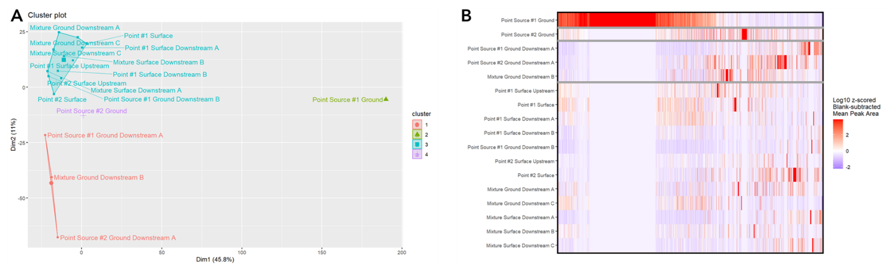
```

### Communicating Outcomes from NTA Studies
Non-targeted analysis expands on traditional targeted techniques and is most useful in scenarios where other methods cannot provide all the desired information. As a result, NTA will, by its very nature, be applied in situations where simple, straightforward answers are unlikely to emerge from a study. NTA also does not fit trivially into a typical environmental response workflow, where a method provides a chemical concentration which can be compared against a reference dose or a regulation to make decisions. Instead, NTA information is often relative, qualitative, and otherwise useful in weight-of-evidence decision making or in revealing avenues for follow-up research using traditional methods. For example, after identifying novel compounds by NTA, traditional quantitative assays for monitoring can be developed, toxicological information can be requested or collected, and cleanup, monitoring, and regulatory actions can be used as with more well-known contaminants.   

It is important to recognize the limitations of the knowledge available from NTA studies when requesting or undertaking them. Using a validated EPA method to determine volatile organic compounds content in drinking water and conducting cleanup is significantly more straightforward than applying NTA and trying to answer the question of “what is in my water?” Therefore, the degree of uncertainty should be recognized up-front in the study planning, and the data delivery must maintain the inherent uncertainty. This means that identifications should be presented as tentative/putative/or otherwise uncertain based on confidence scores - this is not the same as asserting that *no information* is available. Even a Schymanski classification at Level 3 can be enough to assert that a molecule is unequivocally *a PFAS*, or even something as specific as a *fluorotelomer sulfonamide*. Further, while estimates of absolute concentration are difficult, relative abundance measures are sufficient to demonstrate that, for example, a treatment technology results in a 20-fold or 100-fold reduction in measurable PFAS compared to influent water.  

In spite of the limitations, NTA serves a valuable role in identifying chemical contaminants, monitoring their presence and distribution across a range of sample matrixes, and offers the ability to answer sophisticated research questions when combined with environmental modeling. If NTA is conducted with the best practices detailed in this document in mind, it can produce transparent and defensible analyses to meet the needs of environmental and public health programs. 

\newpage\


## List of Acronyms
AMOS: Analytical Methods and Open Spectra Database  
BP4NTA: Best Practices for Non-Targeted Analysis Working Group  
CIC: Combustion Ion Chromatography  
DDA: Data Dependent Acquisition  
DIA: Data Independent Acquisition  
dSPE: Dispersive Solid Phase Extraction  
EIS: Extracted Internal Standards  
ESI: Electrospray ionization  
ENTAiLS: Enabling Non-Targeted Analysis for Per- and Polyfluoroalkyl Substances  
EPA: United States Environmental Protection Agency  
FDA: United States Food and Drug Administration  
GC: Gas Chromatography   
GC-MS: Gas Chromatography Mass Spectrometry  
GC-MS/MS: Gas Chromatography Tandem Mass Spectrometry  
HRMS: High-resolution Mass Spectrometry  
LC: Liquid Chromatography  
LC-MS: Liquid Chromatography Mass Spectrometry  
LC-MS/MS: Liquid Chromatography Tandem Mass Spectrometry  
NIS: Non-extracted Internal Standard  
NMR: Nuclear Magnetic Resonance Spectroscopy  
NTA: Non-targeted Analysis  
ORD: Office of Research and Development  
PFAS: Per- and Polyfluoroalkyl Substances  
PIGE: Particle-Induced Gamma-Ray Emission Spectroscopy  
QA: Quality Assurance  
QC: Quality Control  
qNTA: Quantitative NTA  
QTOF: Quadrupole Time of Flight  
ROAR: Regional-ORD Applied Research   
SPE: Solid Phase Extraction  
TIC: Total Ion Chromatogram  
USGS: United States Geological Survey  
WAX: Weak Anion Exchange  
XIC: Extracted Ion Chromatogram  

\newpage


## Glossary of Terms
*Adduct*: Ions formed during ionization from the interaction of analytes with other components of the sample or buffer  

*Chemical feature*: A measurement of a mass-to-charge (m/z) at a specific retention time in a HRMS method   

*Chemical space*: the constituents of a sample across a multidimensional swath of chemical properties. All possible chemicals within a range of physicochemical properties imposed by the sampling, preparation, and analysis processes    

*Data-dependent acquisition (DDA)*: A HRMS data acquisition method that uses successive precursor and product scans to collect both MS1 (precursor ion) and MS2 (fragment ion) information based on some heuristic value (e.g., most abundant ions previously unsampled) 

*Data-independent acquisition (DIA)*: A HRMS data acquisition method that does not select specific precursors, and instead generates fragmentation spectra from unbiased mass ranges 

*Extracted internal standard (EIS)*: An internal standard (typically an isotopically-labeled compound) that is added to a sample at the beginning of the sample preparation process and is used to track sample preparation method performance (e.g., extraction)    

*Extracted ion chromatogram (XIC)*: Plot that displays the response (signal) of a m/z (or a range of m/z) across the chromatographic window    

*High-resolution mass spectrometry (HRMS)*: Analytical chemistry technique that allows the measurement of a mass-to-charge (m/z) ratio by utilizing high resolution mass analyzers    

*Homologous series*: A group of compounds that differ by a repeating unit – e.g., CF2 for PFAS    

*In-source fragment*: Ions formed from the fragmentation of a molecule during the ionization process    

*Internal standard*: A chemical that is added to samples to track performance of the sample preparation and/or data acquisition methods used   

*Isotopically-labeled compound*: A compound where one or more atoms are a stable heavy isotope, such as 13C or 2H    

*Liquid chromatography (LC)*: A technique that uses a solid stationary column phase and analytes dissolved in a flowing mobile phase to separate chemicals based on the differences in their interaction between the phases    

*Multimer*: An ion formed from a non-covalent complex of multiple molecules of the same type   

*Native compound*: The non-labeled version of an isotopically-labeled compound   

*Non-extracted internal standard (NIS)*: An internal standard (typically an isotopically-labeled compound) that is added to a sample at the end of the sample preparation process, just before data acquisition, and is used to track instrument and method performance   

*Non-targeted analysis (NTA)*: A technique utilizing HRMS instrumentation that characterizes the chemical composition of a sample without the use of *a priori* knowledge of the chemical composition  

*Per- and polyfluoroalkyl substances (PFAS)*: A class of anthropogenic chemicals that have found ubiquitous use in various industrial and commercial applications since the 1940s. Can be [defined as](https://www.oecd.org/en/publications/reconciling-terminology-of-the-universe-of-per-and-polyfluoroalkyl-substances_e458e796-en.html) *“fluorinated substances that contain at least one fully fluorinated methyl or methylene carbon atom (without any H/Cl/Br/I atom attached to it”* 

*Suspect screening analysis*: A technique utilizing HRMS instrumentation that relies on the use of predefined lists or libraries that contain reference data (retention time, mass, fragment ions, and more) for chemicals of interest to narrow the scope of data acquisition and/or data processing  

*Total ion chromatogram (TIC)*: Plot that displays the response (signal) of all ions across the chromatographic window
\newpage


## Appendix A: Summary of PFAS NTA best practices & guidance
```{r, echo=FALSE}
library(knitr)
library(kableExtra)
FluoroMatchOutput2=read.csv("C:\\Users\\HWHITEHE\\OneDrive - Environmental Protection Agency (EPA)\\Profile\\Desktop\\General Work\\Manuscripts\\Translational\\Toolkit\\docs\\Tables\\appendixA.csv",check.names=FALSE)

FluoroMatchOutput2 %>%
kable(caption ="**APPENDIX A**. Summary of PFAS NTA best practices & guidance. ",format="html", align="c",html_font="Lato") %>%
kable_styling(full_width=F, html_font= "Lato", bootstrap_options=c("striped", "hover","responsive")) %>%
  pack_rows("Study Design", 1, 2,label_row_css = "background-color: #0668b3; color: #fff;") %>%
  pack_rows("Sample Collection", 3, 5,label_row_css = "background-color: #0668b3; color: #fff;") %>%
  pack_rows("Sample Preparation", 6, 6,label_row_css = "background-color: #0668b3; color: #fff;") %>%
  pack_rows("Data Acquisition", 7, 9,label_row_css = "background-color: #0668b3; color: #fff;")
```
\newpage


## Appendix B: Summary of QA/QC definitions and guidance
```{r, echo=FALSE}
library(knitr)
library(kableExtra)
FluoroMatchOutput2=read.csv("C:\\Users\\HWHITEHE\\OneDrive - Environmental Protection Agency (EPA)\\Profile\\Desktop\\General Work\\Manuscripts\\Translational\\Toolkit\\docs\\Tables\\appendixB.csv",check.names=FALSE)

FluoroMatchOutput2 %>%
kable(caption ="**APPENDIX B**. Summary of QA/QC definitions and guidance.",format="html", align="c",html_font="Lato") %>%
kable_styling(full_width=F, html_font= "Lato", bootstrap_options=c("striped", "hover","responsive")) %>%
  pack_rows("Sample Collection", 1, 3,label_row_css = "background-color: #0668b3; color: #fff;") %>%
  pack_rows("Sample Preparation", 4, 7,label_row_css = "background-color: #0668b3; color: #fff;") %>%
  pack_rows("Data Acquisition", 8, 14,label_row_css = "background-color: #0668b3; color: #fff;")%>%
footnote(general= "*A suitable n varies but should aim to represent a coherent unit or “batch” of samples. It is determined by a variety of factors including sample matrices and sample collection methods, number of sampling teams, etc. Reasonable values for n may be 5, 10, 20, or more for larger studies based on what each set of blanks is intended to represent.  
^A suitable n is determined by a variety of factors including sample matrices and preparation method complexity. The ideal number should provide at least one set of controls and spikes for each “set” of related samples. Reasonable values for n may be 5, 10, 20, or more for larger sample numbers.  
%A suitable n is determined by a variety of factors including sample matrix and response, where especially complex matrices or those with significant analyte abundance should have more solvent blanks included in the sequence. Reasonable values for n may be 5, 10, 20, or more for larger batches.")
```
\newpage


## Appendix C: Summary of tools and software used in the PFAS NTA data processing workflow
```{r, echo=FALSE}
library(knitr)
library(kableExtra)
FluoroMatchOutput2=read.csv("C:\\Users\\HWHITEHE\\OneDrive - Environmental Protection Agency (EPA)\\Profile\\Desktop\\General Work\\Manuscripts\\Translational\\Toolkit\\docs\\Tables\\appendixC.csv",check.names=FALSE)

FluoroMatchOutput2 %>%
kable(caption ="**APPENDIX C**. Summary of tools and software used in the PFAS NTA data processing workflow. ",format="html", align="c",html_font="Lato") %>%
kable_styling(full_width=F, html_font= "Lato", bootstrap_options=c("striped", "hover","responsive")) %>%
  pack_rows("MSConvert (3.0.23226) [DOWNLOAD](https://proteowizard.sourceforge.io/download.html)", 1, 2,label_row_css = "background-color: #0668b3; color: #fff;") %>%
  pack_rows("mzmine (3.9.0) [DOWNLOAD](https://github.com/mzmine/mzmine/releases)", 3, 6,label_row_css = "background-color: #0668b3; color: #fff;") %>%
  pack_rows("INTERPRET NTA*([Tool in development]( https://doi.org/10.1007/s00216-025-05771-w))*", 7, 8,label_row_css = "background-color: #0668b3; color: #fff;") %>%
  pack_rows("FluoroMatch (2.6) [DOWNLOAD](https://innovativeomics.com/software/fluoromatch-flow-covers-entire-pfas-workflow)", 9, 9,label_row_css = "background-color: #0668b3; color: #fff;") %>%
  pack_rows("SIRIUS (5.8.6) [DOWNLOAD](https://bio.informatik.uni-jena.de/software/sirius/)", 10, 10,label_row_css = "background-color: #0668b3; color: #fff;") %>%
  pack_rows("enviHomolog (2.2) [WEBSITE](https://www.envihomolog.eawag.ch/)", 11, 11,label_row_css = "background-color: #0668b3; color: #fff;")
```
\newpage


## Appendix D: Summarized parameters used for MSConvert
```{r, echo=FALSE}
library(knitr)
library(kableExtra)
FluoroMatchOutput2=read.csv("C:\\Users\\HWHITEHE\\OneDrive - Environmental Protection Agency (EPA)\\Profile\\Desktop\\General Work\\Manuscripts\\Translational\\Toolkit\\docs\\Tables\\appendixD.csv",check.names=FALSE)

FluoroMatchOutput2 %>%
kable(caption ="**APPENDIX D**. Summarized parameters used for MSConvert.",format="html", align="c",html_font="Lato") %>%
kable_styling(full_width=F, html_font= "Lato", bootstrap_options=c("striped", "hover","responsive")) %>%
  pack_rows(".mzXML for mzmine processing", 1, 7,label_row_css = "background-color: #0668b3; color: #fff;") %>%
  pack_rows(".ms2 for FluoroMatch processing", 8, 14,label_row_css = "background-color: #0668b3; color: #fff;")
```
\newpage


## Appendix E: Summarized mzmine modules and parameters described
```{r, echo=FALSE}
library(knitr)
library(kableExtra)
FluoroMatchOutput2=read.csv("C:\\Users\\HWHITEHE\\OneDrive - Environmental Protection Agency (EPA)\\Profile\\Desktop\\General Work\\Manuscripts\\Translational\\Toolkit\\docs\\Tables\\appendixE.csv",check.names=FALSE)

FluoroMatchOutput2 %>%
kable(caption ="**APPENDIX E**. Summarized mzmine modules and parameters described. . ",format="html", align="c",html_font="Lato") %>%
kable_styling(full_width=F, html_font= "Lato", bootstrap_options=c("striped", "hover","responsive")) %>%
  pack_rows("Crop Filtering", 1, 3,label_row_css = "background-color: #0668b3; color: #fff;") %>%
  pack_rows("Mass Detection", 4, 8,label_row_css = "background-color: #0668b3; color: #fff;") %>%
  pack_rows("Mass Detection", 9, 12,label_row_css = "background-color: #0668b3; color: #fff;") %>%
  pack_rows("ADAP Chromatogram Building", 13, 18,label_row_css = "background-color: #0668b3; color: #fff;") %>%
  pack_rows("Chromatogram Resolving", 19, 32,label_row_css = "background-color: #0668b3; color: #fff;") %>%
  pack_rows("13C Isotope Filter", 33, 37,label_row_css = "background-color: #0668b3; color: #fff;") %>%
  pack_rows("Isotope Pattern Finder", 38, 40,label_row_css = "background-color: #0668b3; color: #fff;") %>%
  pack_rows("Alignment", 41, 44,label_row_css = "background-color: #0668b3; color: #fff;") %>%
  pack_rows("Gap-Filling", 45, 48,label_row_css = "background-color: #0668b3; color: #fff;") %>%
  pack_rows("Duplicate Peak Filter", 49, 51,label_row_css = "background-color: #0668b3; color: #fff;") %>%
  pack_rows("Local Compound Database Search", 52, 55,label_row_css = "background-color: #0668b3; color: #fff;") %>%
  pack_rows("Spectral Library Search", 56, 65,label_row_css = "background-color: #0668b3; color: #fff;") 
```

## Toolkit Contributors 
The contents of this toolkit were developed throughout the ROAR collaboration between EPA ORD and Regions 3, 5, and 9. The toolkit was developed by Heather Whitehead and James McCord. The toolkit was reviewed by other ORD researchers including Jon Sobus, Tim Buckley, Jackie Bangma, Denise MacMillan, Troy Ferland, Alex Chao, Gregory Janesch, and Antony Williams. Collaborating partners in the EPA Regions and state environmental and public health laboratories also provided review of toolkit content. The full author list for the relevant publication is given below. 

**Authors**  
*Heather D. Whitehead^1^*, *James P. McCord^1^*, Timothy J. Buckley^1^, Jon. R Sobus^1^, Jacqueline Bangma^1^, Denise K. MacMillan^1^, Troy M. Ferland^1^, Alex Chao^1^, Antony J. Williams^1^, Gregory Janesch^1,2^, Kevin Cofield^3^, Regina Poeske^3^, Erin Newman^4^, Carole Braverman^4^, Matthew Small^5^, Sinisa Urban^6^, Zhao Cao^6^, Andri Dahlmeier^7^, Stefan Saravia^8^, Rosie Rushing^8^, Marla DeVault^8^, Wendy Linck^9^, Erica Kalve^9^, David Schiessel^10^

**Affilitations**  
1.	U.S. Environmental Protection Agency, Office of Research and Development  
2.	Oak Ridge Associated Universities (ORAU)  
3.	U.S. Environmental Protection Agency, Region 3  
4.	U.S. Environmental Protection Agency, Region 5  
5.	U.S. Environmental Protection Agency, Region 9  
6.	Maryland Department of Health  
7.	Minnesota Pollution Control Agency  
8.	Minnesota Department of Health  
9.	California State Water Resources Control Board  
10.	Babcock Laboratories Inc.   


## Contact
For any questions or comments on the toolkit content or the ROAR project please reach out to **Heather Whitehead** at **whitehead.heather@epa.gov** or **James McCord** at **mccord.james@epa.gov**. 